Edge Cluster Orchestrator Troubleshooting
=========================================

Prerequisite Knowledge
----------------------

.. note:: Before commencing troubleshooting, Intel recommends
   being familiar with the following documents:

- :doc:`../cluster_orch/arch/technology_stack` for the technology stack used

- :doc:`../cluster_orch/arch/architecture` for the architecture within Edge
  Cluster Orchestrator

- :doc:`../cluster_orch/arch/deployment` referencing the deployment of the
  Edge Cluster

These will aid greatly in providing a mental model of the cluster creation
process.

This guide provides troubleshooting steps for common issues encountered
trying to set up a cluster within Edge Orchestrator using specific kubectl
commands to help troubleshoot and navigate through the different logs.

Typically it will take a few minutes before the Cluster is
successfully deployed as shown below:

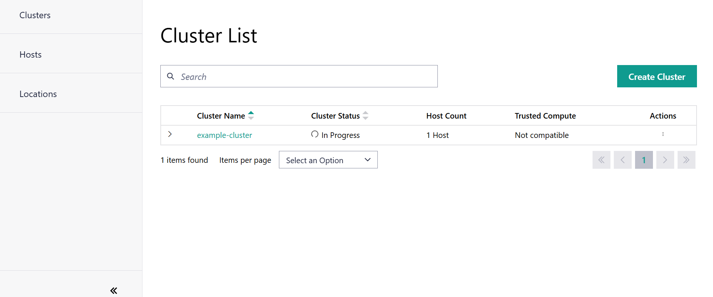

However, if the cluster is stuck in the creation phase for a period longer than
**10 minutes,** then these are the recommended  **debugging commands** to aid
in troubleshooting the various reasons as to why the host is stuck in
creation mode.

Edge Orchestrator
-----------------

.. note::

   This guide is intended for experienced SRE / DevOps engineers who have been
   granted permissions/roles to access the console and further intervention is
   needed to troubleshoot the issue after using logs gather from
   observability. See: :doc:`capture_logs`

   The following commands are executed against an Edge Orchestrator's
   Kubernetes\* Cluster. To troubleshoot access to the ``KUBECONFIG`` is
   required.  Similar logs information can be obtained from
   ``observability-admin`` UI. See:
   :doc:`/user_guide/monitor_deployments/grafana_content`.

.. code:: shell

    kubectl logs -n capi-operator-system -l app=cluster-api-operator

**context:** issues with the overall management of CAPI components.
Things to check for would any misconfigurations or missing resources.

.. code:: shell

    kubectl logs -n capr-system -l cluster.x-k8s.io/provider=bootstrap-rke2

**context:** issues during the bootstrap process of edge clusters,
such as clusters failing to initialize. Things to check for would be
any misconfigurations, for errors during the bootstrap process of
edge clusters and or network issues.

.. code:: shell

    kubectl logs -n orch-cluster -l app=cluster-manager-cm

**context:** issues related to API calls failing or unexpected behaviour in
cluster management.

.. code:: shell

    kubectl logs -n orch-cluster -l app=cluster-manager-controller

**context:** issues relating to CAPI template components required for
further cluster creation - ControlPlaneTemplate, MachineTemplate,
ClusterTemplate and ClusterClass.

.. code:: shell

    kubectl logs -n orch-cluster -l app=southbound-api

Edge Node Logs
--------------

Prerequisite Knowledge to Access the Edge Node Logs
'''''''''''''''''''''''''''''''''''''''''''''''''''

.. note::
   To access the logs on the Edge Node, you will need to have
   access to the logs via observability dashboard. See:
   :doc:`../../../user_guide/monitor_deployments/grafana_content`

To access the logs related to both Cluster Agent and RKE Server, you have to
select the Edge Node Agent Log search as below:

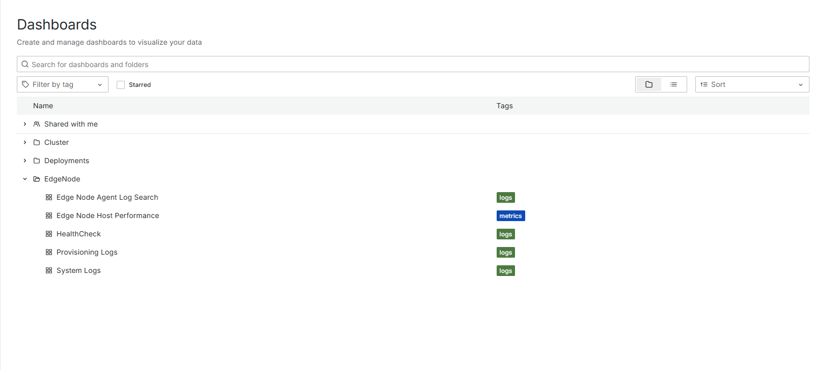

For the particular logs you are looking for,
you can use the search with the filter as shown below for RKE Server:

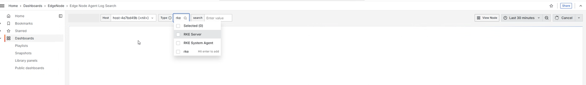

Additionally Issues related to the connect-agent and cluster agent on the Edge
Node not responding can be diagnosed by accessing the logs through the
dashboard:

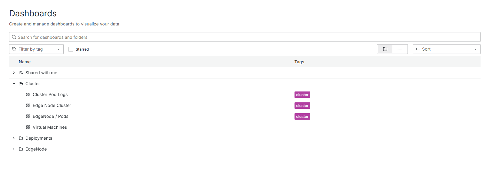

and through searching for the component name in
the search filter as displayed below:

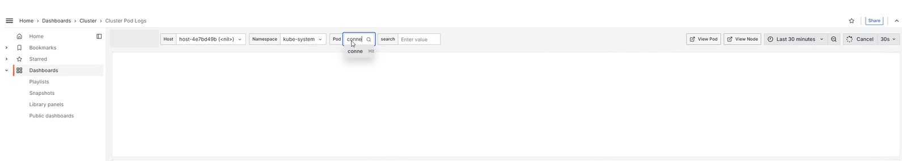

For more information related to logs.
See: :doc:`/user_guide/monitor_deployments/grafana_content`.

**context:** issues with ``rke2-server`` misconfiguration
or Kubernetes cluster installation
(check agent logs for more info as shown in the example for RKE).

**context:** issues with communication to Edge
Node Cluster Agent, such as network failure
or issues specific to the agent
(check agent logs for more info as shown above).

See for more information:
:doc:`/user_guide/monitor_deployments/grafana_content`.

Troubleshooting Edge Node Clusters Extensions Deployment
--------------------------------------------------------

Edge Node
'''''''''

Diagnosing extension issues typically requires kubectl access to the cluster.
You can do this by downloading the cluster kubeconfig from the UI. You can use
this guideline :doc:`/user_guide/set_up_edge_infra/accessing_clusters` to
download the kubeconfig of a target edge cluster.

.. note::

   If the ``connect-agent`` is not deployed and running - the user will not
   have access to Edge Cluster and access to kubectl to use the kubectl
   commands with the kubeconfig will not execute

The kubeconfig file can then be used to interact with
the workload cluster from the Edge Orchestrator environment.
For example, to list all pods in all namespace in the
Edge Node workload cluster (without extensions)

.. code:: shell

    kubectl --kubeconfig=kubeconfig.yaml get pods -A

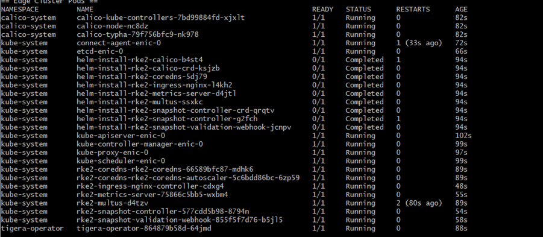

This kubeconfig file will have a short-lived
token with maximum of 60 minutes from the web-ui
login access. So, you have to login
and download a new kubeconfig for the cluster
when it expires.

Example of the logs:

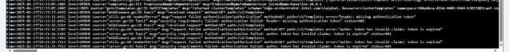

When the kubeconfig file is downloaded, since
it has the same name, you may be careful to use
the most recent version to avoid the expired token issue.

In the deployments tab you will see which apps are failing:

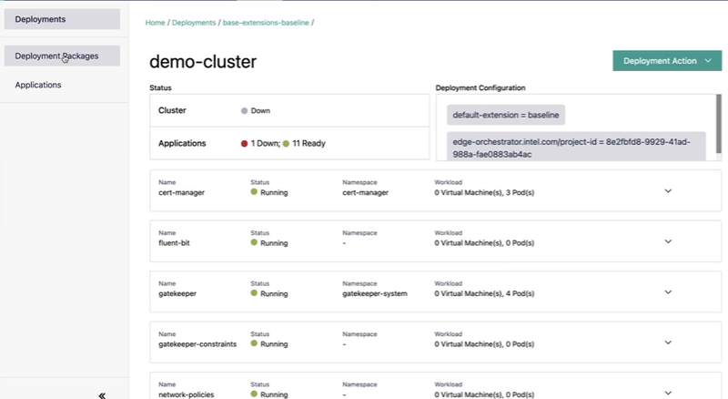

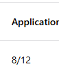

If the number of total apps reported is lower
than what you expected, you will need to check the
orchestrator cluster for a few things:

- App Deployment Manager logs
- ``cattle-fleet-system`` ``gitjob`` logs
- app deployment jobs in the namespace allocated to the downstream cluster

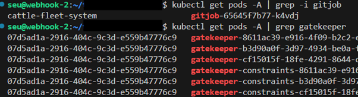

For diagnosing issues with an app that is failing
you can use the downloaded kubeconfig to access
pod logs for the app that is having issues.
If the app does not seem to have any pods running
you can try using helm:

.. code:: shell

    helm ls  -A
    helm history -n <chart namespace> <release name>

The above commands can be used to list the
installed charts and retrieve some info on
ones that failed during install.

Testing Extension Changes
-------------------------

If you want to test changes that you believe will fix an extension, you will
first need a :doc:`/user_guide/package_software/deploy_packages` to apply your
changes to.

Extensions are currently stored here:
`https://github.com/open-edge-platform/cluster-extensions
<https://github.com/open-edge-platform/cluster-extensions>`_.

Once you have your deployment package, make the necessary changes you want to
test. Then, update the version in the ``applications.yaml`` and
``deployment-package.yaml`` files.

.. note::

   The version field in the ``applications.yaml`` file is an arbitrary value you
   can modify to avoid conflicts with other packages and does not need to match
   the chart version.

After making your changes, update the deployment package version in the
``deployment-package.yaml`` file and import it into the UI under the deployment
packages tab.

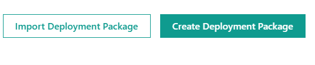

Once the deployment package is imported, go to your failing deployment and
upgrade it:

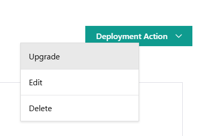

If you want you can also delete and recreate
the cluster to try a start to finish installation
with a clean state.
