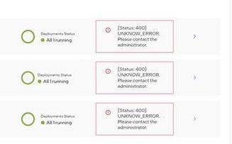

========================================================
Inconsistent State Between Infrastructure and Deployment
========================================================

Symptom
=======

Infrastructure hosts show error 400 and there is inconsistent state of
deployment between the Deployments tab of the dashboard and the deployment
detail page.

Cause
=====

Vault is sealed due to pod restart.

Preconditions
=============

- The Host is up and running correctly.
- The Cluster is up and running correctly.
- Errors are shown as in the symptoms screenshot.

Steps
=====

- Unseal Vault according to the instruction in :doc:`vault`.
- Try to navigate to edge orchestration again, the errors should be gone.
