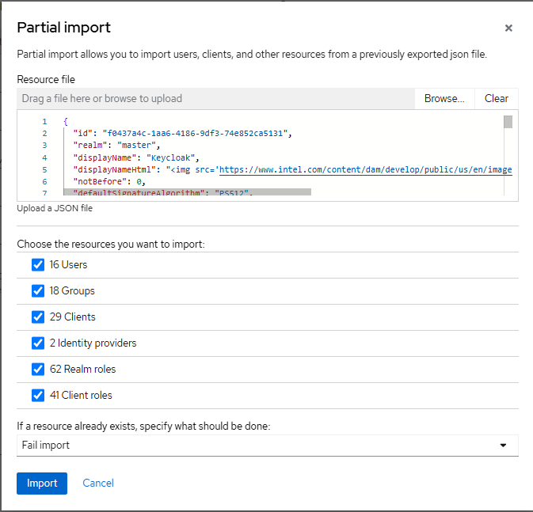

Keycloak\* Solution Issues
===========================

Backup and Restore Identity Provider (IdP) (Keycloak Solution) Configuration INCLUDING USERS
------------------------------------------------------------------------------------------------

**Cause**

Need to backup Keycloak* configuration manually, including Users (which are not
included in the Realm Export function), their Group memberships, local
passwords, and so on.

WARNING: do NOT restore a backup containing the initial "admin" user and
temporary admin password! This may cause the KeycloakConfigClient post-install
job to run and reset Group definitions, User group memberships, and so on.
Normally, this password is changed almost immediately after deployment, so it
is unlikely that the most recent good snapshot would have this "admin" user
configured to the temporary settings. If you are unsure, you must kill all
Keycloak Config Client post-install jobs before restoring the db!

**Preconditions**

`kubectl` is installed and configured to access the Deployment Kubernetes\* Cluster
hosting the Identity Provider (IdP) (Keycloak solution). The person performing this runbook has verified
with IdP (Keycloak solution) IAM Admin for that cluster, that Keycloak solution is in a good
state to backup and restore.

**Steps**

Determine Database Type

IdP (Keycloak solution) is typically deployed with one of the following backing
databases:

- Amazon Aurora\* database - used for AWS\*-hosted Deployments
- PostgreSQL\* shared database - used in local deployments such as a
  kind-hosted deployment cluster in a coder environment

Follow the relevant section to backup and restore the database type in
question.

Backup and Restore Amazon Aurora database for Keycloak solution.

Amazon Aurora database snapshots are taken automatically and can be restored following
normal Amazon Aurora database restore steps (see below). Before performing a restore of a
snapshot, consider whether Amazon Aurora database's rewind functionality might be a better
option in your case.

`Overview of backing up and restoring an Amazon Aurora database cluster <https://docs.aws.amazon.com/AmazonRDS/latest/AuroraUserGuide/Aurora.Managing.Backups.html>`_

Keycloak Solution - Backup and Restore IdP (Keycloak Solution) Configuration WITHOUT USERS
----------------------------------------------------------------------------------------------

**Cause**

Need to backup Keycloak configuration manually, but do NOT need to backup
Users (which are not included in the Realm Export function), their Group
memberships, local passwords, etc.

If user data is to be preserved, stop here and instead see Keycloak - Backup
and Restore IdP (Keycloak solution) Configuration INCLUDING USERS (Copy).

.. note::

   In some testing, the local Keycloak "admin" user account has become
   corrupted, and the deployment unusable, unless another IAM Admin exists; still
   need to root cause. In the meantime, suggestion is to use the whole db backup
   approach linked above, instead of partial export/import.

**Preconditions**

Person performing this runbook has verified with IdP (Keycloak solution) IAM Admin for
that Cluster, that Keycloak solution is in a good state to backup and restore.

**Steps**

To export Realm Config to JSON, do the following:

1. Open the Keycloak Admin console by navigating to the URL
   ``https://keycloak.<cluster_domain>``

2. Sign in using either a local account (e.g., "admin") or SSO account with IAM
   Admin group membership (see Keycloak Solution - Administer IdP (Keycloak solution) User Access
   (Copy) for more info on access groups).

3. From the menu on the left, open Realm settings:

   .. image:: images/keycloak/keycloak-relm-settings.png
      :alt: Realm settings
      :width: 100%

4. In the Action dropdown in the top right corner, choose Partial export.

   .. image:: images/keycloak/keycloak-relm-partial-export.png
      :alt: Relm partial export
      :width: 100%

5. In the Partial export dialog, turn ON "Include groups and roles" and turn ON
   "Include clients" options, then choose Export.

   .. image:: images/keycloak/keycloak-relm-export-options.png
      :alt: Relm export options
      :width: 100%

The realm config is downloaded as a JSON file ``realm-export.json`` to the
Browser's default download location.

At this point, the IdP configuration - except for User information - is backed
up and can be imported from the ``realm-export.json`` file.

Import Realm Config from JSON
-----------------------------

To import, follow the export steps, but choose Partial import instead. Select
the ``realm-export.json`` backup file, and a dialog will open to choose what
resources to import:

Select the resources to restore, choose Import, and the configuration will be
applied.

.. note::

   Because client secrets are exported as hidden chars, the imported
   Identity providers will not have valid client secrets. This is correct behavior
   and an IAM Admin with access to the Application Registrations (e.g., Microsoft Azure\* AD
   Admin, Microsoft Azure B2C Admin) will have to generate new client secrets for each
   Identity Provider and provision them in the Keycloak Identity Provider
   configuration.

Keycloak Solution - Enable Local Password for SSO User
-------------------------------------------------------

**Cause**

For `curl` commands to retrieve `access_token`, the user must have a local
password set. This is different from and will not affect the SSO login password
for the user. It will only affect the Keycloak local password for the user.

**THE PASSWORD MUST MEET DEFAULT REQUIREMENTS:**

- Minimum 14 characters
- At least one lowercase letter
- At least one uppercase letter
- At least one number
- At least one special character

**Preconditions**

- Valid SSO login for the user

**Steps**

1. Navigate to User settings.

2. Open the Keycloak Account Panel (e.g.,
   `https://keycloak.<cluster_domain>/realms/master/account/password`).

3. Take note of the Username value under the Account tab:

   .. image:: images/keycloak/keycloak-set-email.png
      :alt: Keycloak set email
      :width: 100%

4. Set a new password and confirm, then Save:

   .. image:: images/keycloak/keycloak-set-password.png
      :alt: Keycloak set password
      :width: 100%

At this point, the SSO email address and the local password can be used in
`curl` to request an `access_token` and so on.

Keycloak Solution - Enable SSO Sign-on
---------------------------------------

`OpenID Connect v1.0 identity providers <https://www.keycloak.org/docs/latest/server_admin/index.html#_identity_broker_oidc>`_

Keycloak solution - temporarily enable 30 day access tokens and session spans
-------------------------------------------------------------------------------

**Cause**

For demo environments, enable 30 day access token duration and session timeout.
This is a brute-force way and will be refined as time allows.

**THIS IS NOT FOR PRODUCTION USE AND SHOULD NEVER BE DONE ON A SERVER WITH REAL
USER DATA**

**Preconditions**

- Keycloak solution admin access

**Steps**

Enable 30 days in all session duration settings

1. Open Keycloak Admin Panel (e.g., sc-dev Keycloak) and browse to "Realm
   settings" tab on left, and then "Sessions" on the top tabs.

2. Change "SSO Session Idle", "SSO Session Max" and "Offline Session Idle" to
   30 days:

   .. image:: images/keycloak/keycloak-set-sso-30days.png
      :alt: Relm export options
      :width: 100%

3. Then scroll down and click "Save":

   .. image:: images/keycloak/keycloak-set-sso-part2.png
      :alt: Relm export options
      :width: 100%

Enable 30 days in all token duration settings

1. Navigate to "Tokens" tab along the top and change "Access Token lifespan"
   and "Access Token lifespan for Implicit Flow" to 30 days:

   .. image:: images/keycloak/keycloak-set-sso-part3.png
      :alt: Relm export options
      :width: 100%

2. Again, scroll down and click "Save":

   .. image:: images/keycloak/keycloak-set-sso-part4.png
      :alt: Relm export options
      :width: 100%

At this point, token issued by this Keycloak will not expire for 30 days. You
can follow Keycloak - Verify IdP (Keycloak solution) basic functionality (Copy) for
examples of how to fetch `access_token`, and decode the token to verify expiry.

Keycloak Solution - Verify IdP (Keycloak Solution) basic functionality
-----------------------------------------------------------------------

**Cause**

IdP (Keycloak solution) newly deployed or not responding as expected, use these steps
to verify basic functionality.

**Preconditions**

- Commands require that `curl` is installed and `curl` proxy (and `NO_PROXY`)
   is configured correctly to reach deployment host.

**Steps**

Configure Username and Password env vars

.. code-block:: bash

   <prompt>$ KEYCLOAKUSER='<your user>'
   <prompt>$ KEYCLOAKPASS='<your password>'
   # Note that username and password are enclosed in single quotes to prevent
   # mishandling of some characters in env vars.

- or -

.. code-block:: bash

   <prompt>$ KEYCLOAKUSER='alice.inwonderland@intel.com' && \
   KEYCLOAKPASS='alicesLocalKeycloakPassword'
   # Note that an SSO password will not work in these tests; a local password
   # must be configured in Keycloak for the user in question!

- etc -

Configure Cluster FQDN for the cluster in question

.. code-block:: bash

   <prompt>$ CLUSTER_FQDN=your.fqdn.com

Is Cluster reachable (using WebUI as test service)?

.. code-block:: bash

   <prompt>$ curl --insecure --verbose GET \
   https://web-ui.${CLUSTER_FQDN}/dashboard
   # Note --insecure is used to avoid any potential issues with TLS cert trust
   # anchor installation in the debug terminal environment.

A 200 response indicates cluster is reachable.

Is IdP (Keycloak solution) reachable?

.. code-block:: bash

   <prompt>$ curl --insecure --verbose GET \
   -H "Content-Type: application/JSON" \
   "https://keycloak.${CLUSTER_FQDN}/realms/master/.well-known/openid-configuration"

A 200 response indicates Keycloak is reachable.

Get IdP Access Token

.. code-block:: bash

   <prompt>$ IDP_AT=$(curl -kX POST \
   https://keycloak.${CLUSTER_FQDN}/realms/master/protocol/openid-connect/token \
   -d "username=${KEYCLOAKUSER}" \
   -d "password=${KEYCLOAKPASS}" \
   -d "grant_type=password" \
   -d "client_id=example_client" \
   -d "scope=openid" | jq -r '.access_token') && \
   echo -e "Received IDP_AT for '$KEYCLOAKUSER' on '$CLUSTER_FQDN' cluster:\n$IDP_AT"

A base64 encoded access token should be echoed to the terminal indicating
success. The access token can be copy/pasted to a site such as `JSON Web Token (JWT) Debugger <https://jwt.io>`_ to verify correct formatting.

If Keycloak solution is issuing correctly formatted access tokens via the /token
endpoint as above, in likelihood it is up and functioning correctly!
