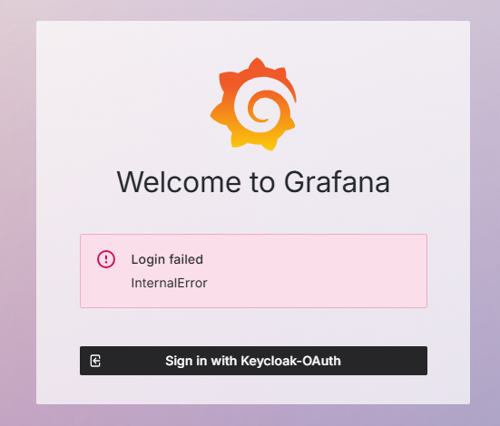
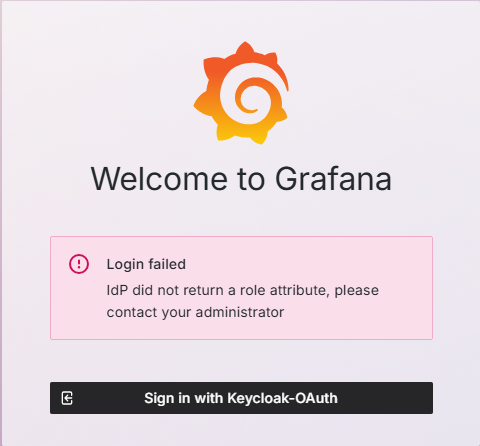
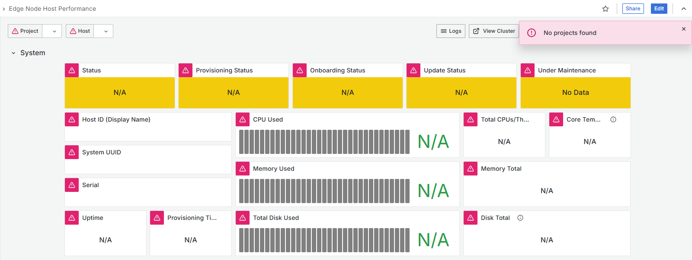
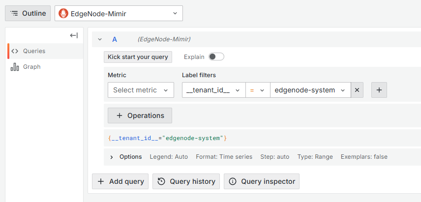

==================
o11y Access Issues
==================

Grafana\* Dashboard login page shows Internal Error
===================================================

**Symptom:**
When trying to access Grafana\* dashboard, the login page shows an internal error.

**Cause:**
This issue can occur if the logged-in user does not have an email address set in Keycloak\* solution.

**Solution:**
Set the email address for the user in Keycloak solution. The email address
is required for Grafana dashboard to work properly.

Grafana Dashboard login page shows Login error
==============================================

**Symptom:**
When trying to access Grafana dashboard, the login page shows a login error.

**Cause:**
This issue can occur if the user is not authorized to access
Grafana dashboard - not part of group that has access to Grafana.

**Solution:**
Make sure the user is part of the groups that have access to Grafana dashboard in Keycloak solution.
Re-login to Grafana dashboard after adding the user to the group.

Grafana dashboard shows "user token not found" error
=======================================================

**Symptom:**
After being logged-in for a long period of time, Grafana dashboard shows "user token not found" error.

**Cause:**
This issue can occur if the user token has expired.

**Solution:**
If the page does not auto-reload - refresh the page manually to get a new token.
If the issue persists, try logging out and logging back in.

Grafana dashboard shows no projects found error
=================================================

**Symptom:**
After logging into Edgenode Observability, Grafana dashboards show a "no projects found"
error and no data

**Cause:**
This happens when there haven't been any projects created yet.
This is expected behavior.

**Solution:**
Create a project in the Edge Orchestrator UI and then check the Grafana dashboards again.

User does not have Explore permissions while being an admin
===========================================================

**Symptom:**
User does not see the Explore tab in Grafana dashboard and cannot edit dashboards.

**Cause:**
This issue can occur in Edgenode Observability Grafana dashboard if the user
is both an admin and a member of per-project Telemetry access group.

**Solution:**
Remove the user from the per-project Telemetry access group in Keycloak solution.
An alternative is to use the Edge Orchestrator Observability Grafana dashboard with Edgenode Observability
sources.

Error sending telemetry to Edge Orchestrator - rejected by Auth Service
========================================================================

**Symptom:**
Telemetry is being sent but cannot be viewed in Grafana dashboard.

**Cause:**
This issue can occur if the user sending the data does not have
the correct permissions in Keycloak solution.
This issue can also occur if the data being sent does not contain proper ``projectId`` header.

**Solution:**
Check ``auth-service`` logs for errors. If there are ``Invalid claims`` errors,
check the user permissions in Keycloak solution and make sure the edgenode group has
correct ``<projectId>_en-agent-rw`` role.

Check Edge Orchestrator Observability Grafana dashboard in Explore tab.
If the data is being sent and not rejected, it can be viewed there:

