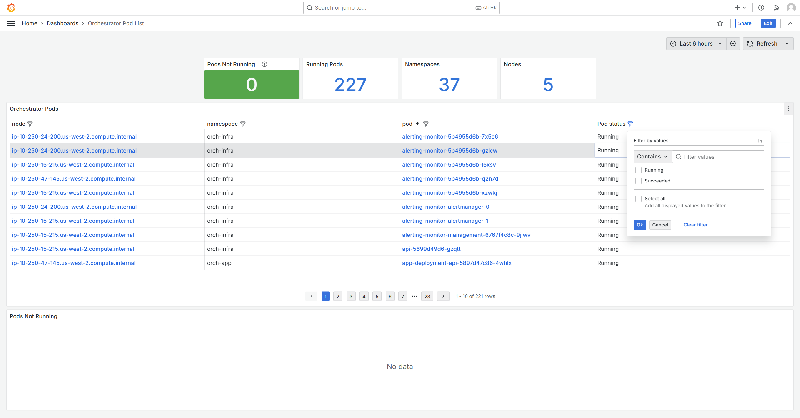

=============================
Edge Orchestrator Performance
=============================

The Grafana dashboards provide you with the metrics and logs view that
support troubleshooting any performance issues of the Edge Orchestrator
and help identify underlying conditions both during development and
while running in production.

To access the administrative dashboards, the user must belong
to ``Service-Admin-Group``, which grants ``telemetry-client/admin``
role. Review **Edge Orchestrator Groups and Roles** section
in User Guide to learn more about available roles and permissions.

Cluster Overview ("Orchestrator Cluster")
=========================================

This dashboard provides a high-level overview of the cluster, including the
number of nodes, namespaces, pods, and stateful sets. Other resources can be
found in **Kubernetes Resources** dashboard row.

Key health indicators are displayed at the top, and next to each node in
cluster node listing, which also links to **Node Overview ("Orchestrator
Node")** dashboard.

This dashboard also provides information on the overall usage of CPU, memory,
and disk within the cluster, along with an overview of pod requests and limits.
More detailed information on cluster resources usage is available in dedicated
dashboard rows:

* CPU
* Memory
* Network
* Disk

Node Overview ("Orchestrator Node")
===================================

This dashboard provides detailed information on single cluster node, with key
health indicators displayed at the top.

The filtered list of running pods and a separate list of problematic
pods is displayed below. Each pod entry is a link to
**Pods Resources Usage ("Pods Resources")** dashboard.

More detailed information on node resources usage is available in dedicated
dashboard rows:

* CPU
* Memory
* Storage
* Network

Pods Resources Usage ("Pods Resources")
=======================================

This dashboard provides key pod status and list of its containers with
their respective resources requests and limits. In addition, fine-grained
per-pod CPU and memory usage is tracked here.

Pods Overview ("Orchestrator Pod List")
=======================================

This dashboard helps to monitor the status of all pods across the Edge Orchestrator
cluster. Key quantitative information is displayed at the top, along with
count of non-running pods, which serves as a health indicator for this
dashboard.

A list of pods is provided with their respective status, namespace,
and node it runs on. The list can be filtered by namespace, node, pod, and
status. Each pod entry is a link to **Pods Resources Usage
("Pods Resources")** dashboard, and each node entry is a link
to **Node Overview ("Orchestrator Node")** dashboard.

Dedicated **Pods Not Running** section helps review problematic pods.

Pods Log Search ("Orchestrator Pods Log Search")
================================================

This dashboard provides a way to search logs produced by Edge Orchestrator
services. The logs can be reviewed with per-pod granularity and filtered
by container and a user-provided text search query.

.. note::
    To use a case-insensitive search, prefix the search query with
    ``(?i)``. For example, to search for logs containing ``error`` or
    ``ERROR``, use ``(?i)error``.

Exploring Metrics
=================

While the default set of dashboards provides a good starting point for
troubleshooting, the **Metrics Explorer** dashboard allows you to explore
available metrics in more detail. The example below shows all available
metrics that have a name that matches ``container_`` string.

