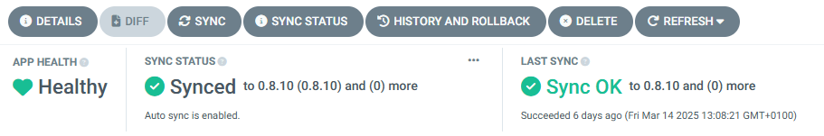

SRE Exporter Issues
===================

Metrics not received at the destination
---------------------------------------

**Symptom:**

The metrics exported from the Edge Orchestrator are not received at the destination server.

The symptom can be verified by querying the destination server API with PromQL\* query: `{__name__=~"orch_.*", customer="<customer-name>"}`,
where `<customer-name>` is by default set to the name of the Edge Orchestrator cluster. If the query returns no results, it indicates
that no metrics are received at the destination.

The customer name can also be checked in run-time in the Argo\* CD web console by searching for the `sre-exporter` application, choosing `DETAILS -> MANIFEST`
and reading the value of `sources[0].helm.valuesObject.metricsExporter.customerLabelValue` from the application manifest.

**Cause:**

The issue can be caused by multiple reasons, such as:

- `sre-exporter` Pod is not running or not healthy
- destination endpoint configuration is incorrect
- metrics collection is not working in the Edge Orchestrator
- network misconfiguration, such as proxy or firewall

**Solution:**

To determine the root cause and resolve the issue, follow the steps below.

#. Check that the `sre-exporter` application exists and is healthy. See the `Health Check`_ section.
#. Check the metric export status by viewing logs. If the metrics are successfully exported,
   double-check the symptom. See the `Checking metric export status by viewing logs`_ section for more details.
#. Check the destination endpoint configuration and compare it with the actual destination server configuration.
   Follow the steps to adjust the configuration if needed. See the `Checking destination endpoint configuration`_ section for more details.
#. Verify that metric collection is working in the Edge Orchestrator by querying the internal endpoints of the `sre-exporter` Pod.
   If it is not, then try to fix internal issues first. See the `Checking metric collection status by querying the sre-exporter endpoint`_ section for more details.
#. If the issue persists, it may be related to network issues such as proxy or firewall. Verify the network configuration and proxy configuration in `sre-exporter`
   by:

   - searching for the `sre-exporter` application in the Argo CD web console
   - choosing `DETAILS -> MANIFEST`
   - checking the value of `sources[0].helm.valuesObject.otelCollector.proxy` in the application manifest

SRE Exporter application is not healthy
---------------------------------------

**Symptom:**

Any of the containers in the `sre-exporter` deployment is not running.
Refer to the `Health Check`_ section for more details about checking the symptom.

**Cause:**

In most cases, this issue is caused by misconfiguration. Check the events for `orch-sre` namespace using command::

  kubectl get event -n orch-sre

Look for events that report failure to attach a volume, find or retrieve a secret, as in the example below::

  2s          Warning   FailedMount         pod/sre-exporter-7d9b586d78-cvdsb               MountVolume.SetUp failed for volume "destination-ca" : secret "destination-secret-ca" not found
  4s          Warning   UpdateFailed        externalsecret/sre-destination-ca-secret        error retrieving secret at .data[0], key: ca_crt, err: failed to get response path $.ca_crt: unknown key ca_crt

**Solution:**

The possible root causes and solutions of `sre-exporter` Pod failure issue are as follows:

- Optional destination server private CA certificate is configured but has not been provided.

  This issue may occur when TLS is enabled. It is typically indicated by an event similar to the one shown below::

    2s          Warning   FailedMount         pod/sre-exporter-7d9b586d78-cvdsb               MountVolume.SetUp failed for volume "destination-ca" : secret "destination-secret-ca" not found

  .. note::

    For both AWS* Cloud and On-premise Orchestrator deployments, the secrets related to SRE destination
    endpoint (basic authentication, URL, and optionally CA certificate) are created automatically
    during Edge Orchestrator deployment and their values need to be provided by the user via environment variables
    and/or parameters during installation. Refer to the installation guide for more details.

  Refer to the section `Update destination endpoint configuration on a running cluster`_ for the steps to provide proper CA certificate of the destination server.

- Invalid value of any of the destination endpoint parameters.

  Please verify that the destination endpoint configuration is correct.
  Invalid values of destination endpoint URL (not a valid URL) or private CA certificate (not a valid certificate) may cause initialization
  failure of the `otel-collector` container in the `sre-exporter` application. The state of the `otel-collector` container can be checked by running the command::

    kubectl get pods -n orch-sre <sre-exporter pod name> -o jsonpath='{.status.containerStatuses[?(@.name=="otel-collector")].state}'
    kubectl logs -n orch-sre <sre-exporter pod name> -c otel-collector

  If any of the destination endpoint parameters are found to be invalid, then refer to the sections `Checking destination endpoint configuration`_
  and `Update destination endpoint configuration on a running cluster`_ for more details on how to fix the problem.

Troubleshooting Tips
--------------------

Health Check
^^^^^^^^^^^^

Verify that the SRE Exporter service is healthy and running in the Argo CD web console (search for the `sre-exporter` application)
or using `kubectl` command::

  $ kubectl get pods -n orch-sre
  NAME                            READY   STATUS    RESTARTS        AGE
  sre-exporter-7b6b5db54f-6zc4z   4/4     Running   12 (5h6m ago)   5d23h

The command above can also be used to obtain the name of the `sre-exporter` Pod.

**Expected result**: The application is synced and healthy / 4 containers running in the `orch-sre` namespace.

In the Argo CD web console:

.. note::

  If the `sre-exporter` application does not exist or no pods are found, verify that the `sre-exporter` application is enabled in the orchestrator cluster configuration by:

  - searching for `root-app` in the Argo CD web console
  - choosing `DETAILS -> MANIFEST`
  - verifying that the profile `enable-sre.yaml` is used in the cluster configuration

  If the profile is not included, an update of the orchestrator cluster configuration is required to enable the `sre-exporter` service.

Checking metric export status by viewing logs
^^^^^^^^^^^^^^^^^^^^^^^^^^^^^^^^^^^^^^^^^^^^^

To debug issues with metrics not being received at the destination, Intel recommends to view the logs from the `sre-exporter`
Pod, container `metrics-exporter` and search for the `otelcol_exporter_send_` string.

The log can be obtained via the Argo CD web console or the `kubectl` command::

  $ kubectl logs -n orch-sre <sre-exporter pod name> -c metrics-exporter | grep otelcol_exporter_send_

The following log entry means that metrics started to be successfully exported to destination::

  2025/02/22 15:22:07 Metric rate "otelcol_exporter_send_failed_metric_points" went below the threshold. Old rate: 1644 New rate: 0

The following log entry means that metrics export to destination started to fail::

  2025/02/22 15:17:07 Metric rate "otelcol_exporter_send_failed_metric_points" went above the threshold. Old rate: 0 New rate: 1644

If there are multiple similar entries, the log timestamps can help determine the root cause. The most recent log entry indicates the current state.

Checking destination endpoint configuration
^^^^^^^^^^^^^^^^^^^^^^^^^^^^^^^^^^^^^^^^^^^

Verify values of destination endpoint URL, basic authentication username, password, and optionally TLS CA certificate by running the commands::

  kubectl get secret -n orch-sre basic-auth-username -o 'jsonpath={.data.username}' | base64 -d; echo
  kubectl get secret -n orch-sre basic-auth-password -o 'jsonpath={.data.password}' | base64 -d; echo
  kubectl get secret -n orch-sre destination-secret-url -o 'jsonpath={.data.url}' | base64 -d; echo

Additionally, if a private CA certificate is configured, verify the value of the `ca.crt` secret value::

  kubectl get secret -n orch-sre destination-secret-ca -o 'jsonpath={.data.ca\.crt}' | base64 -d; echo

If any of these values do not match destination server endpoint configuration, then refer to section
`Update destination endpoint configuration on a running cluster`_.

Update destination endpoint configuration on a running cluster
^^^^^^^^^^^^^^^^^^^^^^^^^^^^^^^^^^^^^^^^^^^^^^^^^^^^^^^^^^^^^^

The destination endpoint configuration consists of three required and one optional parameter, as described in the table:

+-------------+-----------+-----------------------------------+
| Parameter   | Required? | Source of parameter value         |
+=============+===========+===================================+
| Destination | Yes       | - Secret `destination-secret-url` |
| server URL  |           | - JSON Path: `.data.url`          |
|             |           |                                   |
+-------------+-----------+-----------------------------------+
| Basic-auth  | Yes       | - Secret `basic-auth-username`    |
| username    |           | - JSON Path: `.data.username`     |
|             |           |                                   |
+-------------+-----------+-----------------------------------+
| Basic-auth  | Yes       | - Secret `basic-auth-password`    |
| password    |           | - JSON Path: `.data.password`     |
|             |           |                                   |
+-------------+-----------+-----------------------------------+
| Destination | No        | - Secret: `destination-secret-ca` |
| server CA   | (default- | - JSON path: `.data."ca.crt"`     |
| certificate | disabled) |                                   |
|             |           |                                   |
+-------------+-----------+-----------------------------------+

The parameters used in deployed Edge Orchestrator instance are stored in the `orch-sre` namespace as Kubernetes\* secrets.
Refer to the section `Checking destination endpoint configuration`_ for instructions on how to obtain the current values.

In case any of the parameters need to be updated, the user must follow the steps below:

#. The configuration values stored in Kubernetes secrets need to be updated. The secret names and keys are described in the table above.
   See `Kubernetes documentation`_ for instructions on how to update secret value.

   .. _Kubernetes documentation: https://kubernetes.io/docs/concepts/configuration/secret/

#. Verify that the secrets are updated as expected (Refer to the section `Checking destination endpoint configuration`_).
#. Next, the `sre-exporter` configuration must be reloaded to apply the new configuration. Delete SRE Exporter Pod to trigger secret value reload for SRE Exporter service.
   Pod deletion can be done via Argo CD web console:

   .. image:: ./images/sre_exporter/sre-exporter-delete-pod.png

   or using `kubectl` command::

     kubectl delete pod -n orch-sre <sre-exporter pod name>

#. Wait until the SRE Exporter service is healthy and running. Refer to the `Health Check`_ section.
#. Wait for a few more minutes and verify that the metrics are received at the destination server. Refer to the `Checking metric export status by viewing logs`_ section.

Checking metric collection status by querying the sre-exporter endpoint
^^^^^^^^^^^^^^^^^^^^^^^^^^^^^^^^^^^^^^^^^^^^^^^^^^^^^^^^^^^^^^^^^^^^^^^

The more in-depth investigation of issues related to metrics not being received at the destination can be done by querying the internal
endpoints of `sre-exporter` Pod::

  kubectl exec -n orch-sre <sre-exporter pod name> -- curl -v 127.0.0.1:9141/orch/metrics
  kubectl exec -n orch-sre <sre-exporter pod name> -- curl -v 127.0.0.1:9141/orch_edgenode/metrics
  kubectl exec -n orch-sre <sre-exporter pod name> -- curl -v 127.0.0.1:9141/vault/metrics

Each of these calls should return non-empty response with metrics data in Prometheus text format, e.g.::

  # TYPE orch_vault_monitor_vault_status gauge
  orch_vault_monitor_vault_status{customer="example",k8s_pod_name="vault-0",service="orch"} 0
  orch_vault_monitor_vault_status{customer="example",k8s_pod_name="vault-1",service="orch"} 0
  orch_vault_monitor_vault_status{customer="example",k8s_pod_name="vault-2",service="orch"} 0

If the response is empty or contains an error message, it indicates that the metrics collection is not working properly due to an internal
issue in the Edge Orchestrator. Follow troubleshooting guides for other components if needed.
