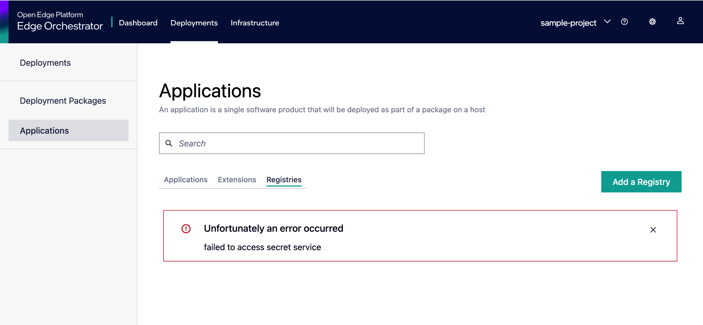
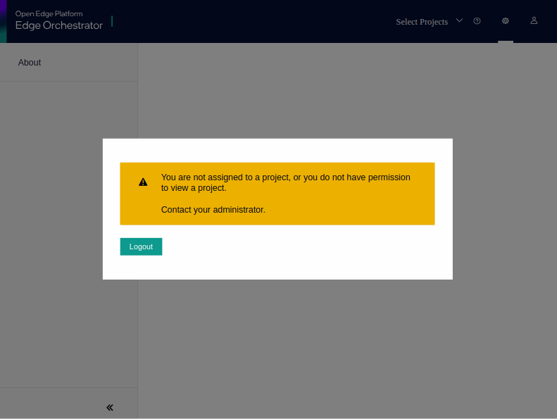

==============
User Interface
==============

The Orchestrator UI is a single-page application that is completely stateless and relies on data provided via a REST API to populate its content.
For this reason, it is always important to keep track of the API responses in conjunction with what is displayed in the UI.

How to check the API calls that the UI is making and the corresponding responses
================================================================================

You can follow this guide to see the requests and responses that the UI sends and receives.

#. Open the browser console
    - Note that to capture requests the console needs to be open before the request is sent
    - To do that, right-click anywhere on the page, and select “Inspect” (note that different browsers will have small variations, e.g., “Inspect Element”). The common shortcut to open the console is Cmd + Alt + J (Google* Chrome on Mac*)
#. In the top Menu of the console select “Network”
    - You can filter the request for “Fetch/XHR” as all the API interactions will be in that category
    - If you are looking for a specific object and you know the ID (e.g., a deployment) you can also use the text box to filter only the requests that have that ID in the URL
    - .. image:: ./images/ui/console-network-1.png
         :alt: Browser Console Network Tab
         :width: 100%
#. Find the failed request
    - They are generally highlighted in red
    - .. image:: ./images/ui/console-network-2.png
         :alt: Browser Console Network Tab
         :width: 100%
#. Click on the failed request
    - This opens a new tab that lets you see all the details of such a request
    - .. image:: ./images/ui/console-network-3.png
         :alt: Browser Console Network Tab
         :width: 100%
#. Where to find information:
    - Headers -> contains the URL, the REST Headers, and other generic information
    - Payload -> contains the data sent to the server
    - Preview -> A formatted representation of the response
    - Response -> The plain response
#. Export the entire request:
    - Right-click on the request you want to export and then select “Save all as HAR” (the text might be slightly different depending on the browser)
    - .. image:: ./images/ui/console-network-4.png
         :alt: Browser Console Network Tab
         :width: 100%

Known issues and solutions
==========================

The following is a list of known issues that occasionally appear in the UI during development and the best-known solution. This is not intended to address issues in productions, as those should be treated as bugs and fixed.

Application registries cannot be fetched
----------------------------------------

When you open the App Catalog Registries tab, you may see an error message indicating that the registries cannot be fetched.

This happens when Vault is sealed in your setup.

**Solution**:

.. code-block:: bash

    mage vault:unseal

User has no roles assigned
--------------------------

The UI shows the error message `You are not assigned to a project, or you do not have permission to view a project` and only
allows you to log out.

This means that the user has not been assigned to any project or organization.
To add the user to the required project or organization, refer to the
:doc:`/shared/shared_mt_overview` guide.
