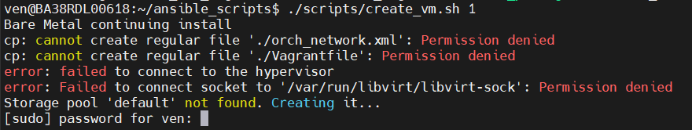
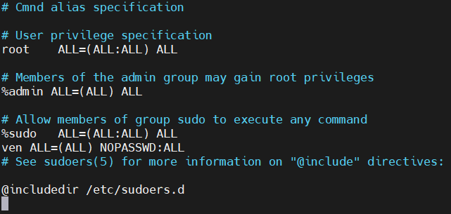
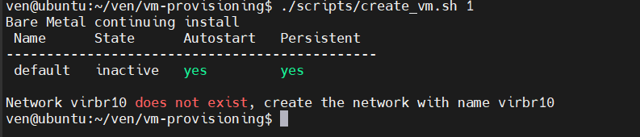
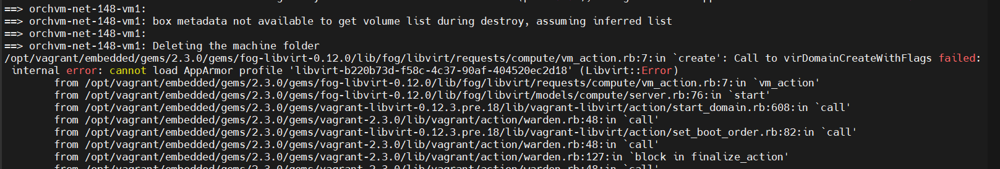
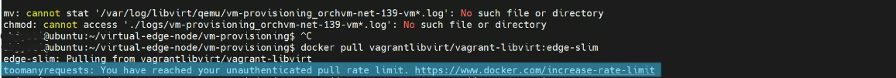
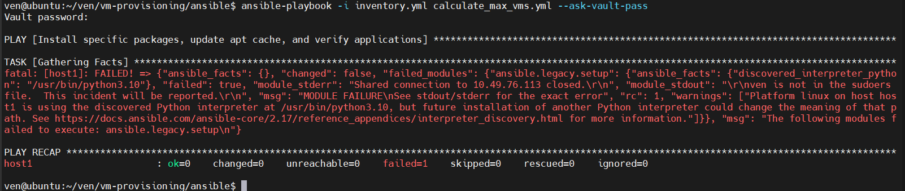

Virtual Edge Node Issues
========================

Here is a list of common virtual edge node creation issues and tips to
resolve them.

.. _user_access_setup:

User Access Setup
-----------------

**Important:** Intel recommends to use a non-root user all the time. Running as root
can lead to security risks and unexpected behavior, especially if the VM
creation process is designed to be run by a non-root user.

If permission errors occur during administrative tasks or managing
virtualization tools, ensure the user is in the necessary groups.

Check the user groups:

.. code:: shell

    groups <username>

Add the User to Groups
^^^^^^^^^^^^^^^^^^^^^^

If you have access to another user account with sudo privileges, log in as
that user and add the user to the following groups. This could be the root
user or another administrative account.

.. code:: shell

    sudo usermod -aG sudo,kvm,docker,libvirt <username>

**OR:** You can create a new user using the script
``./script/create-new-user.sh``. This will create a new user and add the new
user to the required user groups.

Edit the Sudoers File
^^^^^^^^^^^^^^^^^^^^^

You must make specific changes to the sudoers file. Use the `visudo` command to
safely edit it:

.. code:: shell

    sudo visudo

Add the following line if you want to grant ``<username>`` full sudo privileges
without a password prompt:

``<username> ALL=(ALL) NOPASSWD:ALL``

**Example:**

**Note:** You must log out and log back in to apply the changes.

Troubleshooting Bridge Network Issues
-------------------------------------

When creating a VM using a Vagrant file, you may encounter a "network not
found" error if the specified bridge network name is not available on the
system.

Verifying Network Configuration
^^^^^^^^^^^^^^^^^^^^^^^^^^^^^^^

Ensure that the network is correctly configured and active on your system. Use
the following command to list all available networks and verify that your
network is active:

.. code:: shell

    ip link show

Check Network Status
^^^^^^^^^^^^^^^^^^^^

Ensure that the network interface is up and running:

.. code:: shell

    sudo ip link set dev <network_name> up

Replace ``<network_name>`` with the name of your network.

AppArmor Issue Resolution
^^^^^^^^^^^^^^^^^^^^^^^^^

This section provides steps to resolve issues related to AppArmor\* profiles,
particularly when dealing with libvirt.

**Example:**

Reinstall Packages
^^^^^^^^^^^^^^^^^^

Ensure that all necessary packages are reinstalled to address any potential
issues with missing or corrupted files.

Reload AppArmor Module
^^^^^^^^^^^^^^^^^^^^^^^

Reloading the AppArmor profiles can sometimes resolve issues with profile
loading:

.. code-block:: bash

    sudo systemctl reload apparmor

Restart libvirt
^^^^^^^^^^^^^^^

Restart the libvirt service to apply any changes and ensure it is running
correctly:

.. code-block:: bash

    sudo systemctl restart libvirtd

Comprehensive Commands
^^^^^^^^^^^^^^^^^^^^^^

If the above steps do not resolve the issue, execute the following commands to
clean up and reset the environment:

**Note:** These actions will remove certain VM-related files. Ensure backups
are made if necessary.

Remove Boot Certificates
~~~~~~~~~~~~~~~~~~~~~~~~

.. code:: shell

    sudo rm -rf /var/lib/libvirt/boot/<network_name>_ca.der

Replace ``<network_name>`` with the name of your network.

Delete OVMF Firmware Files
~~~~~~~~~~~~~~~~~~~~~~~~~~

.. code:: shell

    sudo rm -rf /usr/share/OVMF/OVMF_*_<network_name>-vm*.fd

Clear VM Disk Images
~~~~~~~~~~~~~~~~~~~~

.. code:: shell

    sudo bash -c "rm -rf /var/lib/libvirt/images/$(basename "$PWD")_<network_name>-vm*.qcow2"
    sudo bash -c "rm -rf /var/lib/libvirt/images/$(basename "$PWD")_<network_name>-vm*.raw"

Move and Set Permissions for Logs
~~~~~~~~~~~~~~~~~~~~~~~~~~~~~~~~~

.. code:: shell

    sudo bash -c "mv /var/log/libvirt/qemu/$(basename "$PWD")_<network_name>-vm*.log ./logs/"
    sudo chmod 644 "./logs/$(basename "$PWD")_<network_name>-vm"*.log

Docker\* Rate Limit Exceeded
-----------------------------

This section provides steps to resolve the "Docker rate limit exceeded" error
encountered while creating VMs using Docker\* Hub and Vagrant tool. This issue arises
when the unauthenticated pull rate limit on Docker Hub is reached.

If you already have the Docker image available on another VM, you can transfer
it to your current VM to avoid hitting Docker Hub's rate limits. Here's how
you can do it:

- Save Docker Image: Use the `docker save` command to export the Docker image
  to a tar file.

Replace ``<image_name>`` with the name of your Docker image (in the VM where
the Docker file exists).

.. code:: shell

    docker save -o myimage.tar <image_name>

- Transfer the Tar File to the Destination VM:

.. code:: shell

    scp myimage.tar user@destination_ip:/path/to/destination

- Load the Docker Image on the Destination VM:

.. code:: shell

    docker load -i /path/to/destination/myimage.tar

- Verify the Image is Available:

.. code:: shell

    docker images

Permission Denied Errors [VMs Creation with Ansible\* Scripts]
---------------------------------------------------------------

Ensure the user has the necessary permissions to access directories and files.

**Troubleshooting:**

Ensure that the user running the script has the necessary permissions to
access the directories and files involved. Use ``chmod`` to adjust file and
directory permissions, and ``chown`` to change ownership if necessary.
Consider using ``become: yes`` to execute tasks with elevated privileges.

.. code:: shell

    chmod +x `install_packages`.sh

Variable Not Found in Inventory or Secret File
----------------------------------------------

If you encounter an error indicating that a variable is not found while
reading the inventory or secret file, follow these steps:

- **Verify File Paths**: Ensure that the paths to all directories
  (scripts, templates, certs) and files (config, `install_packages`.sh)
  are correct. Also, ensure the secret file path is correct.

- **Check Permissions**: Confirm that you have the necessary permissions to
  read the inventory and secret files. Use the ``ls -l`` command to check file
  permissions and adjust them if necessary using ``chmod`` or ``chown``.

- **Validate Variable Names**: Ensure that the variable names used in
  playbooks match those defined in the inventory or secret files. Look for
  typos or case sensitivity issues.

- **Review File Content**: Open the inventory and secret files to verify that
  the expected variables are defined. Ensure that the files are not empty or
  missing critical sections.

Vagrant File and Network Configuration [VMs Creation with Ansible Scripts]
--------------------------------------------------------------------------

Problems with the Vagrant file or issues with network configuration can
prevent the virtual machine from being created or configured correctly and
connecting to the network.

**Troubleshooting:**

Ensure that the Vagrant file is correctly configured with network settings and
provisioning scripts. Verify that the bridge network is correctly configured
in the Vagrant file and that the host machine supports bridge networking. Use
``ansible-playbook <ansible-playbook.yml> -vvv`` to run the playbook with
increased verbosity and identify the source of errors.

.. code:: shell

    ansible-playbook -i inventory.yml `create_vms`.yml -vvv

Resource Limitations [VMs Creation with Ansible Scripts]
--------------------------------------------------------

Insufficient resources on the host machine can lead to failures in creating or
running the virtual machine.

**Troubleshooting:**

- Ensure that the host machine has enough CPU, memory, and disk space to
  support the virtual machine.
- Adjust the number of VMs in the inventory file if necessary.

To ensure the maximum number of VMs can be created on the remote host, run the
``calculate_max_vms.yml`` playbook.

.. code:: shell

    ansible-playbook -i inventory.yml `calculate_max_vms`.yml

If you encounter permission issues as shown below:

Add the user in the required user groups, refer to the
:ref:`User Access Setup <user_access_setup>`.

Additional General Troubleshooting Steps [VMs Creation with Ansible Scripts]
----------------------------------------------------------------------------

Review logs generated by `install_packages` and `create_vms` scripts for error
messages and warnings. Use commands to view the logs in real time:

.. code:: shell

    tail -f create_vms_log.txt
