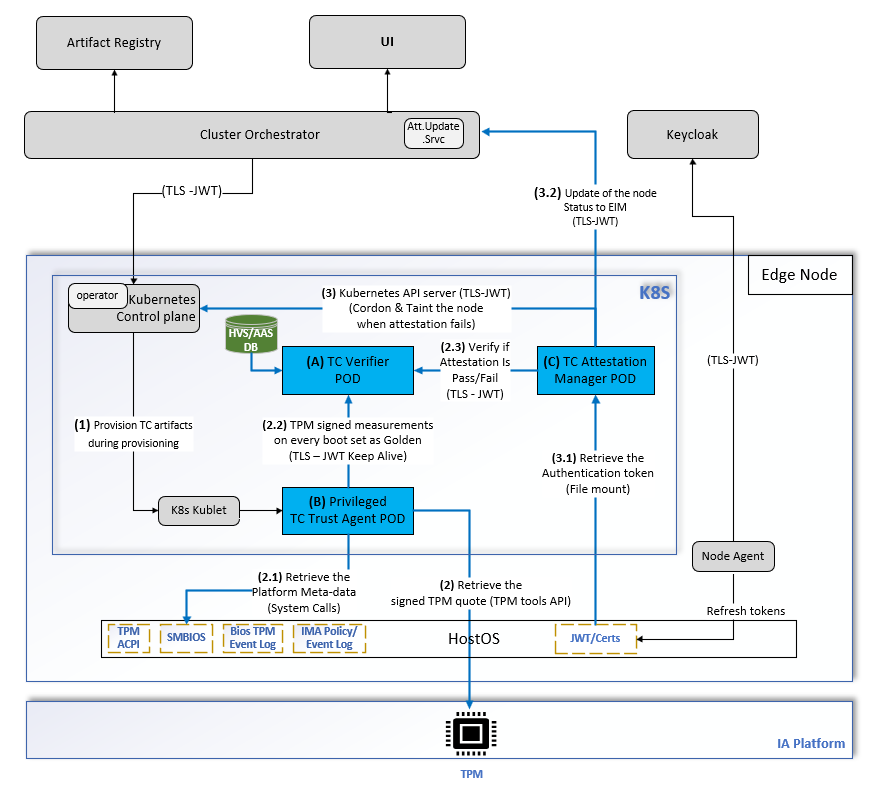
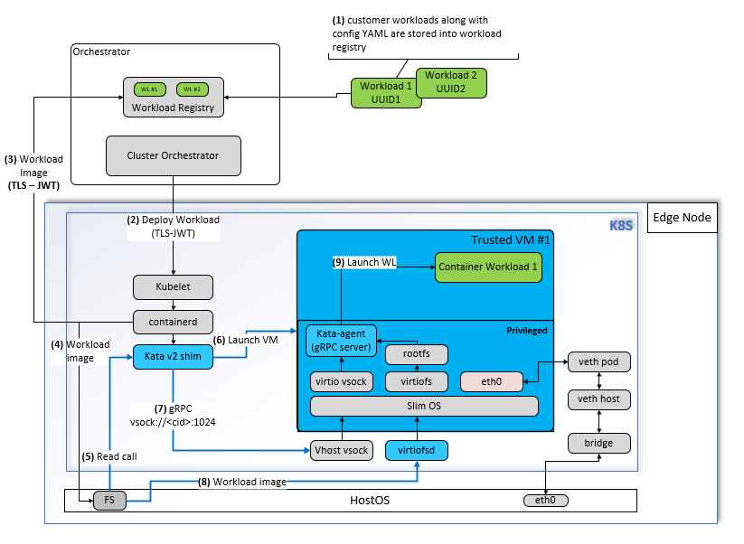

Architecture
============

Trusted Compute is a set of software defined security extensions that utilize hardware security capabilities on the Edge Manageability framework.

Objective
----------
Trusted Compute enabled edge nodes provide protections by:

- **Continuous Monitoring:** Ensure the integrity of platform firmware, OS kernel, critical system components, and runtime environment through ongoing measurement and attestation.
- **Isolated Execution:** Securely execute workloads to prevent unauthorized access or interference, and protect the trusted host from the workloads.

Provision the Edge Node Cluster with Trusted Compute Extension
~~~~~~~~~~~~~~~~~~~~~~~~~~~~~~~~~~~~~~~~~~~~~~~~~~~~~~~~~~~~~~
- **Selection:** Users select the edge node to be Trusted Compute enabled during provisioning.
- **Provisioning:** Trusted Compute extension artifacts are provisioned to the edge node during its setup.

Platform Prerequisites for Enabling Trusted Compute
~~~~~~~~~~~~~~~~~~~~~~~~~~~~~~~~~~~~~~~~~~~~~~~~~~~
- **Secure Boot:** For Trusted compute extensions to be deployed, Secure Boot must be enabled on the edge node.
- **Full Disk Encryption:** Platform must also enable full disk encryption.

Continuous Integrity Monitoring Mechanism
-----------------------------------------
Continuous monitoring involves three key pods:

- Trust Agent Pod
- Verifier Pod
- Attestation Manager Pod

Trust Agent
~~~~~~~~~~~
The Trust boot process establishes a chain of trust from the firmware to the bootloader, kernel, and userspace by measuring the integrity of each component. These measurements (hashes) are stored in the TPM's platform configuration registers (PCR), ensuring the system's trustworthiness. The Trust Agent on the node securely retrieves signed quotes of these measurements from the TPM for remote comparison by the verifier against expected golden values (attestation).

Verifier
~~~~~~~~
A verifier pod comprises four components:

- AAS (authentication and authorization service)
- CMS (certificate management service)
- HVS (host verification service)
- Nats Server (Neural Autonomic Transport System)

The scope of the verifier pod is to:

- Securely retrieve signed quotes from the trust agent pod for every attestation and verify against expected golden flavors and publish the trust report.
- After every reboot of the edge node, the first TPM measurements are set as Golden flavors.

Flavors
~~~~~~~
Flavor creation is the process of adding one or more sets of acceptable golden measurements to the Verification Service database. These measurements correspond to specific system components and are used as the basis of comparison to generate trust attestations. Flavors are automatically matched to hosts based on the Flavorgroup used by the host and the Flavors, and the Flavor Match Policies of the Flavorgroup.

Trust Report Generated by Verifier
~~~~~~~~~~~~~~~~~~~~~~~~~~~~~~~~~~
Trust report is a JSON-formatted report includes a chain or signatures that provides auditability for the Report. The JSON attestation will include the base trust status of the host, as well as the overall trust for each individual Flavor used in the attestation. The Report will also contain host information, such as TPM version, Operating System name and version, BIOS version, etc

Attestation Manager
~~~~~~~~~~~~~~~~~~~
The scope of the Attestation Manager pod is to:

- Set golden flavors with Verifier.
- Set policy for attestation (cron job).
- Verify if the attestation result is a pass or a fail.
- Verify the base dependency (platform metadata), such as secure boot is turned on for every attestation report.
- Update the Edge Infrastructure Manager Instance status when an attestation fails.
- Cordon the node by calling Kubernetes* API server API when an attestation fails.

How Often Should an Attestation Be Run?
~~~~~~~~~~~~~~~~~~~~~~~~~~~~~~~~~~~~~~~

- Users can define a policy in Helm\* charts using the "pollDuration:" field in the values.yaml file to specify how often the attestation should run. The default value is set to 60 minutes. Below is a snippet from values.yaml:
- Every time a node platform reboots, the Trust Agent automatically initiates an attestation.

| env:
|  pollDuration: "60" # duration in minutes

Confidential Workload Protection
--------------------------------
Trusted Compute allows orchestrating and executing a confidential workload within an isolated & trusted VM on the edge node. The security objectives of this approach are:

- Data confidentiality: Unauthorized entities cannot view data while it is in use within the VM.
- Data integrity: Unauthorized entities cannot add, remove, or alter data while it is in use within the VM.
- Code integrity: Unauthorized entities cannot add, remove, or alter code executing in the VM.

The following sections describe the software architecture for protecting workloads using VM-based Isolated Execution Environments in a Kubernetes environment.

Workload (App & Package) Prerequisites for Trusted Compute
~~~~~~~~~~~~~~~~~~~~~~~~~~~~~~~~~~~~~~~~~~~~~~~~~~~~~~~~~~
1. **Build Container Image:** For applications & packages (workloads) that require higher levels of isolation, add configuration to application’s Helm chart to change runtime for container execution.
TODO: Add sample Helm chart here.
2. **Push to Registry:** The user pushes the container image(s) to the workload registry. This is represented as **Step 1** in the diagram.

Deploying the Confidential Workload in Edge Orchestrator
~~~~~~~~~~~~~~~~~~~~~~~~~~~~~~~~~~~~~~~~~~~~~~~~~~~~~~~~
1. **Deploy Workload:** The user deploys the workload using Edge Orchestrator. This is represented as **Step 2** in the diagram.
2. **Orchestration:** Edge Orchestrator schedules the confidential workload to target nodes that are Trusted Compute ready.
3. **Pull Trusted VM Image:** The containerd runtime pulls the trusted VM image along with the workload and stores them on the node's file storage. This is represented as **Steps 3 & 4** in the diagram.
4. **Launch Trusted VM:** The trusted VM is launched and booted up. This is represented as **Step 5** in the diagram.

Workload Execution Flow
~~~~~~~~~~~~~~~~~~~~~~~
1. **Bootstrap Workload:** The Kata runtime shim communicates with the Kata agent within the trusted VM to bootstrap the workload from the mount point. This is represented as **Steps 6, 7, and 8** in the diagram.
2. **Launch Workload:** The Kata agent launches the workload with the necessary resources. This is represented as **Step 8** in the diagram.
