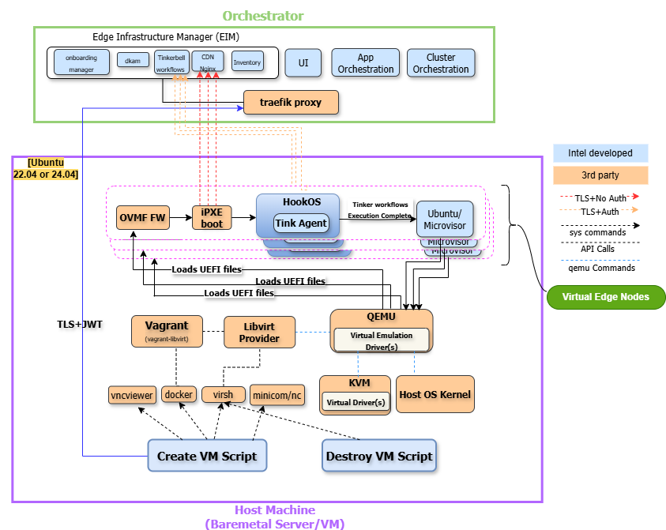

Architecture
============

In this section, you will find the solutions and architecture documentation for projects
under the umbrella of Virtual Edge Node. The Virtual Edge Node consists of components in
|software_prod_name|, such as Vagrant, Libvirt, QEMU, KVM, and Shell scripts, Ansible scripts,
that are responsible for the lifecycle management of virtual machines, including creation,
deletion, scaling, and monitoring. The Virtual Edge Node is built on top of vagrant and libvirt and hides
the complexity of provisioning VMs from Day 0 from the end user by using Shell or Ansible
scripts to create and delete VMs.

Virtual Edge Node supports the creation of VMs from the very beginning of the lifecycle, known as Day 0.
Additionally, it handles Day 1 provisioning, which includes the destruction of VMs, ensuring efficient
resource management and adaptability to changing requirements..

Overview
--------

The Virtual Edge Node is designed to streamline the onboarding and provisioning
of virtual machines, as well as the deployment, management, and testing of edge
computing applications. It provides a set of scripts, templates, and configurations
designed to streamline and automate the initial setup and deployment of virtual
machines (VMs) during the Day 0 provisioning phase on an Edge Orchestrator. It
utilizes Vagrant and libvirt APIs to ensure efficient and smooth VM provisioning.

Features
^^^^^^^^

- **Package Installation**: Manages the installation of necessary packages and
  dependencies before VM provisioning, ensuring a seamless setup process.
- **Reference Templates**: Offers predefined templates to simplify the
  configuration and provisioning of VMs.
- **VM Resources and Edge Orchestrator Configuration**: Manages VM resources and
  specifies the Edge Orchestrator URL for downloading the EFI boot file.
- **Provisioning Monitoring**: Uses `socket_login.exp` to monitor and track the
  progress of VM provisioning in real-time. Tools like Minicom and VNC Viewer are
  useful for monitoring the provisioning process of VMs.
- **Ansible Scripts**: Provides automation scripts for configuring, creating and
  deleting VMs, ensuring consistent and efficient deployment and scaling.

High-Level Architecture
-----------------------

Virtual Edge Node leverages the existing system components:

- **Vagrant**: It is a tool for automating the creation and configuration of
  virtualized environments. It communicates with Libvirt through a Vagrant provider
  plugin called vagrant-libvirt.

- **Libvirt**: Libvirt manages the lifecycle of VMs, including resource allocation,
  network configuration, and storage management, by interfacing with QEMU.

- **KVM**: KVM provides hardware-accelerated CPU virtualization. KVM leverages
  hardware virtualization extensions available in modern CPUs, such as Intel® Virtualization Technology (Intel® VT) for IA-32, Intel® 64 and Intel® Architecture (Intel® VT-x)
  and AMD* Virtualization (AMD-V).

- **QEMU**: If KVM is not supported, QEMU is used for software CPU emulation. It
  provides essential functionality for testing, development, and running VMs on
  systems with/without hardware virtualization support.

.. toctree::
   :hidden:

   workflows
   technology_stack
