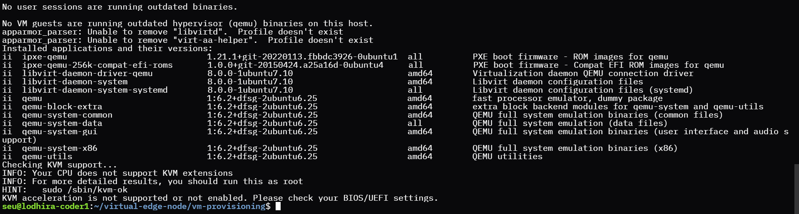

========================
Deployment on AWS* Cloud
========================

After cloning the repository, it's crucial to verify the dependencies required for a KVM-based virtualization environment on your AWS* instance as a prerequisite.
These dependencies ensure your instance is equipped with the necessary tools and libraries to manage virtual machines effectively.

Clone the repository to access the necessary scripts and configurations for deployment:

.. code-block:: shell

    git clone https://github.com/open-edge-platform/virtual-edge-node.git

To check compatibility and availability, move to the `vm-provisioning` repository and run the following commands:

.. code:: shell

    make dependency-check

After executing this command, you should see output similar to the following:

**Note**: If your instance supports nested KVM, it leverages hardware virtualization features provided by modern CPUs,
such as Intel® Virtualization Technology (Intel® VT) for IA-32, Intel® 64 and Intel® Architecture (Intel® VT-x) and AMD* Virtualization (AMD-V).
However, if KVM is not supported, you can consider using QEMU as an alternative. While QEMU allows for successful onboarding of the Virtual Edge Node,
it does not benefit from hardware acceleration, resulting in slower performance compared to KVM-enabled environments.
It is crucial to plan for this trade-off and anticipate potential performance impacts during deployment.

The Virtual Edge Node provisioning tool streamlines VM setup on bare metal servers using automated scripts and templates.
Start by preparing your server environment and following the provided instructions for efficient deployment.

.. toctree::
    :maxdepth: 1

    ../usage/how_it_works_content
    ../usage/getting_started
    ../usage/setup_virtual_edge_node
    ../usage/deploy_virtual_edge_node
    ../usage/manage_virtual_edge_node
