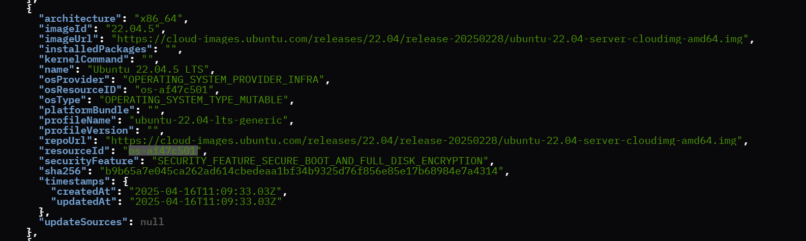

Examples-1: IO Flow 
======================================

Deploying a virtual edge node can be efficiently achieved using the Interactive (IO) flow, leveraging two distinct OS profile resources.

Example 1.1: IO Flow with Ubuntu OS Profile Resource
----------------------------------------------------------

Step 1: Configure the Provider
~~~~~~~~~~~~~~~~~~~~~~~~~~~~~~~

Begin the provisioning process by setting the provider with the Ubuntu OS profile resource, ensuring the security feature is set to "securityFeature":"SECURITY_FEATURE_NONE".
Refer to the image below for guidance

Sample Ubuntu OS Resource: 

Sample Ubuntu Provider Details

.. image:: images/Ubuntu_os_provider.png
   :alt: Ubuntu Provider Details

Step 2: Export the IO flow configs
~~~~~~~~~~~~~~~~~~~~~~~~~~~~~~~~~~~~~

Before running the IO flow script, export the onboarding username and password:

.. code:: shell

    export ONBOARDING_USERNAME="ONBOARDING_USER"
    export ONBOARDING_PASSWORD="ONBOARDING_PASSWORD"

- **ONBOARDING_USERNAME="ONBOARDING_USER"**: This variable represents the username to start IO flow. Replace "ONBOARDING_USER" with the actual username.
- **ONBOARDING_PASSWORD="ONBOARDING_PASSWORD"**: This variable holds the password for the onboarding user. Replace "ONBOARDING_PASSWORD" with the actual password.

Step 3: Run the Create VM script to onboard the VM using the IO flow
~~~~~~~~~~~~~~~~~~~~~~~~~~~~~~~~~~~~~~~~~~~~~~~~~~~~~~~~~~~~~~~~~~~~~~~~~

Run the Create VM script to onboard the virtual machines using the IO flow. Specify the number of VMs to be created:

.. code:: shell

    chmod +x ./script/create_vm.sh
    ./script/create_vms.sh 3

Example 1.2: IO Flow with Edge Microvisor Toolkit Profile Resource
-------------------------------------------------------------------

Deploying a virtual edge node using the Edge Microvisor Toolkit profile resource follows a similar process to the Ubuntu setup, with a key distinction in the initial configuration.
To proceed, simply set the provider with the Edge Microvisor Toolkit resource, ensuring it is correctly configured for deployment. Refer to the image below for detailed guidance:

Sample Edge Microvisor Toolkit Resource

.. image:: images/Microvisor_os_resource.png
   :alt: Edge Microvisor Toolkit Resource

Sample Edge Microvisor Toolkit Provider Details

.. image:: images/Microvisor_provider.png
   :alt: Edge Microvisor Toolkit Provider Details

Once the provider is configured with the Edge Microvisor Toolkit resource, follow the same steps outlined in Example 1.1 to onboard the virtual edge node. This includes exporting
the necessary IO flow configurations, and executing the "create_vm.sh" script with required number of VMs.

Monitoring and Logging
------------------------

Monitor VM provisioning in real-time, providing immediate feedback and logging for troubleshooting.

.. code-block:: shell

    ./socket_login.exp intel-user User1234 /tmp/console0_orchvm-net-218-vm1.sock

Replace 'intel-user' with actual Onboarding username and 'User123' with password, followed by actual bridge network. Execute the following command to find the active bridge networks:

.. code-block:: shell

    virsh list --all

Check Host Status
--------------------

You can see the host status by running the show_host_status.sh script as shown below.

.. code-block:: shell
   
   chmod +x ./scripts/show_host_status.sh
   ./scripts/show_host_status.sh

Sample Ubuntu OS Host Status:

.. image:: images/host-status.png
   :alt: Ubuntu OS Host Status
