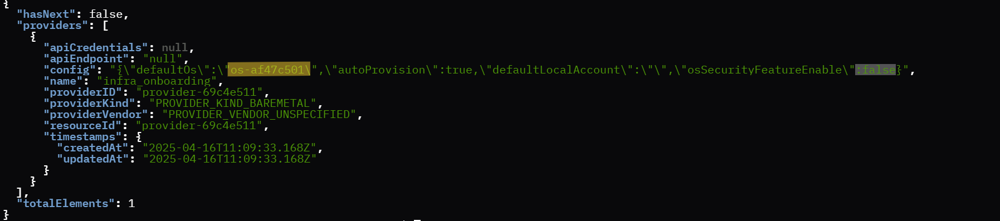
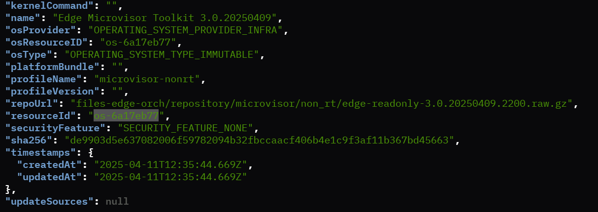
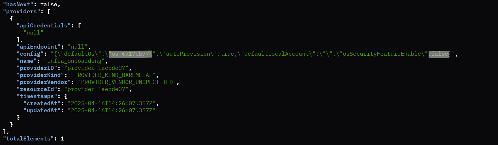
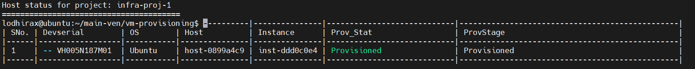

Example-3: NIO Flow with Custom Serial Numbers
====================================================

Deploying a virtual edge node can be efficiently achieved using the Non-Interactive (NIO) flow with Custom Serial numbers, leveraging two distinct OS profile resources.
It is important to note that the profiles must be configured with "securityFeature":"SECURITY_FEATURE_NONE" boot settings to ensure compatibility and ease of deployment.

Example 3.1: NIO Flow with Ubuntu OS Profile Resource
--------------------------------------------------------

Step 1: Configure the Provider
~~~~~~~~~~~~~~~~~~~~~~~~~~~~~~~~~~~

Begin the provisioning process by setting the provider with the Ubuntu OS profile resource, ensuring the security feature is set
to "securityFeature":"SECURITY_FEATURE_NONE". Refer to the image below for guidance:

Sample Ubuntu OS Resource:

.. image:: images/Ubuntu_os.png
   :alt: Ubuntu OS Resource

Sample Ubuntu Provider Details

Step 2: Export the NIO Flow Configurations
~~~~~~~~~~~~~~~~~~~~~~~~~~~~~~~~~~~~~~~~~~~~~~~~

Non-Interactive Onboarding Project and User Configurations are used to automatically register the dynamically created Virtual Edge Node Serial Number. Before running the
NIO flow script, export the project API username and password:

.. code:: shell

    export PROJECT_API_USER="your_project_api_username"
    export PROJECT_API_PASSWORD="your_project_api_password"
    export PROJECT_NAME="your-project-name"

Step 3: Run the Create VM Script with Custom Serial Numbers
~~~~~~~~~~~~~~~~~~~~~~~~~~~~~~~~~~~~~~~~~~~~~~~~~~~~~~~~~~~~~~~

Use this option to specify custom serial numbers for each VM. Run the Create VM script to onboard the virtual machines using the NIO flow.
Specify the number of VMs to be created and provide custom serial numbers:

.. code:: shell

    chmod +x ./scripts/create_vm.sh
    ./scripts/create_vm.sh 3 -nio -serials=VM112M01,VM112M02,VM113M01

Example 3.2: NIO Flow with Edge Microvisor Toolkit Profile Resource
-------------------------------------------------------------------

Deploying a virtual edge node using the Edge Microvisor Toolkit profile resource follows a similar process to the Ubuntu setup, with a key distinction
in the initial configuration. To proceed, simply set the provider with the Edge Microvisor Toolkit resource, ensuring it is correctly configured for deployment.
Refer to the image below for detailed guidance:

Sample Edge Microvisor Toolkit Resource

Sample Edge Microvisor Toolkit Provider Details

Once the provider is configured with the Edge Microvisor Toolkit resource, follow the same steps outlined in Example 1.1 to onboard the virtual edge node. This
includes exporting the necessary NIO flow configurations and executing the create_vm.sh script with the required number of VMs and custom serial numbers.

Monitoring and Logging
------------------------

Monitor VM provisioning in real-time, providing immediate feedback and logging for troubleshooting.

.. code-block:: shell

    ./socket_login.exp intel-user User1234 /tmp/console0_orchvm-net-218-vm1.sock

Replace 'intel-user' with actual Onboarding username and 'User123' with password, followed by actual bridge network. Execute the following command to find the active bridge networks:

.. code-block:: shell

    virsh list --all

Check Host Status
--------------------

You can see the host status by running the show_host_status.sh script as shown below.

.. code-block:: shell
   
   chmod +x ./scripts/show_host_status.sh
   ./scripts/show_host_status.sh

Sample Ubuntu OS Host Status

