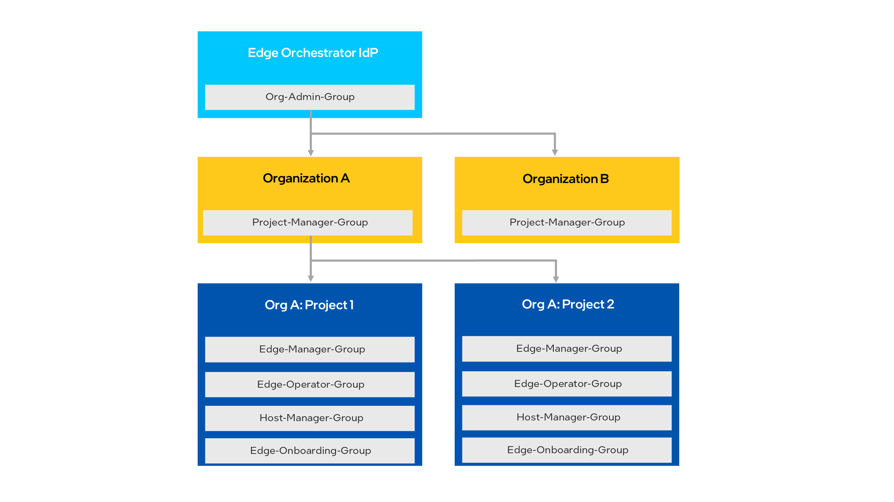

Configure Multi-Tenancy
=======================

Edge Orchestrator supports multi-tenancy, which allows resource isolation
across multiple tenants within a single Edge Orchestrator deployment.

The System Integrator that manages the Edge Orchestrator deployment can
configure tenants that are isolated from each other - a "vertical slice" of the Edge Orchestrator functionality.
Each tenant would appear to have its own set of resources such as edge nodes, clusters, deployments, and etc.; and could not view the resources of others.

Tenancy Concepts
----------------

Edge Orchestrator offers a two-level tenancy structure, with organizations that can contain one or more projects.

Organizations
~~~~~~~~~~~~~

An organization is the top-level tenant construct, which provides:

* Isolation at an Identity and Access Management (IAM) level - a single Edge Orchestrator
  can be federated with Single-Sign On (SSO) at the IAM level with the Identity Provider
  (IdP) of multiple companies, with all companies as members of a single organization.
  See :doc:`/shared/shared_ht_iam_ext` for details.

* Isolation of organization-wide observability data, which are the logs and
  metrics.

Projects
~~~~~~~~

Within each organization, a user can be a member of one or more projects.

Projects provide:

* Isolation of Edge Orchestrator resources, such as clusters, application
  deployments, and edge nodes. After selecting a project, a user can see the resources
  within that project.
* Per-project permissions.  A user can be a member of an administrator group on one project
  within an organization, but a member of a read-only group on another project.

Tenant Planning
---------------

Before configuring a set of tenants, Intel recommends that you plan out the
tenants in the system. Groups that grant permissions at the organization and project levels
are created dynamically during the tenant creation process, and you will need to decide
which users will be added to those groups.

A example tenancy hierarchy is shown as follows:

When Edge Orchestrator is installed, the global IdP admin is created (see details at
:doc:`/shared/shared_gs_iam`), which typically is
added to the
`Org Admin Group <./shared_iam_groups.html#org-admin-group>`__.
Using those permissions, the IdP admin can `Create Organizations`_. In this example, they
create organizations ``A`` and ``B``.

.. note::

   When a user creates an organization (or a project), that user is not
   automatically made a member of that organization or project. If desired, you need to add the user to the group using the instructions
   in `Configuring Users and Groups in Keycloak Idp <./shared_gs_iam.html#configuring-users-and-groups-in-keycloak-idp>`__.

When organizations are created, a `Org ID Project Manager Group <./shared_iam_groups.html#org-id-project-manager-group>`__ is
dynamically added to the Keycloak\* IdP for each organization. To manage projects within the organization, you need to add a user into this group - see
`Configuring Users and Groups in Keycloak Idp <./shared_gs_iam.html#configuring-users-and-groups-in-keycloak-idp>`__ for instructions. In this example, a
user was added to org A's ``Project-Manager-Group``, and creates projects 1 and
2 through the steps in `Create Projects`_.

On project creation, the groups that grant access to Edge Orchestrator resources, are dynamically created. You would then need to add users to these groups to manage resources in each project.

In this release, these groups are placed in the Keycloak IdP master
realm.

.. note::

   A user should not be placed in more than one organization-specific group, or in multiple projects that belong to different organizations.

Configure Tenancy
-----------------

Before using with Edge Orchestrator, you must first create at least one
organization that contains at least one project, which will contain a set of Edge Orchestrator resources. The following instructions describe how to
complete this process.

.. note::
    Alternative guide to managing tenancy via CLI is available at: :doc:`/shared/shared_ht_iam_mt_cli`

Create Organizations
~~~~~~~~~~~~~~~~~~~~

The System Integrator can create organizations using the Tenancy REST API.

To create an organization, the administrator must be in the `Org Admin Group <./shared_iam_groups.html#org-admin-group>`__,
and set the ``JWT_TOKEN`` variable per `Obtaining a JSON Web Token (JWT) <./shared_gs_iam.html#obtaining-a-json-web-token-jwt>`__.

It is typical to put the IdP admin user in this group, see
:doc:`/shared/shared_gs_iam` for instructions on adding users to groups.

An example API call to create organizations by running in a shell/terminal is as follows. Replace the
name and description in this example with suitable values:

.. code-block:: shell

  JWT_TOKEN=[Set to token generated by member of Org-Admin-Group]
  CLUSTER_FQDN=edgeorchestration.example.com
  ORG_NAME=exampleorg
  ORG_DESC="An Example Org"

  curl -X PUT https://api.${CLUSTER_FQDN}/v1/orgs/${ORG_NAME} \
       -H "Content-Type: application/json" -H "accept: application/json" \
       -H "Authorization: Bearer ${JWT_TOKEN}" \
       -d "{\"description\": \"${ORG_DESC}\"}"

After the API has been called, organization-specific groups are created in
Keycloak solution, which grant permissions to the organization. See the
:doc:`/shared/shared_ht_iam_groups` for details.

Once you have created the organization and if you want federation and SSO,
see :doc:`/shared/shared_ht_iam_ext` for
further steps.

To identify groups belonging to this organization in Keycloak solution, or to make API calls,
you may need to obtain the UUID identifier for an Organization, which can be done through the API calls in this example:

.. code-block:: shell

  JWT_TOKEN=[Set to token generated by member of Org-Admin-Group]
  CLUSTER_FQDN=edgeorchestration.example.com
  ORG_NAME=exampleorg

  curl -s -X GET https://api.${CLUSTER_FQDN}/v1/orgs/${ORG_NAME} \
       -H "Content-Type: application/json" -H "accept: application/json" \
       -H "Authorization: Bearer ${JWT_TOKEN}" \
       | jq -r .status.orgStatus.uID

Create Projects
~~~~~~~~~~~~~~~

After creating an organization and associating users with the organization, make the organization user a member of the
`Org ID Project Manager Group <./shared_iam_groups.html#org-id-project-manager-group>`__, which allows them to create projects within that organization.
See `Configuring Users and Groups in Keycloak Idp <./shared_gs_iam.html#configuring-users-and-groups-in-keycloak-idp>`__ to create users and add them to groups.

Then, when logged in as a user in that group, you can create projects as follows:

#. At the Web UI, go to the project admin page at ``http://web-ui.CLUSTER_FQDN/admin/projects``:

   .. figure:: shared_images/mt_project_overview.png
      :width: 800px
      :alt: Multi-tenancy projects overview

#. Click the **Create Project** button, which will bring up a screen to enter a project name:

   .. figure:: shared_images/mt_project_create.png
      :width: 800px
      :alt: Multi-tenancy project creation

#. Enter a name, and click  **Create**. You will be returned to the main project list, and the project creation status will be shown:

    .. figure:: shared_images/mt_project_complete.png
       :width: 800px
       :alt: Multi-tenancy project completion

Users can also create projects using the API (replacing variables as needed):

#. The user doing this must be a member of the organization's `Org ID Project Manager Group <./shared_iam_groups.html#org-id-project-manager-group>`__,
and have set the ``JWT_TOKEN`` variable per `Obtaining a JSON Web Token (JWT) <./shared_gs_iam.html#obtaining-a-json-web-token-jwt>`__.
The following is an example:

  .. code-block:: shell

    JWT_TOKEN=[Set to token generated by member of <org-id>_Project-Manager-Group]
    CLUSTER_FQDN=edgeorchestration.example.com
    PROJ_NAME=manufacturing
    PROJ_DESC="Manufacturing Project"

    curl -X PUT https://api.${CLUSTER_FQDN}/v1/projects/${PROJ_NAME} \
       -H "Content-Type: application/json" -H "accept: application/json" \
       -H "Authorization: Bearer ${JWT_TOKEN}" \
       -d "{\"description\": \"${PROJ_DESC}\"}"

#. Once created, the project may take a short time to be instantiated. You can check the creation status through the API with the following example commands:

  .. code-block:: shell

    JWT_TOKEN=[Set to token generated by member of <org-id>_Project-Manager-Group]
    CLUSTER_FQDN=edgeorchestration.example.com
    PROJ_UUID=$(curl --location https://api.${CLUSTER_FQDN}/v1/projects/${PROJ_NAME} \
    -H "Content-Type: application/json" -H "accept: application/json" \
    -H "Authorization: Bearer ${JWT_TOKEN}" | jq -r .status.projectStatus.uID)

    while [ $(curl -s --location https://api.${CLUSTER_FQDN}/v1/projects/${PROJ_NAME} \
        -H "accept: application/json" -H "Content-Type: application" \
        -H "Authorization: Bearer ${JWT_TOKEN}" | jq -r .status.projectStatus.statusIndicator) \
        != "STATUS_INDICATION_IDLE" ]; do
    echo "Waiting for ${PROJ_NAME} to be provisioned..."
    sleep 5
    done

#. After creating a project, the administrator must add users to the project using Keycloak solution.  Obtain the project ID in the UI or through API, then go to Keycloak solution to add a user to the `group <https://www.keycloak.org/docs/latest/server_admin/index.html#proc-managing-groups_server_administration_guide>`_ associated to the project ID.

Default Tenancy
-----------------

If you wish to use Edge Orchestrator with a single tenant deployment, a default organization
and project can be created during Edge Orchestrator installation by enabling the single tenancy flag.
See :doc:`/deployment_guide/on_prem_how_to/onprem_single_tenancy` for details on enabling this flag.
In this case, a default organization and a default project is created named "default".  
Upon enabling this flag and successful installation of the Edge Orchestrator, a user called `tenant-admin`` is created in Keycloak solution, and added to the
`Org Admin Group <./shared_iam_groups.html#org-admin-group>`__ , `Project-Manager-Group <./shared_iam_groups.html#org-id-project-manager-group>`__, 
`Edge-Manager-Group <./shared_iam_groups.html#project-id-edge-manager-group>`__, `Edge-Onboarding-Group <./shared_iam_groups.html#project-id-edge-onboarding-group>`__,
`Edge-Operator-Group <./shared_iam_groups.html#edge-operator-group>`__ and `Host-Manager-Group <./shared_iam_groups.html#project-id-host-manager-group>`__.
The password for this user is set during installation.

Retrieve Password for tenant-admin user
~~~~~~~~~~~~~~~

To retrieve the tenant-admin password after tenant initialization, use the following command:

  .. code-block:: shell

    kubectl get secret tenant-admin-password -n orch-iam -o jsonpath='{.data.admin-password}' | base64 -d

You can also view the secret details including labels:

  .. code-block:: shell

    kubectl describe secret tenant-admin-password -n orch-iam

.. note::
  The password is base64 encoded in the secret and must be decoded for use.

Delete Tenants
--------------

You can delete both organizations and projects.

.. note::

  Deleting a project will delete all resources within that project. This
  includes edge nodes, which are deauthorized and would need to be re-onboarded to be used with Edge Orchestrator.

You can delete projects through the UI from the project admin page:

#. Click the three-dot icon next to the project and select **Delete**:

    .. figure:: shared_images/mt_project_menu.png
       :width: 800px
       :alt: Multi-tenancy project contextual menu

#. Type the name of the project in to confirm deletion, then click **Delete**:

    .. figure:: shared_images/mt_project_delete.png
       :width: 800px
       :alt: Multi-tenancy project deletion

The project status will be updated through the delete process. Deleting a
project may take some time to complete, depending on how many resources are
owned by the project.

You can also delete projects through API. The following is an example:

.. code-block:: shell

  JWT_TOKEN=[Set to token generated by member of <org-id>_Project-Manager-Group]
  CLUSTER_FQDN=edgeorchestration.example.com
  PROJ_NAME=manufacturing
  PROJ_DESC="Manufacturing Project"

  curl -X DELETE https://api.${CLUSTER_FQDN}/v1/projects/${PROJ_NAME} \
       -H "Content-Type: application/json" -H "accept: application/json" \
       -H "Authorization: Bearer ${JWT_TOKEN}"

Deleting an organization is only possible when all all projects within the
organization have been deleted. You can only delete organizations through the API. The following is an example:

.. code-block:: shell

  JWT_TOKEN=[Set to token generated by member of Org-Admin-Group]
  CLUSTER_FQDN=edgeorchestration.example.com
  ORG_NAME=exampleorg

  curl -X DELETE https://api.${CLUSTER_FQDN}/v1/orgs/${ORG_NAME} \
       -H "Content-Type: application/json" -H "accept: application/json" \
       -H "Authorization: Bearer ${JWT_TOKEN}"
