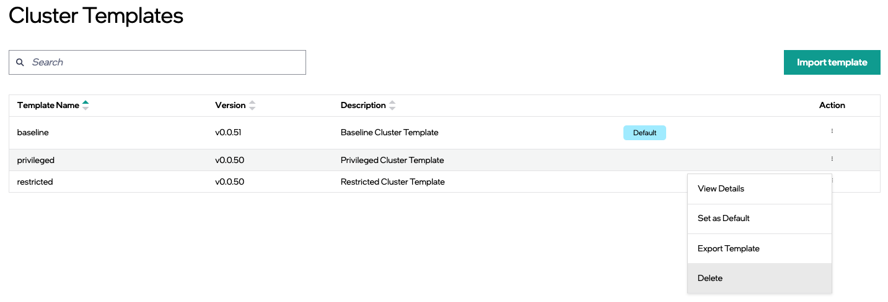

Delete Cluster Template
================================

You can delete a previously imported cluster template.  

.. note:: 
   You cannot delete a cluster template that is either assigned as the default cluster template or was used to create existing clusters.    

Perform the following steps to delete a cluster template:

1. Identify the cluster template you want to delete in the **Cluster Templates** page.

2. In the **Action** column, click the three-dot (...) icon, then click **Delete**.

   
3. On the confirmation window, click **Delete**.

