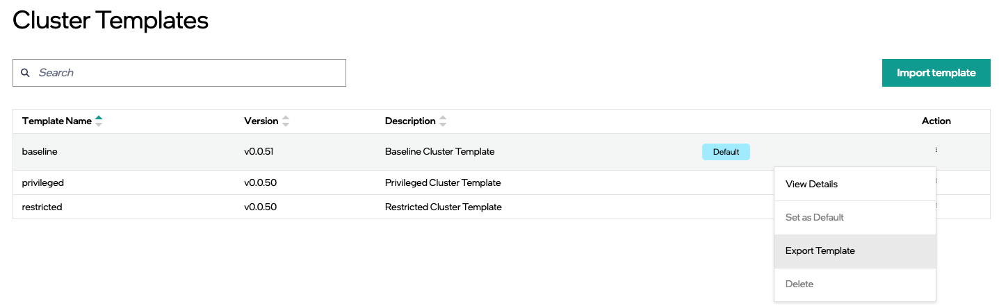

Export Cluster Template
================================

You can export a cluster template in JSON format to a file. This feature allows you to edit your template files locally. Once exported, you can edit the JSON files using the desired text editor and assign the template a new version number, making it easy to manage and maintain cluster templates.  
Maintaining each version of a cluster template using a source control system such as GitHub is recommended.			 

Do the following steps to export a cluster template:

1. Identify the cluster template you want to export in the **Cluster Templates** page.

2. In the **Action** column, click the three-dot (...) icon, then click **Export Template**.

You can also export template from the "View Cluster Template Details" page.
