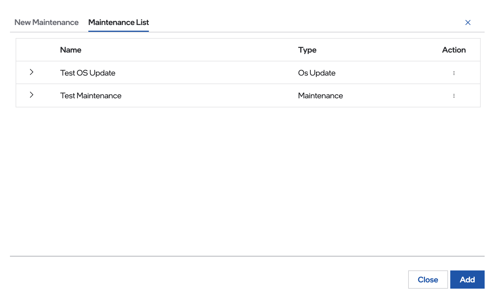
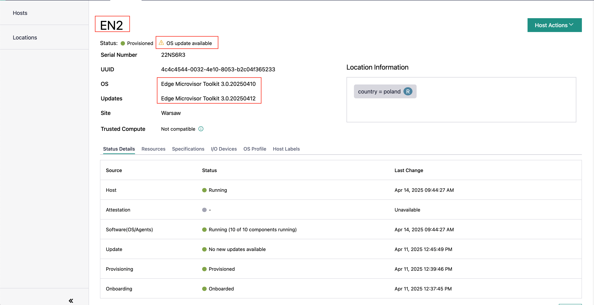

Schedule Maintenance for Configured and Active Hosts
==================================================================

You can schedule the maintenance of your configured and active hosts using
the **Schedule Maintenance** feature. This feature helps you define
time-based events, such as administrative downtime (for example, to move a
node), maintenance windows, software updates, or other events that may
happen once or need to be repeated on a schedule.

Maintaining a proper maintenance schedule helps prevent unexpected downtime and allows timely updates of hardware and software.

Some examples of administrative downtime are:

* Shipping or moving of an edge node
* Planned Internet downtime at the edge node site
* Planned electrical power downtime at the edge node site
* Physical edge node maintenance: refer to the edge node manufacturer
  documentation to do physical maintenance (for example, power supply unit failure)

.. note:: Some physical edge node maintenance may require node re-provisioning. For example, a hard-disk swap.

Schedule a Maintenance for a Single Edge Node
--------------------------------------------------

To schedule maintenance for a single Edge Node, do the following:

1. On the **Configured Host** or **Active Host** page, select the host that
   you want to schedule maintenance for.

#. Click the three-dot (...) icon in the **Actions** column for the desired
   host and select **Schedule Maintenance**. The **Maintenance Details** page appears:

   .. figure:: images/schedule_main.png
      :alt: Schedule Maintenance

#. Enter a name in the **Maintenance Name** field. The name is useful to identify the scheduled maintenance when more are available.

#. Select the maintenance type in the **Maintenance Type** field. The available maintenance types are:

   * **Maintenance**: To schedule any administrative downtime or edge node maintenance.
   * **OS Update**: To schedule edge node software updates (i.e. updates of already installed packages or to install new packages):
      - Refer to :doc:`/user_guide/additional_howtos/host_update_immutable_os` for more information regarding the update of edge node's immutable
        Edge Microvisor Toolkit operating system software.
      - Refer to :doc:`/user_guide/additional_howtos/install_new_packages`
        to install new packages and update an edge node with mutable Ubuntu\* OS.

#. Select the schedule type from the **Schedule Type** drop-down box. You have the option to select one of the following schedule type:

   * **Does not repeat**: The maintenance is scheduled for one time only on the provided start and end date and time
   * **Repeat by day of week**: Repeat the schedule on a specified day(s) of the week (for example, each Tuesday and Thursday)
   * **Repeat by day of month**: Repeat the schedule on a specified day(s) of the month (for example, each first day of the month)

#. Select the time zone from the **Time Zone** drop-down box.

   If you have selected "Does not repeat" as the schedule type:

   i. Update the **Start Date** and **Start Time** according to your needs.

   #. If the schedule is open-ended (unknown end date and time), toggle the **Open-ended** control.

      .. note::
         This is supported only if the schedule does not repeat. If the schedule is open-ended, you need to remove the edge node manually from maintenance.
         Refer to `Delete Scheduled Maintenance or End Maintenance <#delete-scheduled-maintenance-or-end-maintenance>`__.

   #. If the schedule has a known end date and time, update the **End Date** and **End Time** according to your needs.

   If you have selected "Repeat by day of week" or "Repeat by day of month" as the schedule type:

   .. figure:: images/schedule_repeat.png
      :alt: Schedule Maintenance Repeat Example

   i. Update the **Start Time** and **Duration** according to your needs.

   #. Update the **Day** (could be day of the week or day of the month)
      and **Months** according to your needs.

#. Click **Add**

Schedule a Maintenance for all Edge Nodes in the Same Region
----------------------------------------------------------------
Maintenance windows can be scheduled at a **Region** level as well.
A `Maintenance` scheduled on a `Region` will be automatically applied to all elements in that region hierarchy: subregions, sites and hosts.

To schedule a maintenance for a `Region` do the following:

#. In the **Locations** tab pick the region and click on the three dots for it's contextual menu.

    .. figure:: images/contextual_region_add_maintenance.png
      :alt: Schedule Maintenance

#. In the contextual menu tab click on **Schedule Maintenance**, The **Maintenance Details** page for the region appears:

    .. figure:: images/contextual_maintenance_menu_region.png
      :alt: Schedule Maintenance

#. Insert the details for the maintenance. The details are identical to the ones from the section above for a single host.

#. Click **Add**. A green pop-up will notify of the creation of the **Maintenance**

    .. figure:: images/success_maintenance_menu_region.png
      :alt: Schedule Maintenance

Delete Scheduled Maintenance or End Maintenance
--------------------------------------------------

1. On the **Maintenance Details** page of either a **Host** or a **Region**, click **Maintenance List**. The list of maintenance schedules for the given element appears.
The list includes all types of maintenance schedules (not repeated, open-ended, repeated weekly, repeated monthly):

#. Click on the three-dot (...) icon in the **Actions** column and select **Delete**.

   - Deleting a non repeated schedule that has not arrived at the end date and time means that the maintenance for that edge node(s) ends.
   - Deleting an open-ended schedule means that the maintenance for that edge node or all the edge node(s) ends.
   - Deleting a repeated schedule means that all future schedule maintenance for the given edge node(s) are cancelled.

#. A confirmation window appears. Click **Delete** to confirm the deletion.

#. Repeat the operation to delete other maintenance schedules.

Verify the Status of a Node's Latest Update
---------------------------------------------

Every Node provides Edge Orchestrator with its status related to software updates.
There are eight possible update status messages that the Edge Orchestrator registers for the end user:

   *   **No new updates available** - indicates that no software update is currently in progress.
   *   **Updating** - indicates that a software update is currently in progress.
   *   **Update complete, x package(s) updated/installed** - indicates a successful software update in case of mutable OS updates.
         This message holds the number of packages modified during the update.
   *   **Update complete** - indicates a successful software update in case of immutable OS updates.
   *   **Update failed** - indicates that the latest software update ended with failure.
   *   **Downloading artifacts** - indicates that artifacts for immutable OS update are being downloaded.
   *   **Download complete**  - indicates that artifacts for immutable OS update were downloaded successfully.
   *   **Unknown** - indicates an unsupported case.

You can view **Update Status** from one of the **Hosts** detailed view pages.

1. Navigate to the **Active Hosts** page.
#. Click the hostname to view the host details, or click the three-dot icon in the **Actions** column, select **View Details** and observe the "Update Status":

   .. figure:: images/update_status.png
      :alt: Verify EN Software Update Example - Update Status **Downloading artifacts**

In case of completed or failed update additional update status details are recorded per instance:

  *   **UpdateType** - indicates if it was an OS, application, configuration, or firmware update.
  *   **PackageName**  - contains package name in case of mutable OS.
  * 	**UpdateTime** - contains timestamp.
  *   **Action** - indicates if it was an upgrade, or fresh installation.
  *   **Status** - indicates if action was successful or failed.
  * 	**Version** - contains package version in case of mutable OS.
  * 	**FailureReason** - indicates type of failure in case of immutable OS.
  *   **FailureLog** - contains failure description in case of immutable OS.

Currently update status detail are accessible only through REST API queries. To view status details follow the steps:

1. Prepare environment variables

Refer to the API documentation for an explanation on how to retrieve the API authorization token.

.. code-block::

    export API_TOKEN="TOKEN_VALUE"
    export CLUSTER_FQDN="example-orchestrator.intel.com"
    export API_ENDPOINT="https://api.${CLUSTER_FQDN}/v1"
    export PROJECT="example-project"

2. In the host view of the web UI, identify the host name of your EN:

3. Add the host name to environment Variables

.. code-block::

   export HOST_NAME="example-host-name"

4. Query update status details through the **instances** API endpoint by filtering by the host name and update status detail.

.. code-block::

   curl -X GET "${API_ENDPOINT}/projects/${PROJECT}/compute/instances" -H "accept: application/json" -H "Authorization: Bearer ${API_TOKEN}" | jq '.instances[] | select(.host.name == "${HOST_NAME}") | .updateStatusDetail'
