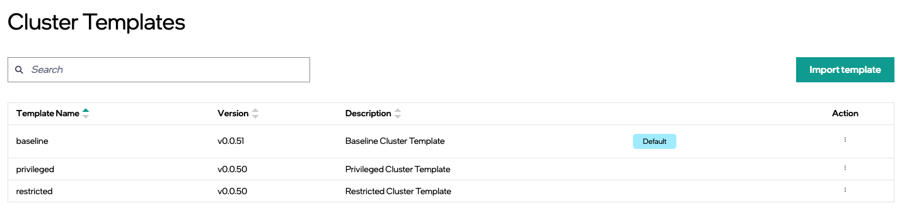

Import Cluster Template
================================

You can import a cluster template using a file in JSON format and add it to the **Clusters Templates** page.

.. note::
   When importing templates from JSON files, the version field in template content is considered the version of the template, and an error message is displayed if the version field is not specified. Also, an error message is displayed if you select an already existing version.

To import a cluster template, do the following:

1. In the **Cluster Templates** page, click **Import Template**.

