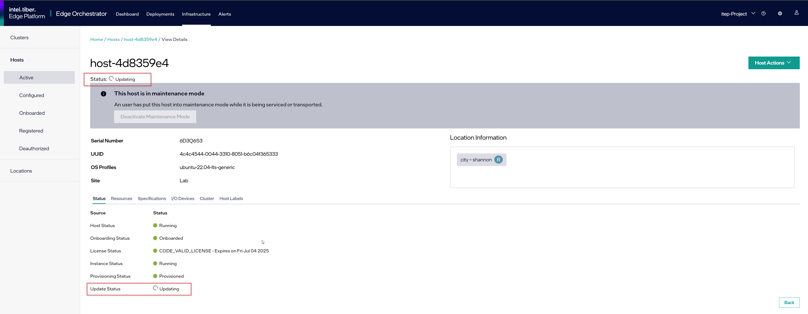
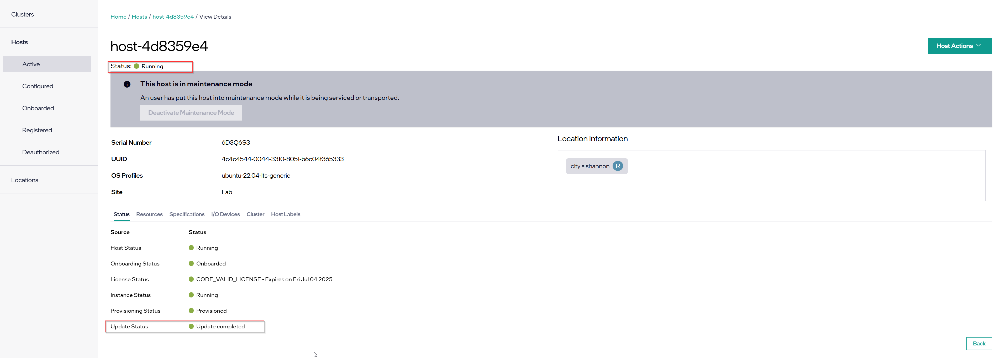

Install a New Debian\* Package on Mutable OS
============================================

This section assumes that you have provisioned and configured an edge node with an OS profile containing a mutable image, such as Ubuntu* OS version 22.04.
The procedure described here does not work for edge nodes provisioned and configured with immutable operating systems, such as the Edge Microvisor Toolkit OS.

You can install new Debian\* packages on edge nodes with mutable OSes using the :doc:`/api/edge_infra_manager`.

.. note:: Verify the source reliability, integrity, and security-related aspects of the Debian package before installing the package.

.. note:: Intel does not support installing out of tree drivers and kernel when the secure boot feature is enabled on the edge node.

Prepare Environment Variables
-----------------------------

.. note::

   To interact with Edge Orchestrator API, you must authenticate with a user who is
   part of the `Host Manager Group <./../../shared/shared_iam_groups.html#project-id-host-manager-group>`__ and obtain a JSON Web Token (JWT)
   used here as `JWT_TOKEN` variable (see `Obtaining a JSON Web Token (JWT) <./../../shared/shared_gs_iam.html#obtaining-a-json-web-token-jwt>`__ for instructions).

   The variables `CLUSTER_FQDN` are `PROJECT_NAME` should be the same as used
   for obtaining the `JTW_TOKEN` value.

.. code-block::

    export API_TOKEN="JWT_TOKEN_VALUE"
    export ORCHESTRATOR="example-orchestrator.intel.com"
    export PROJECT="example project"
    export API_ENDPOINT="https://api.${ORCHESTRATOR}/v1/projects/${PROJECT}"

Identify the OS Resource
------------------------

i. Retrieve the `resourceId` of the OS Resource.

   You can find the OS Resource name on the **Active**, **Configured**, or **Onboarded** Hosts tab, under the *Operating System* column.
   You can also query the OS Resource name through the Edge Infrastructure Manager `/OSResources` API endpoint by filtering the OS resource name:

   .. code-block::

       curl --silent "$API_ENDPOINT/compute/os?filter=name=\"[name of the OS resource]\"" -X GET -H "Authorization: Bearer $API_TOKEN" -H 'Content-Type: application/json' | jq -r '.OperatingSystemResources[].resourceId'

   Ensure that only a single Resource ID is returned, if there are more, choose the expected one.
   To see all OS resources and their attributes:

   .. code-block::

        curl --silent "$API_ENDPOINT/compute/os" -X GET -H "Authorization: Bearer $API_TOKEN" -H 'Content-Type: application/json' | jq

#. To facilitate the next operations, export the OS resource ID obtained into an environment variable:

   .. code-block::

       export OS_RESOURCE_ID=[selected OS resource "resourceId"]

Create an Advanced Packaging Tool (APT) Source
-----------------------------------------------------------

If the desired Debian packages are not included in the default Ubuntu\* APT repository or in any of the repositories (`updateSources` field) already set in the OS Resource,
you must provide a new APT source using the DEB822 Source Format.

.. note::

    Pay special attention to the formatting requirements of the GNU Privacy Guard (GPG) key, which is the value of the `Signed-By` key. Follow the DEB822 format:

    - Represent empty lines with a dot.

    - Indent each line of the key with a single space.

.. code-block::

    Types: deb
    URIs: https://repo.mongodb.org/apt/ubuntu
    Suites: jammy/mongodb-org/7.0
    Components: multiverse
    Signed-By:
     -----BEGIN PGP PUBLIC KEY BLOCK-----
     Version: GnuPG v1
     .
     mQINBGPILWABEACqeWP/ktugdlWEyk7YTXo3n19+5Om4AlSdIyKv49vAlKtzCfMA
     QkZq3mfvjXiKMuLnL2VeElAJQIYcPoqnHf6tJbdrNv4AX2uI1cTsvGW7YS/2WNwJ
     C/+vBa4o+yA2CG/MVWZRbtOjkFF/W07yRFtNHAcgdmpIjdWgSnPQr9eIqLuWXIhy
     H7EerKsba227Vd/HfvKnAy30Unlsdywy7wi1FupzGJck0TPoOVGmsSpSyIQu9A4Z
     uC6TE/NcJHvaN0JuHwM+bQo9oWirGsZ1NCoVqSY8/sasdUc7T9r90MbUcH674YAR
     8OKYVBzU0wch4VTFhfHZecKHQnZf+V4dmP9oXnu4fY0/0w3l4jaew7Ind7kPg3yN
     hvgAkBK8yRAbSu1NOtHDNiRoHGEQFgct6trVOvCqHbN/VToLNtGk0rhKGOp8kuSF
     OJ02PJPxF3/zHGP8n8khCjUJcrilYPqRghZC8ZWnCj6GJVg6WjwLi+hPwNMi8xK6
     cjKhRW3eCy5Wcn73PzVBX9f7fSeFDJec+IfS47eNkxunHAOUMXa2+D+1xSWgEfK0
     PClfyWPgLIXY2pGQ6v8l3A6P5gJv4o38/E1h1RTcO3H1Z6cgZLIORZHPyAj50SPQ
     cjzftEcz56Pl/Cyw3eMYC3qlbABBgsdeb6KB6G5dkNxI4or3MgmxcwfnkwARAQAB
     tDdNb25nb0RCIDcuMCBSZWxlYXNlIFNpZ25pbmcgS2V5IDxwYWNrYWdpbmdAbW9u
     Z29kYi5jb20+iQI+BBMBAgAoBQJjyC1gAhsDBQkJZgGABgsJCAcDAgYVCAIJCgsE
     FgIDAQIeAQIXgAAKCRAWDSa7F4W6OM+eD/sE7KbJyRNWyPCRTqqJXrXvyPqZtbFX
     8sio0lQ8ghn4f7lmb7LnFroUsmBeWaYirM8O3b2+iQ9oj4GeR3gbRZsEhFXQfL54
     SfrmG9hrWWpJllgPP7Six+jrzcjvkf1TENqw4jRP+cJhuihH1Gfizo9ktwwoN9Yr
     m7vgh+focEEmx8dysS38ApLxKlUEfTsE9bYsClgqyY1yrt3v4IpGbf66yfyBHNgY
     sObR3sngDRVbap7PwNyREGsuAFfKr/Dr37HfrjY7nsn3vH7hbDpSBh+H7a0b/chS
     mM60aaG4biWpvmSC7uxA/t0gz+NQuC4HL+qyNPUxvyIO+TwlaXfCI6ixazyrH+1t
     F7Bj5mVsne7oeWjRrSz85jK3Tpn9tj3Fa7PCDA6auAlPK8Upbhuoajev4lIydNd2
     70yO0idm/FtpX5a8Ck7KSHDvEnXpN70imayoB4Fs2Kigi2BdZOOdib16o5F/9cx9
     piNa7HotHCLTfR6xRmelGEPWKspU1Sm7u2A5vWgjfSab99hiNQ89n+I7BcK1M3R1
     w/ckl6qBtcxz4Py+7jYIJL8BYz2tdreWbdzWzjv+XQ8ZgOaMxhL9gtlfyYqeGfnp
     hYW8LV7a9pavxV2tLuVjMM+05ut/d38IkTV7OSJgisbSGcmycXIzxsipyXJVGMZt
     MFw3quqJhQMRsA==
     =gbRM
     -----END PGP PUBLIC KEY BLOCK---

Update OS Resources
-------------------------
You can now update the chosen OS resource by patching the OS resource.

1. Add the APT source created in multi-line format, to the `updateSources` list in single-line format. The following example includes two update sources: the Intel(R) Release Service repository and the MongoDB\* repository.

#. Add the names of the packages that must be installed, to the `installedPackages` field, separating them with the "\n" character. You cannot specify versions of the package; the latest version available in the APT repository will be installed.

.. note:: Ensure that the `updateSources` and `installedPackages` fields contain the previous values plus the additional values required by the update; the `PATCH` overrides their content.

.. note:: Always specify the `sha256` field; reuse the 'sha256' from the chosen OS resource at `Identify the OS Resource <#identify-the-os-resource>__`

.. note:: A `kernelCommand` parameter is also accepted as part of patching the OS resource. Provision of this parameter along with valid kernel command-line values will result in the edge node booting up with the new kernel command-line parameters after the edge node update.

.. code-block::

    export UPDATE_OS_RESOURCES='{
    "updateSources": [
        "#ReleaseService\nTypes: deb\nURIs: https://files-rs.edgeorchestration.intel.com/files-edge-orch/repository\nSuites: 3.0\nComponents: main\nSigned-By:\n -----BEGIN PGP PUBLIC KEY BLOCK-----\n .\n mQINBGXE3tkBEAD85hzXnrq6rPnOXxwns35NfLaT595jJ3r5J17U/heOymT+K18D\n A6ewAwQgyHEWemW87xW6iqzRI4jB5m/fnFvl8wS1JmE8tZMYxLZDav91XfHNzV7J\n pgI+5zQ2ojD1yIwmJ6ILo/uPNGYxvdCaUX1LcqELXVRqmg64qEOEMfA6fjfUUocm\n bhx9Yf6dLYplJ3sgRTJQ0jY0LdAE8yicPXheGT+vtxWs/mM64KrIafbuGqNiYwC3\n e0cHWMPCLVe/lZcPjpaSpx03e0nVno50Xzod7PgVT+qI/l7STS0vT1TQK9IJPE1X\n 8auCEE0Z/sT+Q/6Zs4LiJnRZqBLoPFbyt7aZstS/zzYtX5qkv8iGaIo3CCxVN74u\n Gr4B01H3T55kZ4LE1pzrkB/9w4EDGC2KSyJg2vzqQP6YU8yeArJrcxhHUkNnVmjg\n GYeOiIpm+S4X6mD69T8r/ohIdQRggAEAMsiC+Lru6mtesKC8Ju0zdQIZWAiZiI5m\n u88UqT/idq/FFSdWb8zMTzE0doTVxZu2ScW99Vw3Bhl82w6lY689mqfHN6HAw3Oj\n CXGBd4IooalwjGCg27jNTZ5HiImK1Pi2wnlMdFyCXR4BPwjHMfEr1av3m4U9OkfB\n lVPHS35v0/y22e6FENg7kUiucY4ytKbbAMFeVIwVopHOhpDT29dUtfRsZwARAQAB\n tAVJbnRlbIkCTgQTAQoAOBYhBNBzdS76jrQWu9oBzLoBs/zr58/PBQJlxN7ZAhsD\n BQsJCAcCBhUKCQgLAgQWAgMBAh4BAheAAAoJELoBs/zr58/PboUQAMAP8f2plI1W\n Zypc+CszsnRMUqDtwiqA56Q+ZTc6Tdb/P7Isw/lLno3LgL4fkip8Yxmql9zA4aXk\n EnNd3mPZcZdP2fogkgOd2gqbmcu604P3kUrlIrrWbSpyH+qmtwfyV09j7xucQ527\n +1gXGwVNXcqrmgUWlYTXD+SIeXosmWPvAJgF2PvI1ETTjXvpJryNaaekw1gmRYfs\n Jiq6LPGvPkyefcgXRD2lgTWnMRpAfiukIhZro0YLIqj3godF2qsmu3Xb6IhFFHFN\n eL9IVqJW/cEsFD21P5sC6FjQjV+Hu2jRTPFVHsTEiF34XC2LNDiVaZWtLIhWXjas\n FTwBw2vqGaWRUhAUWzmvfS97XGx5gDMdODNfwGfsFzDLfmuW7gFaT/qkc07KmaYb\n QobESazmA51UiEcxOwUZWsVwWM259YIc2TTndkCJf2P9rOXLCmOYbtOZqLcnpE4O\n tKkATRwwSP2uOyMmkwRbTwazR5ZMJ1tAO+ewl2guyDcJuk/tboh57AZ40JFRlzz4\n dKybtByZ2ntW/sYvXwR818/sUd2PjtRHekBq+bprw2JR2OwPhfAswBs9UzWNiSqd\n rA3NksCeuj/j6sSaqpXn123ZtlliZttviM+bvbSps5qJ5TbxHtSwr4H5gYSlHVT/\n IwqUfFrYNoQVDejlGkVgyjQYonEqk8eX\n =w4R+\n -----END PGP PUBLIC KEY BLOCK-----",
        "Types: deb\nURIs: https://repo.mongodb.org/apt/ubuntu\nSuites: jammy/mongodb-org/7.0\nComponents: multiverse\nSigned-By:\n -----BEGIN PGP PUBLIC KEY BLOCK-----\n Version: GnuPG v1\n .\n mQINBGPILWABEACqeWP/ktugdlWEyk7YTXo3n19+5Om4AlSdIyKv49vAlKtzCfMA\n QkZq3mfvjXiKMuLnL2VeElAJQIYcPoqnHf6tJbdrNv4AX2uI1cTsvGW7YS/2WNwJ\n C/+vBa4o+yA2CG/MVWZRbtOjkFF/W07yRFtNHAcgdmpIjdWgSnPQr9eIqLuWXIhy\n H7EerKsba227Vd/HfvKnAy30Unlsdywy7wi1FupzGJck0TPoOVGmsSpSyIQu9A4Z\n uC6TE/NcJHvaN0JuHwM+bQo9oWirGsZ1NCoVqSY8/sasdUc7T9r90MbUcH674YAR\n 8OKYVBzU0wch4VTFhfHZecKHQnZf+V4dmP9oXnu4fY0/0w3l4jaew7Ind7kPg3yN\n hvgAkBK8yRAbSu1NOtHDNiRoHGEQFgct6trVOvCqHbN/VToLNtGk0rhKGOp8kuSF\n OJ02PJPxF3/zHGP8n8khCjUJcrilYPqRghZC8ZWnCj6GJVg6WjwLi+hPwNMi8xK6\n cjKhRW3eCy5Wcn73PzVBX9f7fSeFDJec+IfS47eNkxunHAOUMXa2+D+1xSWgEfK0\n PClfyWPgLIXY2pGQ6v8l3A6P5gJv4o38/E1h1RTcO3H1Z6cgZLIORZHPyAj50SPQ\n cjzftEcz56Pl/Cyw3eMYC3qlbABBgsdeb6KB6G5dkNxI4or3MgmxcwfnkwARAQAB\n tDdNb25nb0RCIDcuMCBSZWxlYXNlIFNpZ25pbmcgS2V5IDxwYWNrYWdpbmdAbW9u\n Z29kYi5jb20+iQI+BBMBAgAoBQJjyC1gAhsDBQkJZgGABgsJCAcDAgYVCAIJCgsE\n FgIDAQIeAQIXgAAKCRAWDSa7F4W6OM+eD/sE7KbJyRNWyPCRTqqJXrXvyPqZtbFX\n 8sio0lQ8ghn4f7lmb7LnFroUsmBeWaYirM8O3b2+iQ9oj4GeR3gbRZsEhFXQfL54\n SfrmG9hrWWpJllgPP7Six+jrzcjvkf1TENqw4jRP+cJhuihH1Gfizo9ktwwoN9Yr\n m7vgh+focEEmx8dysS38ApLxKlUEfTsE9bYsClgqyY1yrt3v4IpGbf66yfyBHNgY\n sObR3sngDRVbap7PwNyREGsuAFfKr/Dr37HfrjY7nsn3vH7hbDpSBh+H7a0b/chS\n mM60aaG4biWpvmSC7uxA/t0gz+NQuC4HL+qyNPUxvyIO+TwlaXfCI6ixazyrH+1t\n F7Bj5mVsne7oeWjRrSz85jK3Tpn9tj3Fa7PCDA6auAlPK8Upbhuoajev4lIydNd2\n 70yO0idm/FtpX5a8Ck7KSHDvEnXpN70imayoB4Fs2Kigi2BdZOOdib16o5F/9cx9\n piNa7HotHCLTfR6xRmelGEPWKspU1Sm7u2A5vWgjfSab99hiNQ89n+I7BcK1M3R1\n w/ckl6qBtcxz4Py+7jYIJL8BYz2tdreWbdzWzjv+XQ8ZgOaMxhL9gtlfyYqeGfnp\n hYW8LV7a9pavxV2tLuVjMM+05ut/d38IkTV7OSJgisbSGcmycXIzxsipyXJVGMZt\n MFw3quqJhQMRsA==\n =gbRM\n -----END PGP PUBLIC KEY BLOCK---"
    ],
    "installedPackages": "net-tools\nmongodb-org",
    "sha256":"<sha256>>"
    }'

    curl --silent "$API_ENDPOINT/compute/os/$OS_RESOURCE_ID" -X PATCH -H "Authorization: Bearer $API_TOKEN" -H 'Content-Type: application/json' --data "UPDATE_OS_RESOURCES"

The newly added packages will be installed on all the edge nodes that are configured with the given OS Resource only if a maintenance window is scheduled for that edge node.

Scheduling Ubuntu OS Update
------------------------------------

To schedule an update of an edge node's Ubuntu OS, follow the steps for **OS Update** maintenance type described in the
:doc:`/user_guide/additional_howtos/host_schedule_main` section.
Upon a successful scheduling of an update, the Platform Update Agent on the edge node will run the update at the selected time and date.
If new packages were specified before the update, the packages will be installed as part of this process.
As part of the update process, all packages with update candidates available in the remote `APT` repositories will be updated to the available version.
The Platform Update Agent will respond with an appropriate status on a successful update, to the Maintenance Manager.
In case of an update failure, the Platform Update Agent will return a relevant failure status.

Successful Ubuntu OS Update
^^^^^^^^^^^^^^^^^^^^^^^^^^^^^^^^^^^

Upon successful completion of the update procedure, the relevant status will be displayed in the UI for the updated host. Note that the update status will change to "No new updates available" shortly after completion.

Update Considerations
---------------------------

Updating an OS will reboot the edge node.
