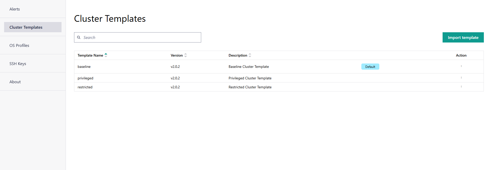

Cluster Template
==========================

A cluster template is a predefined configuration or blueprint for setting up and managing clusters.
Cluster templates allow you to rapidly provision and deploy clusters with uniform configurations, minimizing time and effort.

Edge Orchestrator supports the JSON format for creating, exporting, or importing a cluster template.

.. note::
   Only an edge manager can create a cluster template.

|software_prod_name| comes with three built-in cluster templates:

* restricted
* baseline
* privileged

To go to the **Cluster Templates** page, click the **Settings** tab and then
click **Clusters Templates** on the left menu. You can view the built-in
cluster template. Intel provides and maintains these default templates. Each
built-in template provides different restrictions that are automatically applied
for customer workloads:

The common settings in the cluster templates include:

* Kubernetes\* platform version v1.30.10+rke2r1
* Preconfigured mirrors for Container Runtime Interface (CRI)
* Preconfigured Container Network Interface (CNI) – Multus, Calico, and Wireguard\* CNIs
  that are enhanced by preconfigured network policies.
* Common configuration of the cluster IP addresses - cluster or service CIDRs
* Optional list of deployment metadata key-value pairs populated as cluster labels
  and used to identify clusters as targets for
  :doc:`/user_guide/how_it_works/automated_deployment`.

Built-in cluster templates have the following deployment metadata labels:

.. list-table::
   :widths: 20, 20
   :header-rows: 1

   * - Cluster Template Name
     - deployment-metdata

   * - restricted
     - "default-extension": "restricted"

   * - baseline
     - "default-extension": "baseline"

   * - privileged
     - "default-extension": "privileged"

|software_prod_name| comes with three built-in deployments corresponding to default deployment metadata.
These are referred to as base extensions and contain the following set of common preconfigured Kubernetes extensions:

  * `Node Feature Discovery <https://intel.github.io/kubernetes-docs/nfd>`_
  * `OpenEBS\* container-attached storage solution <https://openebs.io/docs/>`_
  * Observability stack:
      * `Node Exporter agent <https://prometheus.io/docs/guides/node-exporter/>`_
      * `Prometheus\* toolkit <https://prometheus.io/docs/introduction/overview/>`_
      * `Telegraf\* agent <https://docs.influxdata.com/telegraf/v1/>`_
      * `Fluent Bit\* telemetry agent <https://docs.fluentbit.io/manual/v/1.7>`_
  * `cert-manager X.509 certificate controller <https://cert-manager.io/docs/>`_
  * `Gatekeeper cloud-native policy controller <https://open-policy-agent.github.io/gatekeeper/website/docs/>`_

The following table lists the various enabled and disabled settings for the default templates:

.. list-table::
   :widths: 20, 20, 20, 20
   :header-rows: 1

   * - Constraints
     - restricted
     - baseline
     - privileged

   * - capabilities
       Controls Linux\* capabilities on containers. Corresponds to the allowedCapabilities field in  PodSecurityPolicy
       Allowed: NET_BIND_SERVICE
       All others are denied.
     - ENABLED
     - ENABLED
     - DISABLED

   * - host-network
       Controls the usage of host network namespace by pod containers.
       Corresponds to the hostNetwork fields in a PodSecurityPolicy.
     - ENABLED
     - DISABLED
     - DISABLED

   * - volumeTypes
       Forbids hostPath volume type. Corresponds to the volumes field in a PodSecurityPolicy.
     - ENABLED
     - ENABLED
     - DISABLED

   * - hostNamespace
       Disallows sharing of host PID and IPC namespaces by pod containers. Corresponds to the hostPID and hostIPC fields in a PodSecurityPolicy.
     - ENABLED
     - ENABLED
     - DISABLED

   * - hostPorts
       Controls usage of host ports by pod containers. If usage of host ports is allowed, you must specify specific port ranges. Corresponds to the hostPorts field in a PodSecurityPolicy.
       HostPorts usage is not allowed when this constraint is enabled.
     - ENABLED
     - ENABLED
     - DISABLED

   * - privilegedContainer
       Disallows enabling privileged mode in containers. Corresponds to the privileged field in a PodSecurityPolicy.
     - ENABLED
     - ENABLED
     - DISABLED

   * - privilegedEscalation
       Restricts escalation to root privileges. Corresponds to the allowPrivilegeEscalation field in a PodSecurityPolicy.
     - ENABLED
     - DISABLED
     - DISABLED

   * - read-only-root-filesystem
       Requires the use of the read-only root file system by pod containers. Corresponds to the readOnlyRootFilesystem field in a PodSecurityPolicy.
     - ENABLED
     - DISABLED
     - DISABLED

   * - Sysctls
       Controls the sysctl profile used by containers. Allowed sysctls when the constraint is enabled:
       -	kernel.shm_rmid_forced
       -	net.ipv4.ip_local_port_range
       -	net.ipv4.ip_unprivileged_port_start
       -	net.ipv4.tcp_syncookies
       -	net.ipv4.ping_group_range
     - ENABLED
     - ENABLED
     - DISABLED

.. note::
   When security is of highest priority, Intel recommends using the 'restricted' template as
   a default for all clusters managed by Edge Orchestrator. Otherwise, Intel recommends
   assigning 'baseline' as the default cluster template.

From this page, you can click the three-dot (...) icon in the **Actions** column and you can do the following:

    * :doc:`/user_guide/additional_howtos/view_cluster_template`
    * :doc:`/user_guide/additional_howtos/set_default_cluster_template`
    * :doc:`/user_guide/additional_howtos/import_cluster_template`
    * :doc:`/user_guide/additional_howtos/export_cluster_template`
    * :doc:`/user_guide/additional_howtos/delete_cluster_template`

.. toctree::
   :hidden:

   view_cluster_template
   set_default_cluster_template
   export_cluster_template
   import_cluster_template
   delete_cluster_template
