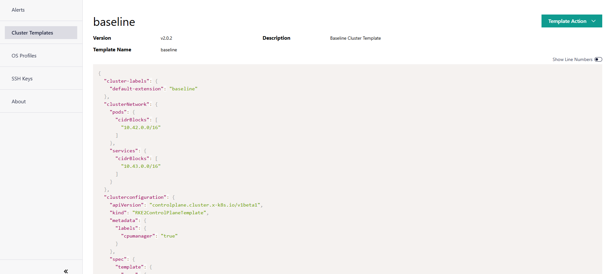

View Cluster Template Details
==============================

To view the details of the cluster template:

1. In the **Cluster Templates** page, select the cluster template to view its details.

2. Click the three-dot (...) icon in the **Actions** column and select **Details**. The
   cluster template details page appears.

The cluster template includes the following details:

* Details about the cluster template, such as name, version number, and description.

* Details of the cluster template in JSON format.

* An optional list of deployment metadata key-value pairs. Clusters assigned the
  deployment metadata provided in the cluster template will automatically have matching
  deployments installed. For more information on deployment metadata, see
  :doc:`/user_guide/how_it_works/automated_deployment`.

The **Export Template** option allows you to export the template to a JSON file.
