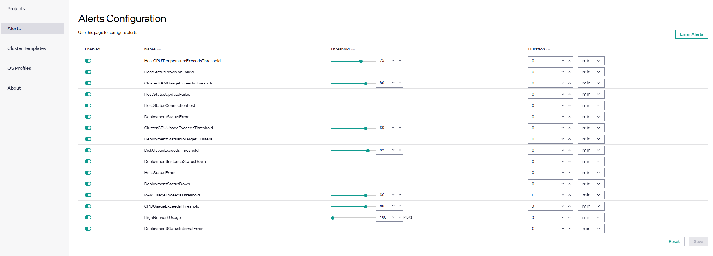

Configure Alert Paramteters
===========================

**Alert Definitions** allow you to enable and disable
alerts and tweak conditions under which they are triggered.

.. note::
  Only users with special privileges can view and configure Alert Definitions.
  To enable viewing and editing the alert-rw role must be assigned to gain access
  across all projects. To enable per-project viewing and editing the following
  roles must be assigned respectively: `<project-id>_alrt-r` and `<project-id>_alrt-rw`.
  For additional details, see :doc:`/shared/shared_iam_groups`.

To navigate to **Alerts Configuration** page, click **Settings** tab on the top menu and click **Alerts** on the left menu.

.. list-table::
   :widths: 20, 20
   :header-rows: 1

   * - Field
     - Description

   * - Enabled
     - Indicates if the Alert is enabled. Allows to globally turn an Alert on and off.

   * - Name
     - The name of the alert.

   * - Threshold
     - Allows to fine-tune the threshold that will trigger an alert once crossed and maintained for at least
       **Duration** time.

   * - Duration
     - Allows to fine-tune the time that the condition needs to persist in order to trigger an alert.

.. note::
  **Example**: Setting **Threshold** to `75` and **Duration** to `30s` for **DiskUsageExceedsThreshold** alert
  would trigger an alert if disk usage remained over 75% for at least 30 seconds.
