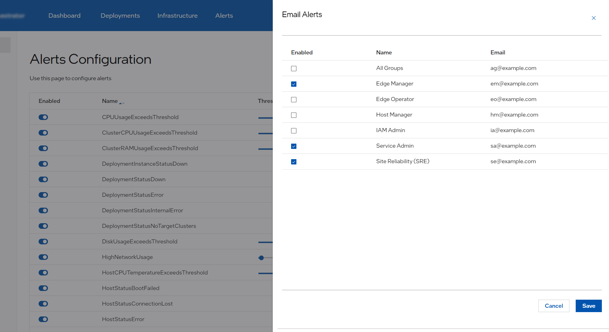

Configure Email Notifications for Alerts
========================================

**Email Notifications** settings allow you to enable sending alerts in the form of
an email to users registered in IAM (Keycloak\* solution). Selecting users for email
notifications will result in sending all alerts to each of those users. The
notifications include both `firing` and `resolved` alerts.

.. note::
  `Service admin` has permission `alrt-rx-rw` to view and configure Email Notifications.
  For additional details, see :doc:`/shared/shared_iam_groups` and `Setting Up a Service-Admin User in Keycloak`_.

To navigate to **Email Alerts** settings, navigate to **Alerts Configuration** page
by clicking **Settings** tab on the top menu and clicking **Alerts** on the left menu, and then selecting
**Email Alerts** option.

.. list-table::
   :widths: 20, 20
   :header-rows: 1

   * - Field
     - Description

   * - Enabled
     - Allows to enable email notifications for this user

   * - Name
     - First Name and Last Name of the user as it appears in IAM (Keycloak)

   * - Email
     - Email address as it appears in IAM (Keycloak)

.. note::
   Mail delivery relies on the presence of an external SMTP server that |software_prod_name| needs to be
   configured with during installation.

.. _setting-up-service-admin-user:

Setting Up a Service-Admin User in Keycloak
-------------------------------------------

Prerequisites
-------------

- Access to Keycloak admin console.
- The mage target `mage tenantUtils:createEdgeInfraUser`, creating a new user:
  `<project-name>-service-admin-api-user` in _Host-Manager-Group and
  service-admin-group.

Step 1: Verify User Creation
----------------------------

1. **Log in to Keycloak Admin Console**:
   - Open your web browser and navigate to the Keycloak admin console URL.
   - Log in using your admin credentials.

2. **Navigate to Users**:
   - In the Keycloak admin console, click on `Users` in the left-hand menu.
   - Search for the `service-admin` user to verify its creation.

Step 2: Update User Attributes
------------------------------

1. **Edit User Details**:
   - Click on the `service-admin` user from the list.
   - Go to the "Attributes" tab.

2. **Set Required Attributes**:
   Add the following attributes:
   - **First Name**: Enter the user's first name.
   - **Last Name**: Enter the user's last name.
   - **Email**: Enter the user's email address.

3. **Save Changes**:
   - Click "Save" to apply the changes.

Step 3: Assign User to a Project
--------------------------------

1. **Navigate to Groups**:
   - Click on "Groups" in the left-hand menu.

2. **Find or Create a Project Group**:
   - Search for the project group to which you want to assign the user.
   - If the group does not exist, create a new group for the project.

3. **Add User to Project Group**:
   - Go back to the "Users" section and select the `service-admin` user.
   - Click on the "Groups" tab.
   - Add the user to the project group by selecting the group and clicking "Join".

Step 4: Verify Permissions
--------------------------

1. **Check User Roles**:
   - Ensure the `service-admin` user has the `alrt-rx-rw` permission.
   - Navigate to the "Role Mappings" tab for the user and verify the role assignment.

Step 5: Test Access to Web UI
-----------------------------

1. **Log in as Service-Admin User**:
   - Log out of the admin console and log in as the `service-admin` user.
   - Navigate to the web UI for managing email alerts.

2. **Verify Functionality**:
   - Ensure the user can access the email alerts section and manage receivers.

Troubleshooting
---------------

- If the user cannot access the UI, double-check group membership and role assignments.
- Ensure all attributes are correctly set in Keycloak solution.

By following these steps, you should be able to set up the service-admin user
in Keycloak solution, allowing them to manage email alerts in Mailpit tool effectively.
