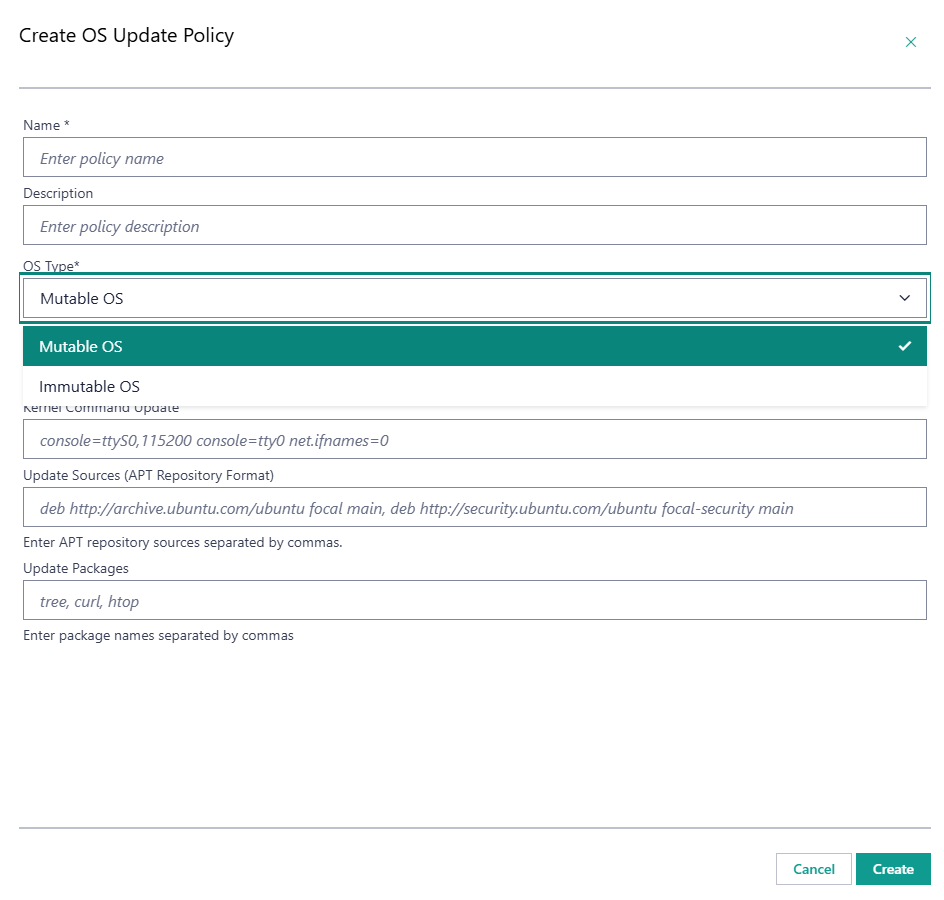
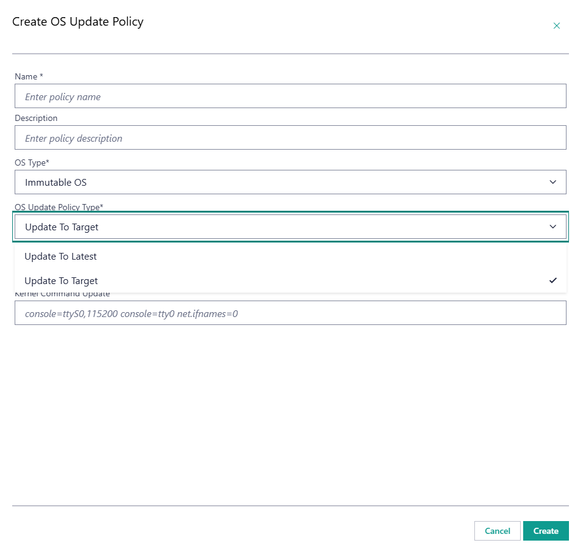
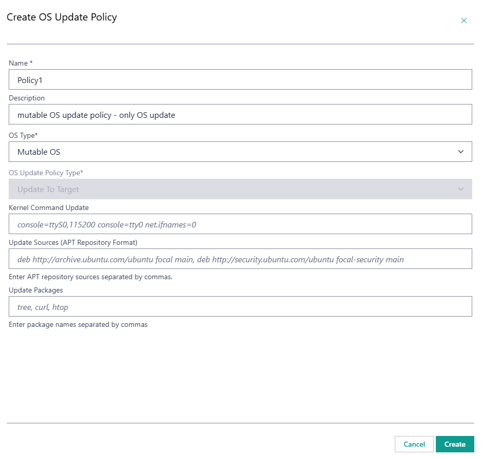
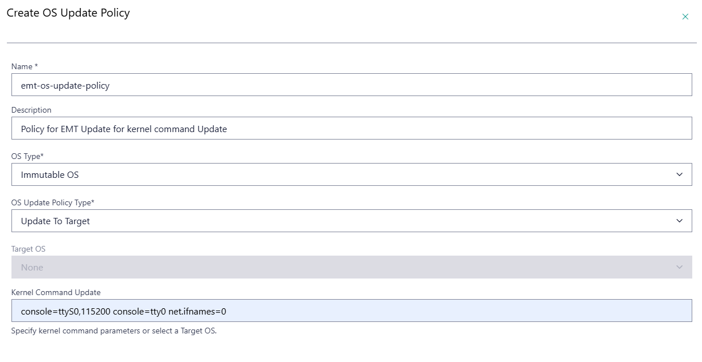
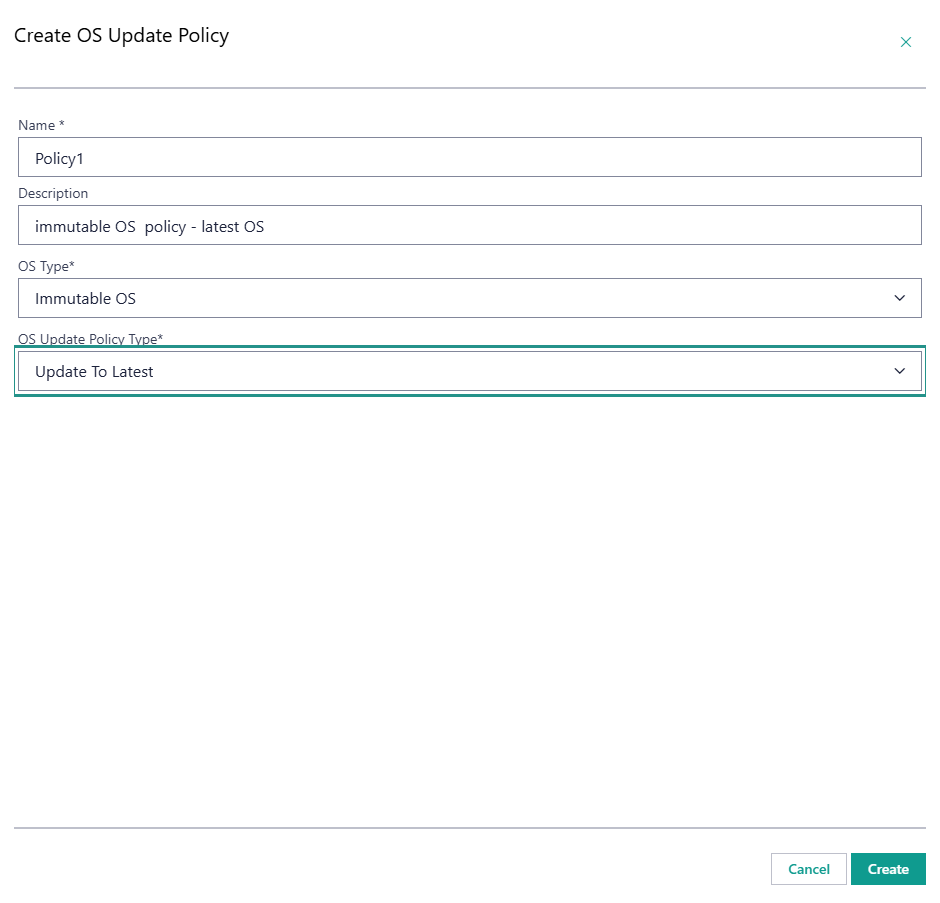

Apply an OS Update Policy
============================================

This section assumes that you have provisioned and configured an edge node with an OS profile containing a mutable or immutable image, such as Ubuntu* OS version 22.04 or the Edge Microvisor Toolkit OS.
The procedure described here works for edge nodes provisioned and configured with both mutable and immutable operating systems, however during creation of the OS Update Policy, ensure to select the appropriate OS Type. 
Based on the selected OS Type, the relevant options will be enabled for update configuration.

OS Update Policy Types
----------------------
Two kinds of OS Update Policies are available:
- a policy that updates to the latest available OS image version (Update to Latest) - supported only for the immutable OS.
- a policy that updates to a specific OS image version (Update to Target) - supported for both mutable and immutable OSes.

Update to Target
^^^^^^^^^^^^^^^^

For mutable OS updates the target OS Update Policy allows for:
- specifying new Debian packages to be installed on the edge nodes as part of the update process.
- adding new APT sources from which the new packages will be installed.
- updating kernel command-line parameters.

For immutable OS updates the target OS Update Policy allows for:
- specifying the target OS image version to which the edge nodes will be updated.
- updating kernel command-line parameters.

Update to Target
^^^^^^^^^^^^^^^^

For immutable OS updates, the latest OS Update Policy allows for:
- updating to the latest available OS image version.

Create OS Update Policy and Link it to Host using Orch CLI
----------------------------------------------------------

i. Set up the Orch CLI tool as in :doc:`/user_guide/set_up_edge_infra/orch_cli/orch_cli_guide`.

ii. Create a yaml file with the OS Update Policy configuration.

        See the following examples of OS Update Policy configuration for mutable and immutable OS:
        .. code-block:: yaml
            appVersion: apps/v1
            spec:
                name: "policy1"
                description: "mutable OS update"
                updatePolicy: "UPDATE_POLICY_TARGET"
                updateKernelCommand: "hugepages=2"
                updatePackages: "tree"

        .. code-block:: yaml
            appVersion: apps/v1
            spec:
                name: "policy2"
                description: "immutable OS update- target OS"
                updatePolicy: "UPDATE_POLICY_TARGET"
                targetOs: "os-aef16d62"

        .. code-block:: yaml
            appVersion: apps/v1
            spec:
                name: "policy3"
                description: "immutable OS update - latest OS"
                updatePolicy: "UPDATE_POLICY_LATEST"

iii. Create the OS Update Policy using the Orch CLI and the file and locate its resource ID.

    .. code_block:: bash
        orch-cli create osupdatepolicy ./policy1.yaml
        orch-cli list osupdatepolicy

iv. Locate the resource ID of your host and link your OS Update Policy with it.

    .. code_block:: bash
        orch-cli list host
        orch-cli set host <host-resource-id> -u <os-update-policy-resource-id>

Create OS Update Policy and Link it to Host using Web UI
--------------------------------------------------------

Select the OS Update Policy Type
^^^^^^^^^^^^^^^^^^^^^^^^^^^^^^^^

i. Within the Web UI navigate to configuration section and open the **OS Update Policy** page.

.. figure:: images/os-update-policy_screen_empty.png
        :alt: OS Update Policy - empty list 

ii. Click on the **Create OS Update Policy** button to open the **Create OS Update Policy** form.

    OS Update Policy contains fields specific to mutable OS update and Immutable OS update. Choose the OS type accordingly.

iii. If selected OS type is immutable, choose the OS Update Policy type: **Update To Target** or **Update To Latest**.

Provide Update Details
^^^^^^^^^^^^^^^^^^^^^^

Following the selection of OS Update Policy type, provide the relevant update details as described below. The following are examples of available configurations of OS Update Policies.
Once the relevant fields are filled, hit the **Create** button to create the OS Update Policy.

.. figure:: images/os-update-policy_update_packages.png
        :alt: OS Update Policy - Target OS update per mutable OS - new packages example

.. figure:: images/os-update-policy_mutable_kernel_and_packages.png
        :alt: OS Update Policy - Target OS update per mutable OS - new packages and kernel command update

.. figure:: images/os-update-policy_mu_OS.png
        :alt: OS Update Policy - Target OS update example per immutable OS

Associate the OS Update Policy with Hosts
-----------------------------------------
Within the Web UI, navigate to the **Hosts** page, open the desired Host details page, and select **Updates** tab. Here, set applied policy by selecting the created OS Update Policy from the **OS Update Policy** drop-down list.
The newly added packages will be installed on all the edge nodes that are configured with the given OS Update Policy if a maintenance window is scheduled for that edge node.

.. figure:: images/os-update-policy_update_packages.png TODO
        :alt: OS Update Policy Association with Host

Scheduling an OS Update
------------------------------------

Upon successful creation and assignment of an OS Update Policy, a new update can be scheduled following the steps described in the
:doc:`/user_guide/advanced_functionality/host_schedule_main` section.
Note that no OS Update Policy is assingned to the host before the update is expected to start - the edge node update will not start, and no status change will be reported.

OS Update Policy Assignment Considerations
-------------------------------------------

An OS Update Policy assigned to a host, or used in a historical update of an existing host cannot be deleted. Web UI does not allow for modifying OS Update Policies.
In case a change is required to an OS Update Policy, create a new OS Update Policy with the desired configuration and assign it to the host.     