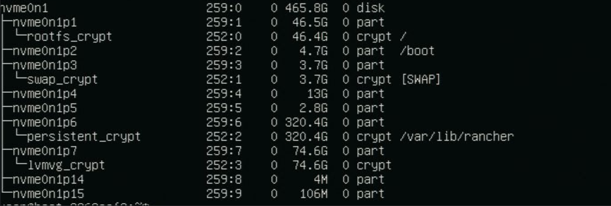
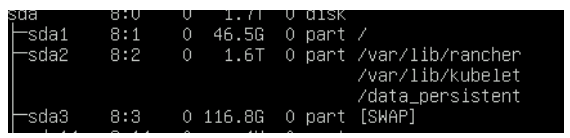

User configurable rootfs and LVM partition for persistent volume for applications
=================================================================================

Requirement: User should be able to configure the space allocated for ``rootfs`` 
and LVM size in case of edge node has single disk. LVM partition here is assumed 
to be used for persistent volume for user applications using kubernetes OpenEBS 
CSI addon. This is not an issue if the edge node has 2 disks then one disk with
lower disk size is used for OS partition and other disk is used for LVM partition.
LVM size parameter is host (edge node) specific and user shall be able to configure
during registration of host using orch-cli.

If user doesn't provide the LVM partition then default value is set to 0
and EN shall get more space for ``rootfs`` and persistent volume(user applications)

Following are the implementation details and assumptions:

#. LVM configurability is supported only for edge node with single disk.
#. The LVM size is configurable only during the registration process of the edge node.
#. LVM size will be used to configure both LVM and ``rootfs`` partition.
#. The LVM size can be specified in gigabytes (GB) during the registration process.
#. LVM partition will be created only if the specified size is greater than 0 on a single HDD.
#. If the edge node has multiple disks, the LVM size configuration will not be applicable.
#. Users will have to deploy the OpenEBS CSI addon to utilize the LVM partition for persistent volume.
#. The LVM size parameter is specific to each host (edge node) and can be configured individually during registration.
#. Kubernetes installed on the edge node will have a dedicated partition to store container images, manifest, logs etc.
#. By default kubernetes partition will be used for persistence volume for user applications if CSI like OpenEBS 
    is not installed, configured and requested. 

#. How to configure the LVM size during registration of edge node.

You can configure the LVM size for an edge node during registration by specifying the desired size using the `orch-cli` tool. This allows you to customize storage allocation according to your requirements at the time of host onboarding.

The orch-cli tool facilitates registration of a set of hardware devices as edge nodes through a comma-separated value (CSV) file:

#. orch-cli supports the creation of an empty template, and/or tests the validity of a given CSV file for it to be used during creation the host resources.
#. orch-cli facilitates the import of the edge nodes present in a CSV file to the Edge Orchestrator.

Download Tools
~~~~~~~~~~~~~~

The tool ``orch-cli`` is publicly available for release in
Open Container Initiative\* (OCI\*) compliant registries. Intel recommends using the ``oras`` client to interact with it.
Ensure that you have ``oras`` available on your system or follow the instructions in the
`public documentation <https://oras.land/docs/installation>`_ to install it.

For information on how to download the tool see the orch-cli documentation :ref:`cli-download` section.

For more information about the orch-cli tool and how to use it to create and view other Edge Orchestrator resources, refer to the:
:doc:`/user_guide/set_up_edge_infra/orch_cli/orch_cli_guide`

Login to the Edge Orchestrator
------------------------------

Go to the directory where the downloaded orch-cli tool resides (for example, ~), to run the login command.

Login to access the Edge Orchestrator API.
Make the file executable and run the login command:
Replace `<CLUSTER_FQDN>` with the name of the domain used during installation, and `<PROJECT>` with an actual project created in the Edge Orchestrator for a given user:

.. code-block:: bash

   ./orch-cli login <USER> <PASSWORD> --keycloak https://keycloak.orch-<CLUSTER_FQDN>/realms/master

Generate a .csv File
--------------------

This section guides through the creation of a formatted `.csv` file with all the entries. This is optional if you already have a correct `.csv` file.

Go to the directory where the downloaded orch-cli tool resides (for example, ~), to run it:

.. code-block:: bash

   ./orch-cli create host --project <PROJECT_NAME> --api-endpoint https://api.<CLUSTER_FQDN> --generate-csv=<FILENAME>.csv

Now, you can populate the `.csv` file by appending details of systems.
Do not change the first line `Serial,UUID,OSProfile,Site,Secure,RemoteUser,Metadata,LVMSize,CloudInitMeta,K8sEnable,K8sClusterTemplate,K8sConfig,Error - do not fill`
because that is the expected format.
The `Serial`, `UUID`, `OSProfile` and `Site` columns must be filled, with the serial number and UUID of the edge node(s) you want to register as well as the OSProfile
name/resource ID, and the site resource ID.
The other columns are optional - for more information seek help with `-h` flag.
The following is an example:

.. code-block:: bash

   Serial,UUID,OSProfile,Site,Secure,RemoteUser,Metadata,LVMSize,CloudInitMeta,K8sEnable,K8sClusterTemplate,K8sConfig,Error - do not fill
   2500JF3,4c4c4544-2046-5310-8052-cac04f515233,"Edge Microvisor Toolkit 3.0.20250808",site-b05caf24
   ICW814D,4c4c4544-4046-5310-8052-cac04f515233,"ubuntu-22.04-lts-generic",site-b05caf24
   FW908CX,4c4c4544-0946-5310-8052-cac04f515233,"Edge Microvisor Toolkit 3.0.20250717",site-a053abcd

Check the CSV File
------------------

You can now validate the CSV file that you have created yourself or through generation by attempting a dry run deployment.
.. code-block:: bash

   ./orch-cli create host --project <PROJECT_NAME> --api-endpoint https://api.<CLUSTER_FQDN> --import-from-csv <FILENAME>.csv --dry-run

orch-cli
~~~~~~~~

This section shows how to use a CSV file to import a series of devices as edge nodes,
the utility provides a set of override flags that can be used to globally override the arguments throughout the CSV file:

.. code-block:: bash

   Flags:
  -l, --lvm-size                           Override the LVM size configuration provided in CSV file for all hosts
  -j, --cloud-init string                  Override the cloud init metadata provided in CSV file for all hosts
  -f, --cluster-config string              Override the cluster configuration provided in CSV file for all hosts
  -c, --cluster-deploy string              Override the cluster deployment flag provided in CSV file for all hosts
  -t, --cluster-template string            Override the cluster template provided in CSV file for all hosts
  -d, --dry-run                            Verify the validity of input CSV file
  -g, --generate-csv string[="test.csv"]   Generates a template CSV file for host import
  -h, --help                               help for host
  -i, --import-from-csv string             CSV file containing information about to be provisioned hosts
  -m, --metadata string                    Override the metadata provided in CSV file for all hosts
  -o, --os-profile string                  Override the OSProfile provided in CSV file for all hosts
  -r, --remote-user string                 Override the metadata provided in CSV file for all hosts
  -x, --secure string                      Override the security feature configuration provided in CSV file for all hosts
  -s, --site string                        Override the site provided in CSV file for all hosts

CSV file fields:
The fields `OSProfile`, `Site`, `Secure`, `RemoteUser`, `CloudInitMeta`,  and `Metadata` are used for provisioning configuration of the Edge Node.
The fields accept both name and resource IDs, with an exception of site which only accepts resource IDs.
The `Secure` field is a boolean value that can be set to `true` or `false`. The `Metadata` field is a key-value pair separated by an `=` sign, and multiple key-value pairs are separated by an `&` sign.
The `LVMSize` field is used to specify the size of the LVM partition in GB. If this field is left blank it defaults to 0, meaning no LVM partition will be created and all available disk space will be allocated to the root filesystem.
The `K8sEnable` enables the auto creation of single node K3s cluster and is by default a boolean `false`. When enabled additional configuration must
be provided via `K8sClusterTemplate` which expects the template name and version in format `<name>:<version>`, and optional config `K8sConfig` in format
`role:<roles>;name:<name>;labels:<name=value>&<name2=value2>`

#. Do the following before running the `create host` command with the `orch-cli`:

   i. Complete the CSV file with the provisioning details for the edge nodes you want to register. `OSProfile` and `Site` are a mandatory fields without which provisioning configuration cannot be completed. Also, be aware that the `OSProfile` and `Secure` fields are related. If `Secure` is set to `true`, the `OSProfile` must support it. If left blank, `Secure` defaults to `false`.
      The values in other fields are validated before consumption though an empty string is allowed for all of them. If a column is not filled in but followed but value in other column it should be left blank followed by nex column ie. `value,,value2`.
      The following is an example:

      .. code-block:: bash

         Serial,UUID,OSProfile,Site,Secure,RemoteUser,Metadata,LVMSize,CloudInitMeta,K8sEnable,K8sClusterTemplate,K8sConfig,Error - do not fill
         2500JF3,4c4c4544-2046-5310-8052-cac04f515233,os-7d650dd1,site-08c1e377,true,localaccount-9dfb57cb,key1=value1&key2=value2,70,custom-config
         ICW814D,4c4c4544-4046-5310-8052-cac04f515233,ubuntu-22.04-lts-generic,site-08c1e377,true,myuser-key,key1=value1&key2=value2,
         FW908CX,4c4c4544-0946-5310-8052-cac04f515233,os-7d650dd1,site-08c1e377,true,myuser-key,key1=value1&key2=value2,80,,true,baseline:v1.0.0,role:all;name:mycluster;labels:sample-label=samplevalue&sample-label2=samplevalue2

#. Run the bulk import tool. Go to the directory where you have downloaded the file (e.g. ~).
   The URL in the command is a mandatory argument that points the tool towards the Edge Orchestrator where the devices will be registered.
   Replace test.csv with your CSV filename, and CLUSTER_FQDN with the name of the domain used during installation, and the PROJECT_NAME with an actual project created in the Edge Orchestrator for a given user:

   .. code-block:: bash

      ./orch-cli create host --project <PROJECT_NAME> --api-endpoint https://api.<CLUSTER_FQDN> --import-from-csv test.csv

#. The orch-cli validates the input file again, similar to the dry-run tool, and generates an error report if validation fails.
   If validation passes, the bulk import tool proceeds to the registration phase.
   For each host registration that succeeds, expect output similar to the following at the console:

   .. code-block:: bash

      ✔ Host Serial number : 2500JF3  UUID : 4c4c4544-2046-5310-8052-cac04f515233 registered. Name : host-a835ac40
      ✔ Host Serial number : ICW814D  UUID : 4c4c4544-4046-5310-8052-cac04f515233 registered. Name : host-17f57696
      ✔ Host Serial number : FW908CX  UUID : 4c4c4544-0946-5310-8052-cac04f515233 registered. Name : host-7bd98ae8
      CSV import successful

#. If there are errors during registration, a new CSV file with the name ``import_error_timestamp_filename`` is generated with each failed line having a corresponding error message.

Example of invocation and failure:

   .. code-block:: bash

      ./orch-cli create host  --import-from-csv test.csv
      Importing hosts from file: test.csv to server: https://api.CLUSTER_FQDN
      Onboarding is enabled
      Checking CSV file: test.csv
      Generating error file: import_error_2025-08-15T18:28:44+05:30_test.csv
      error: Failed to import all hosts

      $ cat import_error_2025-08-15T18\:28\:44+05\:30_test.csv
      Serial,UUID,OSProfile,Site,Secure,RemoteUser,Metadata,LVMSize,CloudInitMeta,K8sEnable,K8sClusterTemplate,K8sConfig,Error - do not fill
      FW908CX,4c4c4544-0946-5310-8052-cac04f515233,os-7d650dd1,site-abcd1234,true,myuser-key,key1=value1&key2=value2,80,Host already registered

Here are the steps to configure the LVM size using orch-cli during
registration of host/edge node.

#. How to use the LVM partition for RKE cluster

Edge Node partition schema after provision
------------------------------------------

After Successful Edge node provision,the Ubuntu partition schema contains mainly 3 partitions based on LVM size provided as input

#. First partition is rootfs and its set to 50GB for all OS and other package related installations.
#. Second partition is data partition where the /var/lib/rancher will be mounted for user application deployment
#. Third partition is LVM ( logical volume) 

#. For Secure boot enabled edge node partition schema looks as shown below picture

Partition 6 for data persistent and mounted to /var/lib/rancher for user application deployment

Partition 7 for LVM

#. For Secure boot disable edge node partition schema looks as shown below picture

#. Partition 2 for data persistent and mounted to /var/lib/rancher for user application deployment

#. Partition 4 for LVM

