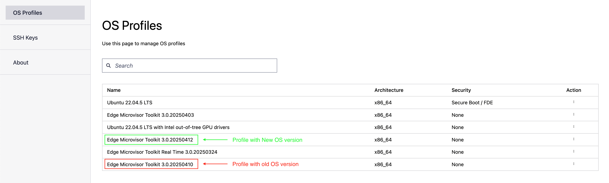
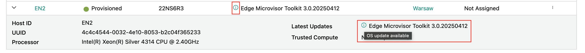
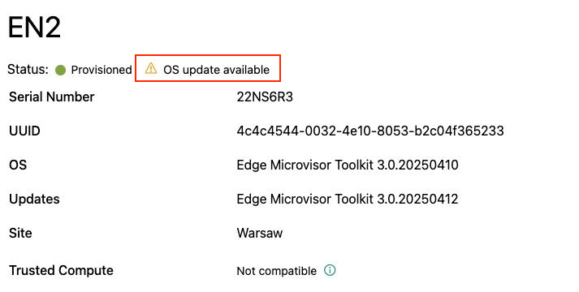
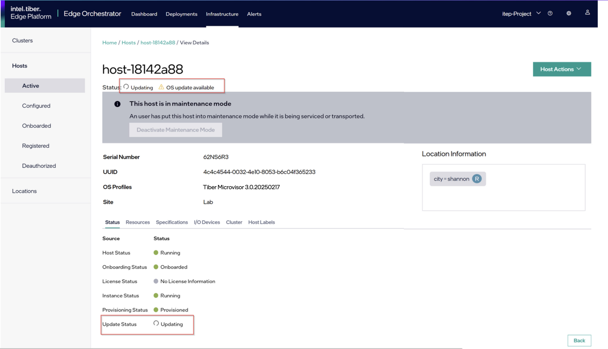

Update an Edge Node's Immutable OS Software
============================================

You can update the edge node's Intel®  Edge Microvisor Toolkit operating system software through Edge Orchestrator, by scheduling an update during a maintenance window.
The Maintenance Manager, which is a part of Edge Infrastructure Manager on Edge Orchestrator, will respond with information about the update and schedule, to a
corresponding Platform Update Agent on the edge node.
The Platform Update Agent will update the edge node.

**Edge Microvisor Toolkit** - This is an immutable OS where the OS level software is installed on a read-only partition (**Partition A**) and cannot be manipulated or updated by a package manager.
The OS is updated by installing a new Edge Microvisor Toolkit image onto a separate partition (**Partition B**), and swapping the boot partition from **A** to **B** during reboot.
The source of the update is a new Edge Microvisor Toolkit image provided in a Release Service.

Update an Edge Node with the Immutable OS
------------------------------------------------

Updates to the Edge Microvisor Toolkit come in the form of new OS images available in the **Release Service**.
A component called **OS Resource Manager** periodically queries the **Release Service** for the latest changes to the Edge Microvisor Toolkit profiles.
When the Edge Orchestrator is upgraded, the OS Resource Manager detects new OS Profiles for
the Edge Microvisor Toolkit images that are compatible with the current Edge Orchestrator version.
The latest Edge Microvisor Toolkit profile contains information about the latest Edge Microvisor Toolkit image.

OS Resource Manager Default Operation
^^^^^^^^^^^^^^^^^^^^^^^^^^^^^^^^^^^^^^^

By default, the OS Resource manager will automatically link the new OS Resource containing information about the latest Edge Microvisor Toolkit image,
to the desired OS within the edge node instances associated with this type of OS.
This means that whenever a newer version of the the Edge Microvisor Toolkit is discovered, a subsequent scheduled update of the edge node will result in the latest OS being installed.

Enable OS Resource Manager in Manual Mode
^^^^^^^^^^^^^^^^^^^^^^^^^^^^^^^^^^^^^^^^^^^

It is possible to disable the automatic OS Resource linkage in the OS Resource Manager.
This will allow for use cases where the latest-available Edge Microvisor Toolkit version may not be desirable,
and an update within the fleet of edge nodes will only install a specific available version of the OS.
To disable the automatic OS Resource linkage the Edge Orchestrator will be deployed with, enable the **os-resource-manager-manual-mode: true** option in the **enable-osrm-manual-mode.yaml**
profile file of the Edge Orchestrator's orch-configs repository.
For more information on how to deploy and configure Edge Orchestrator, refer to the relevant installation guide for either the cloud or on-premises.

To link an OS Resource to the desired OS within the edge-node instances when the manual mode is enabled for OS Resource Manager:

.. note::

      The steps are only valid when the OS Resource Manager is deployed in manual mode.

1. Obtain access to API and discover the available OS Resources:

    .. code-block::

          CLUSTER_FQDN=<example.domain>
          ADMIN_USERNAME=<example_admin>
          ADMIN_PASSWORD=<example_password>
          CLIENT_ID=<example_clientID>
          PROJECT=<example_project>

          JWT_TOKEN=$(curl -s --location --request POST "https://keycloak.${CLUSTER_FQDN}/realms/master/protocol/openid-connect/token" \
          --header 'Content-Type: application/x-www-form-urlencoded' \
          --data-urlencode "grant_type=password" \
          --data-urlencode "client_id=${CLIENT_ID}" \
          --data-urlencode "username=${ADMIN_USERNAME}" \
          --data-urlencode "password=${ADMIN_PASSWORD}" \
          --data-urlencode "scope=openid profile email groups" | jq -r .access_token)

          export MI_API_URL=https://api.${CLUSTER_FQDN}/v1/projects/${PROJECT}

          curl -X GET "$MI_API_URL/compute/os" -H "accept:application/json" -H "Authorization: Bearer ${JWT_TOKEN}"  | jq

#. Update the desired OS field of the instance in the inventory:

    .. code-block::

          # Find the instance
          curl -X GET "$MI_API_URL/compute/instances" -H "accept:application/json" -H "Authorization: Bearer ${JWT_TOKEN}"  | jq

          # Update the instance with selected OS Resource containing desired OS version. Replace **<OSRESOURCE_ID>** and **<INSTANCE_ID>** with desired IDs.
          curl -X PATCH -H 'Accept: application/json' -H "Authorization: Bearer ${JWT_TOKEN}" --data '{"osId": "<OSRESOURCE_ID>"}' --header "Content-Type: application/json" $MI_API_URL/compute/instances/<INSTANCE_ID>

#. From now on, any scheduled update will attempt to update the Edge Microvisor Toolkit to the specified version. To verify:

    .. code-block::

        curl -X GET "$MI_API_URL/compute/instances" -H "accept:application/json" -H "Authorization: Bearer ${JWT_TOKEN}"  | jq

Display Available Updates on UI
^^^^^^^^^^^^^^^^^^^^^^^^^^^^^^^^^

When a newer image of Edge Microvisor Toolkit is detected, the UI will indicate that an update for an edge node is available.
The indication will be available in the **Active Hosts** view and as part of the individual edge node's view:

Scheduling OS update
^^^^^^^^^^^^^^^^^^^^^^^^^

To schedule an update of the edge node's Edge Microvisor Toolkit, follow the steps for **OS Update** maintenance type described in the
:doc:`/user_guide/advanced_functionality/host_schedule_main` section.
Upon a successful scheduling of an update, the Platform Update Agent on the edge node will run the update at the selected time and date.
The Platform Update Agent will respond with an appropriate status on a successful update, to the Maintenance Manager.
In case of an update failure, the Platform Update Agent will return a relevant failure status and/or attempt a rollback to the Edge Microvisor Toolkit version installed prior to the update attempt.

Successful OS Update
^^^^^^^^^^^^^^^^^^^^^^^^^

Upon successful completion of the update, the relevant Edge Microvisor Toolkit version information will be displayed in the UI for the updated host.
The notification related to new updates available will disappear until a newer version of Edge Microvisor Toolkit is available, and the node will be back in the **running** state.

Update Considerations
------------------------

Updating an OS will reboot the edge node.
