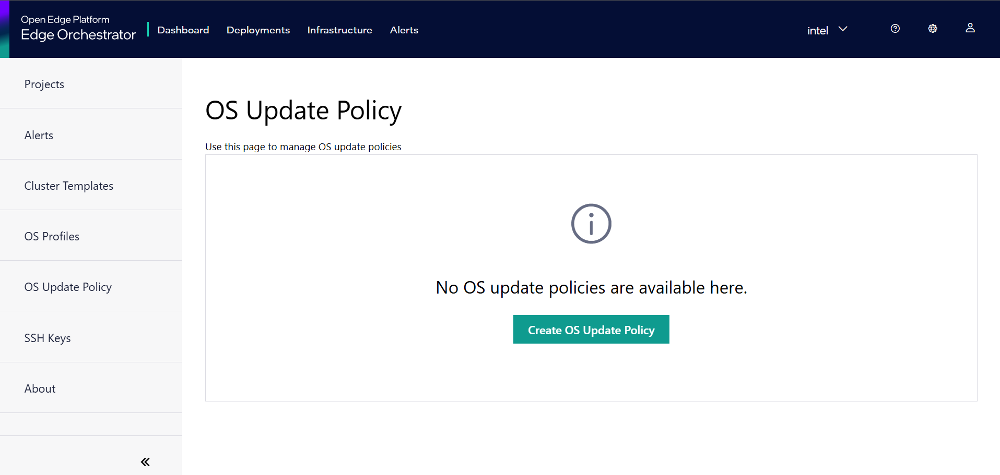
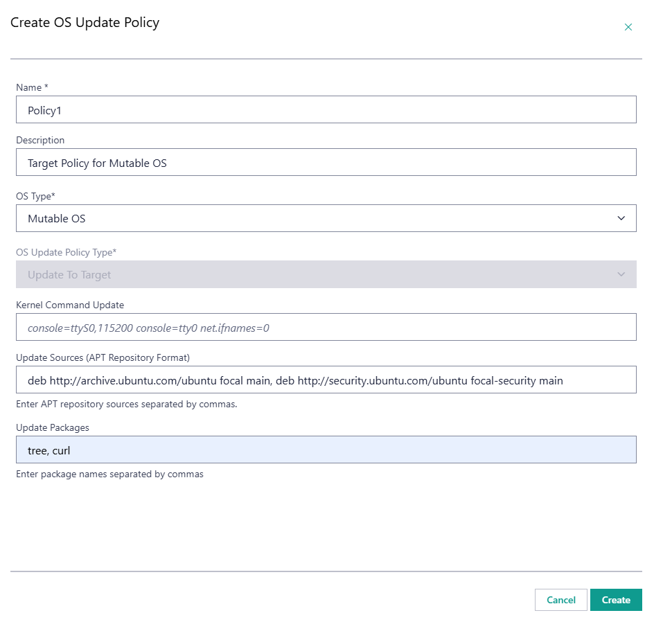
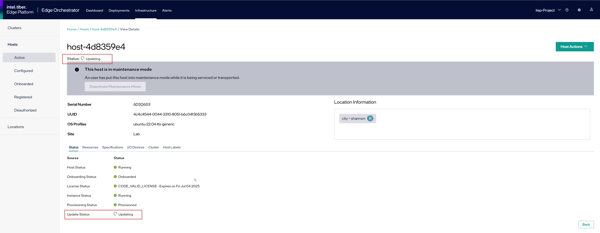
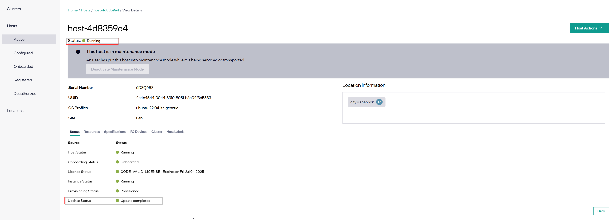

Install a New Debian\* Package on Mutable OS
============================================

This section assumes that you have provisioned and configured an edge node with an OS profile containing a mutable image, such as Ubuntu* OS version 22.04.
The procedure described here does not work for edge nodes provisioned and configured with immutable operating systems, such as the Edge Microvisor Toolkit OS.

You can install new Debian\* packages on edge nodes with mutable OSes using the :doc:`/api/edge_infra_manager`, Web-UI, or Orch CLI. This section describes how to install new packages using the Web UI.

.. note:: Verify the source reliability, integrity, and security-related aspects of the Debian package before installing the package.

.. note:: Intel does not support installing out of tree drivers and kernel when the secure boot feature is enabled on the edge node.

Create an Advanced Packaging Tool (APT) Source
----------------------------------------------

If the desired Debian packages are not included in the default Ubuntu\* APT repository or in any of the repositories (`updateSources` field) already set in the OS Resource,
you must provide a new APT source using the DEB822 Source Format.

.. note::

    Pay special attention to the formatting requirements of the GNU Privacy Guard (GPG) key, which is the value of the `Signed-By` key. Follow the DEB822 format:

    - Represent empty lines with a dot.

    - Indent each line of the key with a single space.

.. code-block::

    Types: deb
    URIs: https://repo.mongodb.org/apt/ubuntu
    Suites: jammy/mongodb-org/7.0
    Components: multiverse
    Signed-By:
     -----BEGIN PGP PUBLIC KEY BLOCK-----
     Version: GnuPG v1
     .
     mQINBGPILWABEACqeWP/ktugdlWEyk7YTXo3n19+5Om4AlSdIyKv49vAlKtzCfMA
     QkZq3mfvjXiKMuLnL2VeElAJQIYcPoqnHf6tJbdrNv4AX2uI1cTsvGW7YS/2WNwJ
     C/+vBa4o+yA2CG/MVWZRbtOjkFF/W07yRFtNHAcgdmpIjdWgSnPQr9eIqLuWXIhy
     H7EerKsba227Vd/HfvKnAy30Unlsdywy7wi1FupzGJck0TPoOVGmsSpSyIQu9A4Z
     uC6TE/NcJHvaN0JuHwM+bQo9oWirGsZ1NCoVqSY8/sasdUc7T9r90MbUcH674YAR
     8OKYVBzU0wch4VTFhfHZecKHQnZf+V4dmP9oXnu4fY0/0w3l4jaew7Ind7kPg3yN
     hvgAkBK8yRAbSu1NOtHDNiRoHGEQFgct6trVOvCqHbN/VToLNtGk0rhKGOp8kuSF
     OJ02PJPxF3/zHGP8n8khCjUJcrilYPqRghZC8ZWnCj6GJVg6WjwLi+hPwNMi8xK6
     cjKhRW3eCy5Wcn73PzVBX9f7fSeFDJec+IfS47eNkxunHAOUMXa2+D+1xSWgEfK0
     PClfyWPgLIXY2pGQ6v8l3A6P5gJv4o38/E1h1RTcO3H1Z6cgZLIORZHPyAj50SPQ
     cjzftEcz56Pl/Cyw3eMYC3qlbABBgsdeb6KB6G5dkNxI4or3MgmxcwfnkwARAQAB
     tDdNb25nb0RCIDcuMCBSZWxlYXNlIFNpZ25pbmcgS2V5IDxwYWNrYWdpbmdAbW9u
     Z29kYi5jb20+iQI+BBMBAgAoBQJjyC1gAhsDBQkJZgGABgsJCAcDAgYVCAIJCgsE
     FgIDAQIeAQIXgAAKCRAWDSa7F4W6OM+eD/sE7KbJyRNWyPCRTqqJXrXvyPqZtbFX
     8sio0lQ8ghn4f7lmb7LnFroUsmBeWaYirM8O3b2+iQ9oj4GeR3gbRZsEhFXQfL54
     SfrmG9hrWWpJllgPP7Six+jrzcjvkf1TENqw4jRP+cJhuihH1Gfizo9ktwwoN9Yr
     m7vgh+focEEmx8dysS38ApLxKlUEfTsE9bYsClgqyY1yrt3v4IpGbf66yfyBHNgY
     sObR3sngDRVbap7PwNyREGsuAFfKr/Dr37HfrjY7nsn3vH7hbDpSBh+H7a0b/chS
     mM60aaG4biWpvmSC7uxA/t0gz+NQuC4HL+qyNPUxvyIO+TwlaXfCI6ixazyrH+1t
     F7Bj5mVsne7oeWjRrSz85jK3Tpn9tj3Fa7PCDA6auAlPK8Upbhuoajev4lIydNd2
     70yO0idm/FtpX5a8Ck7KSHDvEnXpN70imayoB4Fs2Kigi2BdZOOdib16o5F/9cx9
     piNa7HotHCLTfR6xRmelGEPWKspU1Sm7u2A5vWgjfSab99hiNQ89n+I7BcK1M3R1
     w/ckl6qBtcxz4Py+7jYIJL8BYz2tdreWbdzWzjv+XQ8ZgOaMxhL9gtlfyYqeGfnp
     hYW8LV7a9pavxV2tLuVjMM+05ut/d38IkTV7OSJgisbSGcmycXIzxsipyXJVGMZt
     MFw3quqJhQMRsA==
     =gbRM
     -----END PGP PUBLIC KEY BLOCK---

Create OS Update Policy
------------------------

**OS Update Policy** allows you to specify new Debian packages to be installed on the edge nodes as part of the update process, and to add new APT sources from which the new packages will be installed. For more information on **OS Update Policy** see :doc:`/user_guide/advanced_functionality/apply_new_os_update_policy`.
Follow these steps to create an OS Update Policy that installs new packages on edge nodes with mutable OSes:

i. Within the Web UI navigate to configuration section and open the **OS Update Policy** page.

ii. Click on the **Create OS Update Policy** button to open the **Create OS Update Policy** form.

    OS Update Policy contains fields specific to mutable OS update and Immutable OS update.
    To install new Debian packages on edge nodes with mutable OSes, select OS Type **Mutable OS** and OS Update Policy Type **Update To Target**. This will enable only fields applicable to mutable OS updates.

iii. Provide the Update Sources and Update Packages following this example, and hit **Create** button:

Associate the OS Update Policy with Hosts
-----------------------------------------
Within the Web UI, navigate to the **Hosts** page, open the desired Host details page, and select **Updates** tab. Here, set applied policy by selecting the created OS Update Policy from the **OS Update Policy** drop-down list.
The newly added packages will be installed on all the edge nodes that are configured with the given OS Update Policy if a maintenance window is scheduled for that edge node.

.. figure:: images/os-update-policy_link-to-host.png
        :alt: OS Update Policy - update packages example  

Scheduling Ubuntu OS Update
---------------------------

To schedule an update of an edge node's Ubuntu OS, follow the steps for **OS Update** maintenance type described in the
:doc:`/user_guide/advanced_functionality/host_schedule_main` section.
Upon a successful scheduling of an update, the Platform Update Agent on the edge node will run the update at the selected time and date.
If new packages were specified before the update, the packages will be installed as part of this process.
As part of the update process, all packages with update candidates available in the remote `APT` repositories will be updated to the available version.
The Platform Update Agent will respond with an appropriate status on a successful update, to the Maintenance Manager.
In case of an update failure, the Platform Update Agent will return a relevant failure status.

Successful Ubuntu OS Update
^^^^^^^^^^^^^^^^^^^^^^^^^^^

Upon successful completion of the update procedure, the relevant status will be displayed in the UI for the updated host.
Note that the update status will change to "No new updates available" shortly after completion.

Update Considerations
---------------------

Updating an OS will reboot the edge node.
