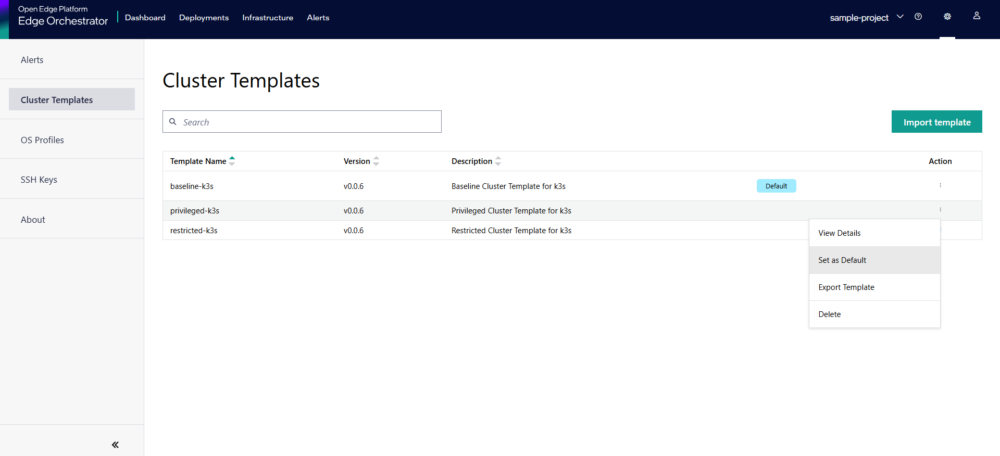

Set Default Cluster Template
================================

When you set a template as the default, it displays as the default option when creating a cluster.
However, when you create a single host cluster while configuring the host, the default template will be automatically selected.
For more information, see :doc:`/user_guide/set_up_edge_infra/edge_node_onboard/onboarding_actions/provision_host`.

.. note::
   The user can only assign one template as the default template at any time.

To assign the default template, do the following:

1. In the **Cluster Templates** page, select the cluster template that you want to set as default.

2. Click the three-dot (...) icon in the **Actions** column and select **Set as default**. The cluster template remains as default.

