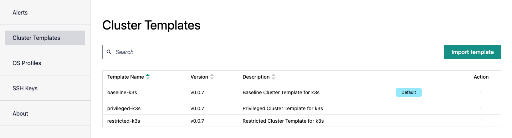

Cluster Template
==========================

A cluster template is a predefined configuration or blueprint for setting up and managing clusters.
Cluster templates allow you to rapidly provision and deploy clusters with uniform configurations, minimizing time and effort.

Edge Orchestrator supports the JSON format for creating, exporting, or importing a cluster template.

.. note::
   Only an edge manager can create a cluster template.

|software_prod_name| comes with three built-in cluster templates:

* restricted-k3s
* baseline-k3s
* privileged-k3s

To go to the **Cluster Templates** page, click the **Settings** tab and then
click **Clusters Templates** on the left menu. You can view the built-in
cluster template. Intel provides and maintains these default templates. Each
built-in template provides different restrictions that are automatically applied
for customer workloads:

The common settings in the cluster templates include:

* Kubernetes\* platform version v1.32.9+k3s1
* Minimal addons required for a single-node cluster operation, including CNI
  (Flannel) and CoreDNS
* Pod Security Admission (PSA) policy level that defines the security
  constraints for the cluster. See `Pod Security Standards
  <https://kubernetes.io/docs/concepts/security/pod-security-standards/>`_ to
  learn about different policy levels.
* Configurations for Kubernetes control plane with recommended TLS cipher suites
* Common configuration of the cluster IP addresses
* Optional list of deployment metadata key-value pairs populated as cluster
  labels and used to identify clusters as targets for
  :doc:`/user_guide/advanced_functionality/automated_deployment`.

.. note::

  When security is a top priority, use the `baseline` or `restricted` templates
  as the default for all clusters managed by Edge Orchestrator. For trial
  environments, the `privileged` template can be used, as it provides no
  restrictions and is suitable for testing purposes.

From this page, you can click the three-dot (...) icon in the **Actions** column and you can do the following:

    * :doc:`/user_guide/advanced_functionality/view_cluster_template`
    * :doc:`/user_guide/advanced_functionality/set_default_cluster_template`
    * :doc:`/user_guide/advanced_functionality/import_cluster_template`
    * :doc:`/user_guide/advanced_functionality/export_cluster_template`
    * :doc:`/user_guide/advanced_functionality/delete_cluster_template`

.. warning::

  The default pod and service subnets in the cluster templates are set to:

  - Pod CIDR: `10.42.0.0/16`
  - Service CIDR: `10.43.0.0/16`

  These subnets may conflict with your local network configuration at the edge.
  Before deploying a cluster, check that these subnets are not already in use
  by your local network. If there is a conflict, create a new cluster
  template with custom pod and service subnets that are valid for your environment.

  An easy way to achieve this is exporting the existing template you want to use
  as a base.

  Modify the `clusterNetwork` section in the downloaded JSON file:

  .. code-block:: json

     "clusterNetwork": {
       "pods": {
         "cidrBlocks": [
           "CUSTOM_POD_CIDR"
         ]
       },
       "services": {
         "cidrBlocks": [
           "CUSTOM_SERVICE_CIDR"
         ]
       }
     }

  Replace `CUSTOM_POD_CIDR` and `CUSTOM_SERVICE_CIDR` with subnets that are
  valid for your edge environment. Update the template name
  and/or version before importing it.

.. toctree::
   :hidden:

   view_cluster_template
   set_default_cluster_template
   export_cluster_template
   import_cluster_template
   delete_cluster_template

.. note::

   In applications deployments a Pull Rate Limit error may occur when pulling container
   images from Docker Hub. To avoid this issue, consider using an authenticated Docker Hub
   account or a private container registry. The Docker Hub account credentials can be configured
   by customizing the cluster template before deploying a cluster. To create a cluster template
   you can export the existing template, add the Docker Hub credentials in the containerd registry
   configuration section within the config.toml.tmpl file content under clusterconfiguration.spec.
   template.spec.kthreesConfigSpec.files of the JSON file, and then import the modified template.

   Example:

   .. code-block:: json

      {
          "content": "{{ template \\\"base\\\" . }}\n\n[plugins.\\\"io.containerd.grpc.v1.cri\\\".containerd.runtimes.kata-qemu]\n  runtime_type = \\\"io.containerd.kata-qemu.v2\\\"\n  runtime_path = \\\"/opt/kata/bin/containerd-shim-kata-v2\\\"\n  privileged_without_host_devices = true\n  pod_annotations = [\\\"io.katacontainers.*\\\"]\n\n[plugins.\\\"io.containerd.grpc.v1.cri\\\".containerd.runtimes.kata-qemu.options]\n  ConfigPath = \\\"/opt/kata/share/defaults/kata-containers/configuration-qemu.toml\\\"\n\n[plugins.\\\"io.containerd.grpc.v1.cri\\\".registry.configs.\\\"registry-1.docker.io\\\".auth]\n  username = \\\"<dockerhub-username>\\\"\n  password = \\\"<dockerhub-access-token>\\\"\n\n[plugins.\\\"io.containerd.nri.v1.nri\\\"]\n  disable = false\n  disable_connections = false\n  plugin_config_path = \\\"/etc/nri/conf.d\\\"\n  plugin_path = \\\"/opt/nri/plugins\\\"\n  plugin_registration_timeout = \\\"5s\\\"\n  plugin_request_timeout = \\\"2s\\\"\n  socket_path = \\\"/var/run/nri/nri.sock\\\"",
          "path": "/var/lib/rancher/k3s/agent/etc/containerd/config.toml.tmpl"
      }

   In the above example, replace `<dockerhub-username>` and `<dockerhub-access-token>`
   with your Docker Hub account username and access token respectively.
