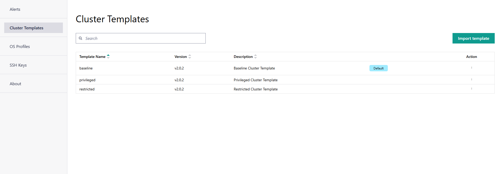

Cluster Template
==========================

A cluster template is a predefined configuration or blueprint for setting up and managing clusters.
Cluster templates allow you to rapidly provision and deploy clusters with uniform configurations, minimizing time and effort.

Edge Orchestrator supports the JSON format for creating, exporting, or importing a cluster template.

.. note::
   Only an edge manager can create a cluster template.

|software_prod_name| comes with three built-in cluster templates:

* restricted
* baseline
* privileged

To go to the **Cluster Templates** page, click the **Settings** tab and then
click **Clusters Templates** on the left menu. You can view the built-in
cluster template. Intel provides and maintains these default templates. Each
built-in template provides different restrictions that are automatically applied
for customer workloads:

The common settings in the cluster templates include:

* Kubernetes\* platform version v1.30.10+rke2r1
* Preconfigured mirrors for Container Runtime Interface (CRI)
* Preconfigured Container Network Interface (CNI) – Multus, Calico, and Wireguard\* CNIs
  that are enhanced by preconfigured network policies.
* Common configuration of the cluster IP addresses - cluster or service CIDRs
* Optional list of deployment metadata key-value pairs populated as cluster labels
  and used to identify clusters as targets for
  :doc:`/user_guide/advanced_functionality/automated_deployment`.

Built-in cluster templates have the following deployment metadata labels:

.. list-table::
   :widths: 20, 20
   :header-rows: 1

   * - Cluster Template Name
     - deployment-metadata

   * - restricted
     - "default-extension": "restricted"

   * - baseline
     - "default-extension": "baseline"

   * - privileged
     - "default-extension": "privileged"

Each built-in template applies a set of security policies with varying levels of restrictions.

For more info on pod security admission policies, see the official Kubernetes documentation on
`Pod Security Admission <https://kubernetes.io/docs/concepts/security/pod-security-admission/>`_.

.. note::
   When security is of highest priority, Intel recommends using the 'restricted' template as
   a default for all clusters managed by Edge Orchestrator. Otherwise, Intel recommends
   assigning 'baseline' as the default cluster template.

From this page, you can click the three-dot (...) icon in the **Actions** column and you can do the following:

    * :doc:`/user_guide/advanced_functionality/view_cluster_template`
    * :doc:`/user_guide/advanced_functionality/set_default_cluster_template`
    * :doc:`/user_guide/advanced_functionality/import_cluster_template`
    * :doc:`/user_guide/advanced_functionality/export_cluster_template`
    * :doc:`/user_guide/advanced_functionality/delete_cluster_template`

.. toctree::
   :hidden:

   view_cluster_template
   set_default_cluster_template
   export_cluster_template
   import_cluster_template
   delete_cluster_template
