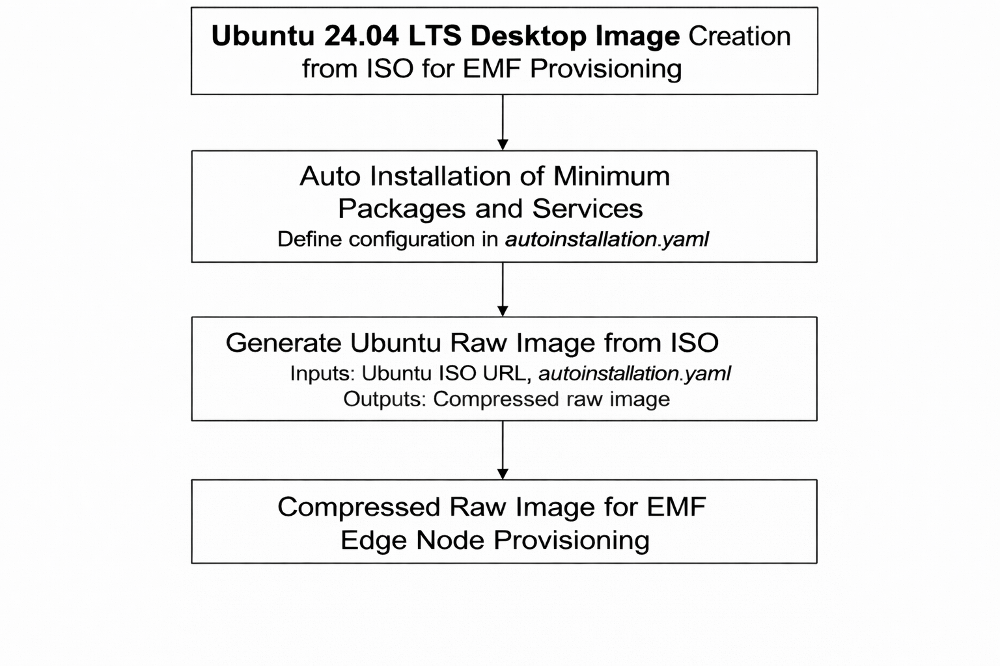
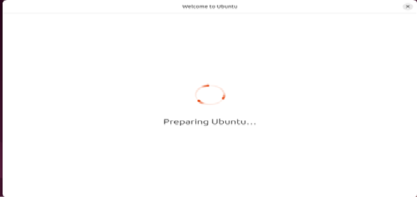

Ubuntu 24.04 LTS Desktop Image Creation
=======================================

In a typical EMF flow, Ubuntu canonical Server-based images are used for edge node provisioning. However, if you prefer
to use an Ubuntu Desktop image, you can achieve this by leveraging automated scripts to prepare the image from an ISO
file

Prerequisites
-------------

You need Ubuntu 22 LTS or Ubuntu 24 LTS development system for generating the raw image.

Workflow Diagram
----------------

To generate an Ubuntu Desktop raw image from an ISO file, you primarily need two components as mentioned below.

        1.autoinstallation.yaml: Defines system settings, required packages, and services to install during the
        ISO-based installation process.

        2.Prepare_ubuntu_raw_img.sh: A script that creates the raw image from the ISO file

Creating Ubuntu Desktop Raw Image
---------------------------------

The Prepare_ubuntu_raw_img.sh script generates the raw image using the following inputs:
        - autoinstallation.yaml (Ensure proper indentation; incorrect formatting will cause image generation to fail.)
        - Ubuntu Desktop ISO URL (Provide the official ISO link for Ubuntu Desktop 24.04 LTS).

Automated Scripts
~~~~~~~~~~~~~~~~~

**Prepare_ubuntu_raw_img.sh**

.. code-block:: shell

   #!/bin/bash

   # SPDX-FileCopyrightText: (C) 2026 Intel Corporation
   # SPDX-License-Identifier: Apache-2.0

   ####################################################
   #
   # File Name: Prepare_Ubuntu_Image.sh
   # Details: This script is to generate Ubuntu RAW
   #          Image from ISO file
   #
   ###################################################
   set -e

   # --- Configuration ---
   ISO_URL=""
   OUTPUT_IMG="ubuntu-desktop-24.04.raw.img"
   USER_DATA=""
   SEED_ISO="seed.iso"
   DISK_SIZE="10G"

   # Check root
   if [ "$EUID" -ne 0 ]; then
       echo "Please run as root (use sudo)"
       exit 1
   fi

   usage() {
   echo "Usage : `basename $0` -i <iso_link> -c autoinstall.yaml "
   echo "Options are below"
   echo "  -i , --isolink  | provide the iso artifactory link"
   echo "  -c , --configuration file | provide the autoinstall.yaml file"
   }

   while getopts "i:c:h:" option
   do
      case "$option" in
      i) ISO_URL="$OPTARG" ;;
      c) USER_DATA="$OPTARG" ;;
      h|?) usage
         exit 0
     ;;
   esac
   done

   # Validate required arguments
   if [ -z "$ISO_URL" ] || [ -z "$USER_DATA" ]; then
       echo "Error: Both -i (ISO URL) and -c (config file) are required"
       usage
       exit 1
   fi

   #  Install dependency pkgs ---
   echo "Installing dependencies..."
   sudo apt update && sudo apt install -y qemu-system-x86 qemu-utils xorriso cloud-image-utils wget dosfstools e2fsprogs parted coreutils

   ISO_FILE=$(basename "$ISO_URL")

   # Download ISO ---
   if [ ! -f "$ISO_FILE" ]; then
       echo "Downloading Ubuntu $ISO_FILE..."
       wget -O "$ISO_FILE" "$ISO_URL"
   fi

   #  Extract vmlinuz and initrd ---
   echo "Extracting boot files from ISO..."
   mkdir -p ./iso_mount
   sudo mount -o loop "$ISO_FILE" ./iso_mount
   cp ./iso_mount/casper/vmlinuz .
   cp ./iso_mount/casper/initrd .
   sudo umount ./iso_mount
   rmdir ./iso_mount

   #  Prepare Build Files ---
   echo "Creating seed ISO and blank disk..."
   touch meta-data
   cloud-localds "$SEED_ISO" "$USER_DATA" meta-data
   if [ -f "$OUTPUT_IMG" ]; then
       rm -rf "$OUTPUT_IMG"
       rm -rf "$OUTPUT_IMG".gz > /dev/null 2>&1
       rm -rf "$OUTPUT_IMG"* > /dev/null 2>&1
   fi
   qemu-img create -f raw "$OUTPUT_IMG" "$DISK_SIZE"

   #  Run QEMU Installation ---
   echo "Starting Installation (Minimal Desktop)..."
   echo "Note: This will output logs directly to this terminal."

   qemu-system-x86_64 \
       -enable-kvm \
       -m 8192 \
       -smp 4 \
       -bios /usr/share/qemu/OVMF.fd \
       -drive file="$OUTPUT_IMG",format=raw,if=virtio,cache=unsafe \
       -drive file="$ISO_FILE",format=raw,readonly=on,if=virtio \
       -drive file="$SEED_ISO",format=raw,readonly=on,if=virtio \
       -kernel vmlinuz \
       -initrd initrd \
       -append "autoinstall ds=nocloud fsck.mode=skip quiet console=ttyS0 console=tty0" \
       -vnc :1 \
       -serial mon:stdio \
       -no-reboot

   sync
   sleep 5
   sync
   echo "Installation finished."

   # Post-Install: Image Verification ---

   echo "Image Verification"
   qemu-system-x86_64 \
       -enable-kvm \
       -m 4096 \
       -smp 4 \
       -bios /usr/share/qemu/OVMF.fd \
       -drive file="$OUTPUT_IMG",format=raw,if=virtio \
       -nographic \
       -serial mon:stdio &

   # Capture the Process ID of QEMU
   QEMU_PID=$!

   echo "QEMU PID: $QEMU_PID"

   echo "Waiting for VM to shut down cleanly..."
   wait "$QEMU_PID"

   echo "VM exited cleanly "

   # Label the partitions for generated Image

   echo "Creating the partition labels for the Image"

   # Mount image as loop device with partition scanning
   LOOP_DEV=$(sudo losetup -Pf --show "$OUTPUT_IMG")

   # Wait a second for kernel to register partitions
   sleep 2

   echo "Applying label 'uefi' to partition 1..."
   sudo fatlabel "${LOOP_DEV}p1" uefi || echo "Failed to label p1"

   echo "Applying label 'rootfs' to partition 2..."
   sudo e2label "${LOOP_DEV}p2" rootfs || echo "Failed to label p2"

   # Also set GPT Partition Names for clarity in tools like GParted
   sudo parted "${LOOP_DEV}" name 1 uefi
   sudo parted "${LOOP_DEV}" name 2 rootfs

   # Detach loop device
   sudo losetup -d "$LOOP_DEV"

   # Cleanup ---
   rm vmlinuz initrd "$SEED_ISO" meta-data

   # Compress the Image to .gz using pigz
   echo "Creating Imge Compression,Please Wait"
   if pigz -9 -k "$OUTPUT_IMG"; then
       echo "DONE: $OUTPUT_IMG.gz created successfully."
   else
       echo "ERROR: pigz failed."
       exit 1
   fi

   # Generate the sha-checksum file
   echo "Generating the CheckSum File,Please Wait"

   if sha256sum $OUTPUT_IMG.gz >  $OUTPUT_IMG.gz.sha256sum ; then
       echo "Sha256sum generated successfully for the image $OUTPUT_IMG.gz"
   else
       echo "Failed to generate the Sha256sum file,Please check!!"
   fi

   echo "################################################"
   echo " Image Creation SUCCESS!"
   echo " Raw Image Created: $OUTPUT_IMG.gz"
   echo " CheckSum File Created: $OUTPUT_IMG.gz.sha256sum"
   echo " Partition 1 (FAT32): uefi"
   echo " Partition 2 (EXT4):  rootfs"
   echo "################################################"

autoinstallation.yaml
---------------------

.. code-block:: yaml

   #cloud-config
   # See the autoinstall documentation at:
   # https://canonical-subiquity.readthedocs-hosted.com/en/latest/reference/autoinstall-reference.html
   autoinstall:
     active-directory:
       admin-name: ''
       domain-name: ''
     apt:
       disable_components: []
       fallback: offline-install
       geoip: true
       mirror-selection:
         primary:
         - country-mirror
         - arches: &id001
           - amd64
           - i386
           uri: http://archive.ubuntu.com/ubuntu/
         - arches: &id002
           - s390x
           - arm64
           - armhf
           - powerpc
           - ppc64el
           - riscv64
           uri: http://ports.ubuntu.com/ubuntu-ports
       preserve_sources_list: false
       security:
       - arches: *id001
         uri: http://security.ubuntu.com/ubuntu/
       - arches: *id002
         uri: http://ports.ubuntu.com/ubuntu-ports
     codecs:
       install: false
     drivers:
       install: false
     user-data:
       users:
       - name: user
         shell: /bin/bash
         passwd: $6$i2P96xaVS20An4xS$wf.l8QHtdl6yPjU.Y3H0WDPQRnHqmw5vj75gShMmytqUoxz0VrkPeUy5CWDDW/oRH7q6tJhWLoAqITx/muOXK1
         groups: [adm,sudo]
         lock-passwd: false
         sudo: ALL=(ALL) NOPASSWD:ALL
       write_files:
       - path: /usr/local/bin/first-boot-fix.sh
         owner: root:root
         permissions: '0755'
         content: |
           #!/bin/bash

           # 1. Kill the installer's "lock" files
           rm -f /etc/cloud/cloud-init.disabled
           rm -f /etc/cloud/cloud-init.d/99-installer.cfg

           # 2. Disable disk growth
           cat > /etc/cloud/cloud.cfg.d/99-disable-growpart.cfg <<'EOF'
           growpart:
             mode: off

           resize_rootfs: false
           EOF

           # 3. Set the datasource
           echo 'datasource_list: [ NoCloud, None ]' > /etc/cloud/cloud.cfg.d/99-custom-datasource.cfg

           # 3. Re-arm cloud-init
           echo "policy: enabled" > /etc/cloud/ds-identify.cfg
           echo "datasource: NoCloud" >> /etc/cloud/ds-identify.cfg

           cloud-init clean --logs --machine-id

           # 4. Wait for APT locks
           echo "Checking for active APT processes..."
           while fuser /var/lib/dpkg/lock-frontend /var/lib/apt/lists/lock >/dev/null 2>&1; do
              sleep 2
           done

           # 5. FAST NETWORK CHECK

           echo "Testing repo connectivity..."
           until apt-get update -o Acquire::ConnectTimeout=5 -o Acquire::Retries=0 -qq > /dev/null 2>&1; do
              echo "Repositories unreachable. Checking again in 5s..."
              sleep 5
           done

           # 6. Install the packages you removed from the autoinstall section
           apt-get update
           apt-get install -y openssh-server net-tools wget cloud-utils curl vim

           # 7. Self-destruct
           systemctl disable first-boot-fix.service
           rm -f /etc/systemd/system/first-boot-fix.service
           shutdown -h now

       - path: /etc/systemd/system/first-boot-fix.service
         owner: root:root
         permissions: '0644'
         content: |
           [Unit]
           Description=Reset Cloud-Init on First Boot
           After=network.target
           Before=cloud-init.service

           [Service]
           Type=oneshot
           ExecStart=/usr/local/bin/first-boot-fix.sh
           RemainAfterExit=yes

           [Install]
           WantedBy=multi-user.target
       runcmd:
         - systemctl daemon-reload
         - systemctl enable first-boot-fix.service
         - systemctl start first-boot-fix.service

     kernel:
       package: linux-generic-hwe-24.04
     keyboard:
       layout: us
       toggle: null
       variant: ''
     locale: en_US.UTF-8
     network:
       ethernets:
         ens3:
           dhcp4: true
       version: 2
     oem:
       install: auto
     # Provide Proxy server ,if applicable
     proxy:
     source:
       id: ubuntu-desktop-minimal
       search_drivers: false
     ssh:
       allow-pw: true
       authorized-keys: []
       install-server: false
     storage:
       version: 1
       layout:
         name: direct
     timezone: Asia/Kuala_Lumpur
     updates: security
     version: 1
     interactive-sections: []

     late-commands:
       - curtin in-target --target=/target -- apt-get update || true
       - curtin in-target --target=/target -- apt-get upgrade -y || true
       - curtin in-target --target=/target -- sed -e 's@^GRUB_TIMEOUT_STYLE=hidden@# GRUB_TIMEOUT_STYLE=hidden@g' -e 's@^GRUB_TIMEOUT=0@GRUB_TIMEOUT=5@g' -e 's@^GRUB_CMDLINE_LINUX=\"\"@GRUB_CMDLINE_LINUX=\"console=tty0 console=ttyS0,115200n8\"@g' -i /etc/default/grub
       - curtin in-target --target=/target -- update-grub
       - curtin in-target --target=/target -- apt list --installed > /opt/Bom-list.txt
     shutdown: poweroff

Script Execution
----------------

    ``sudo ./Prepare_ubuntu_raw_img.sh -i iso_url -c autoinstallation.yaml``

    Example:  sudo ./Prepare_ubuntu_raw_img.sh -i https://releases.ubuntu.com/24.04/ubuntu-24.04.3-desktop-amd64.iso -c autoinstall.yaml

On successful execution, the script creates a raw.gz image on same location where the script executed with correctly
labelled partitions as shown below.
- Partition 1 (FAT32): uefi
- Partition 2 (EXT4): rootfs

Cloud-init services are enabled in the raw image (they are disabled by default in desktop images) for zero touch
edge node provisioning.

Finally, the generated image can be hosted on a release service or NGINX server to initiate the provisioning flow

Troubleshooting
---------------

Once the script has started, you can monitor the image generation progress using VNC Viewer.
Please ensure VNC Viewer is installed on your Ubuntu system before proceeding.
Steps to Connect:
1. Open VNC Viewer and enter your development system IP address followed by the port number

Format: <IP_ADDRESS>:<PORT_NUMBER>

Example:
    • Development System IP: 10.20.30.40
    • VNC Port from script: 1
    • VNC Viewer Input: 10.20.30.40:1

This will allow you to view the installation progress in real-time, in general it will take 20 ~30 minutes to complete
the installation.
You will see below screen on the vnc-viewer for successful installation.

Success_Screen1:
----------------

Success_Screen2:
----------------

After successful installation the VM will automatically shut down.

Important Note
--------------

If the installation screen remains on screen 1 without progressing to screen 2 after 15-20 minutes
this indicates a potential syntax error or issue in the `autoinstallation.yaml` file.

Action Required
---------------
1. Double-check the `autoinstallation.yaml` file for errors
2. Fix any identified issues
3. Rerun the script

