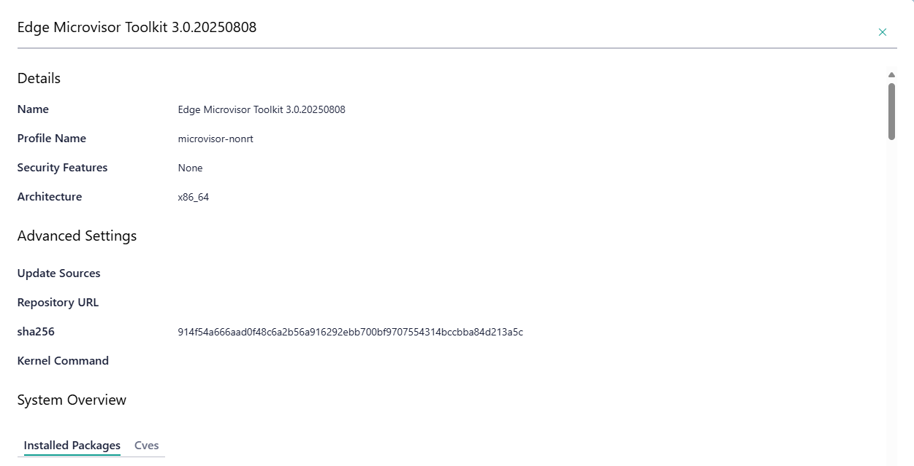
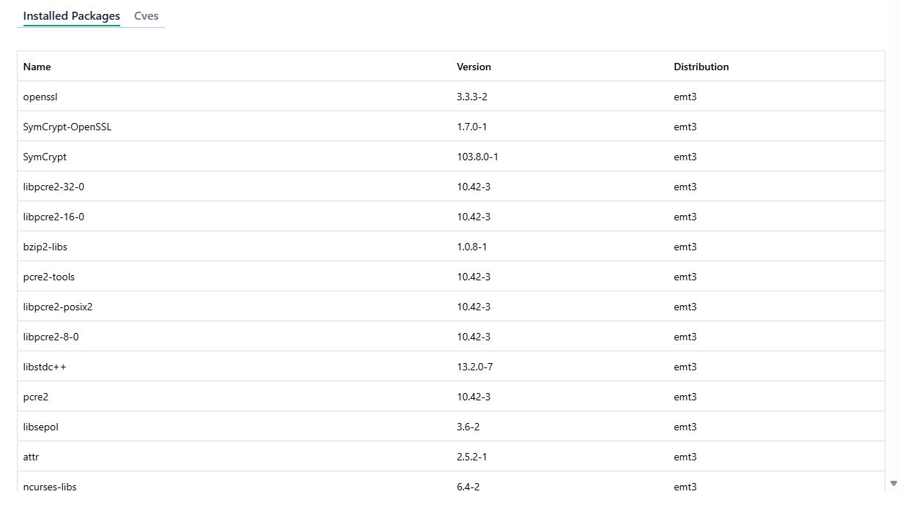

View OS Profiles
==============================

See :doc:`/shared/shared_os_profile`.

Edge Orchestrator enables you to view available OS Profiles installed in the
system and their settings. You cannot edit or delete OS profiles from this view.

In Edge Orchestrator click on the settings (gear) icon in the upper right of
the application window. Then, click the **OS Profiles** tab to the left of the settings page.
The following view is shown:

From this view you will see all OS profiles available:

* **Name:** The OS resource name
* **Architecture:** The OS resource architecture, e.g. x86_64
* **Security:** Indicates if this OS is capable of supporting features like Secure Boot (SB) and Full Disk
  Encryption (FDE). Immutable after creation.

By clicking on the action menu you can get more details about a specific OS Profile:

* **Update Sources:** The list of OS resource update sources
* **Repository URL:** The URL repository of the OS update sources
* **sha256:** SHA256 checksum of the OS resource in hexadecimal
* **Kernel Command:** The OS resource kernel command

View Installed Packages Details
^^^^^^^^^^^^^^^^^^^^^^^^^^^^^^^^^^^

Click the **Installed Packages** tab to view information about list of installed packages on the OS resource (only for immutable OS):

* **Installed Packages:** The list of installed packages on the OS resource (only for immutable OS)

View CVEs Details
^^^^^^^^^^^^^^^^^^^^^^^^^

Click the **Cves** tab to view the information about list of existing CVEs on the OS resource (only for immutable OS):

* **Cves:** The list of existing CVEs on the OS resource (only for immutable OS)

Available OS Resources during the Host Configuration
----------------------------------------------------

When configuring an host (see :doc:`/user_guide/set_up_edge_infra/edge_node_onboard/onboarding_actions/provision_host`),
users can select the available OS profiles through the UI.

.. note:: This option will be greyed out if `autoProvisioning` was enabled at installation time or configured at runtime :doc:`/shared/shared_update_provider`.

