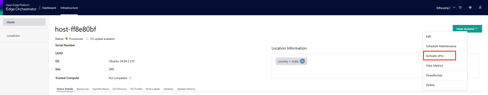
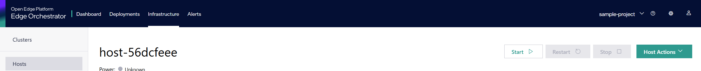

==============================
Intel® vPro® Power Management
==============================

This guide describes how to use Intel® vPro® features for power management, including activation, performing power operations, and deactivation.

Activation of vPro Power Management
-----------------------------------

To use vPro power management features, the device must be provisioned and activated. Vpro activation Changed to opt-in feature
instead of a mandatory feature Vpro activation moved to day 2 Operations as part of Host actions. Now Vpro can be activated
for both Active Management Technology (AMT-Vpro Enterprise) and Intel Standard Manageability (ISM-Vpro Essential) devices.

.. note::
   1. If the edge node is AMT/ISM-enabled, then only Vpro activation is enabled as part of Host actions.

   2. Vpro activation and deactivation will be triggered via Host actions.

   3. vPro profiles are currently created using Client Control Mode (CCM). CCM mode support is planned for
      version 3.1. Support for Admin Control Mode (ACM) is targeted as technical debt for version 3.2.

Enabling vpro from Host Actions:

Assumptions & Recommendations
-----------------------------

- **BIOS Enablement:** Ensure Intel® vPro® is enabled in the system
   BIOS. If vPro is not required, it is recommended to disable it in
   the BIOS for security and compliance. **Note:** Some platforms (e.g.,
   OnLogic K804) do not provide BIOS options to enable/disable vPro. See
   `AMT Issues <../troubleshooting/amt_issues.html#vpro-enabled-without-bios-configuration-option-on-onlogic-k804>`_
   for platform-specific limitations.
- **MEBx Password:** For enhanced security, set a strong and unique Intel® MEBx password during initial setup.
   If the default password is still in use, change it immediately to prevent unauthorized access.
- **Port Enablement:** Ensure that the 4433 network ports for Intel® AMT communication are open
   and not blocked by firewalls.

Power Operations
----------------------------

Once activated, you can perform various power operations such as power on, power off, reset, and cycle.
These operations can be managed through the user interface (UI):

**UI Power ON/OFF Operations Example:**

Clicking 'Start' will power on the device, 'Stop' will power it off,

**UI Power Reset Operations Example:**

Clicking 'Restart' will Reset the device.

**CLI Power Operations Example:**

.. code-block:: bash

   # Power On
   orch-cli set host <host-id>  --project <project_name> --power on

   # Power Off
   orch-cli set host <host-id>  --project <project_name> --power off

   # Reset
   orch-cli set host <host-id>  --project <project_name> --power reset

Replace `<host_id>` and `<project_name>` with your actual host-id and project name.

**Check the current power status of the edge node:**

To check the power state of a host using the DMT-specific API, use the following `curl` command:

.. code-block:: bash

   curl -X "GET" "https://mps-wss.<orch-address>/api/v1/amt/power/state/<HOST_UUID>" \
     -H "accept: application/json" \
     -H "Authorization: Bearer ${JWT_TOKEN}"

Replace `<cluster-name>` with your cluster domain name.
Replace `<HOST_UUID>` with the UUID of your host and ensure `${JWT_TOKEN}` is set to a valid authentication token.

This API will return the current power state of the specified.

**Check the device vPro details of the edge node:**

.. code-block:: bash

   curl -X "GET" "https://mps-wss.<cluster-name>/api/v1/devices/<HOST_UUID>" \
   -H "accept: application/json" \
   -H "Authorization: Bearer ${JWT_TOKEN}"

Replace `<cluster-name>` with your cluster domain name.
Replace `<HOST_UUID>` with the UUID of your host and ensure `${JWT_TOKEN}` is set to a valid authentication token.

Deactivation of vPro Power Management
-------------------------------------

To deactivate vPro management features, the device can be deauthorized or deactivated from host-actions.
**Deauthorize host** and **Deactivate Vpro** will deactivate the device and prevent from further management via vPro.

Troubleshooting
---------------

If you encounter issues during activation, power operations, or deactivation,
refer to the logs or use the `--verbose` flag with `orch-cli` for more details.

For further assistance, consult the official documentation or contact support.
