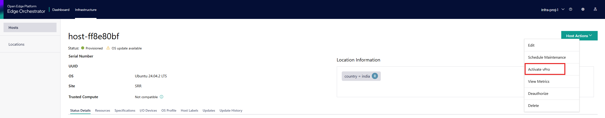
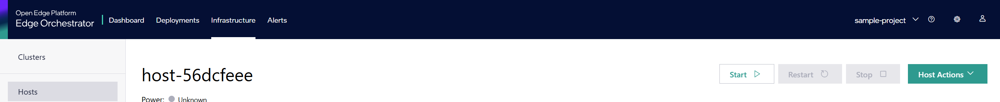

==============================
Intel® vPro® Power Management
==============================

This guide describes how to use Intel® vPro® features for power management, including activation, performing power operations, and deactivation.

Activation of Intel® vPro® Power Management
-------------------------------------------

To use Intel® vPro® power management features, the device must be provisioned and activated. Intel® vPro® activation changed to opt-in feature
instead of a mandatory feature. Intel® vPro® activation moved to day 2 Operations as part of Host actions. Now Intel® vPro® can be activated
for both Active Management Technology (AMT-Intel® vPro® Enterprise) and Intel Standard Manageability (ISM-Intel® vPro® Essential) devices.

.. note::
   1. If the edge node is AMT/ISM-enabled, then only Intel® vPro® activation is enabled as part of Host actions.

   2. Intel® vPro® activation and deactivation will be triggered via Host actions.

   3. Intel® vPro® profiles are currently created using Client Control Mode (CCM).

Enabling Intel® vPro® from Host Actions:

Assumptions & Recommendations
-----------------------------

- **BIOS Enablement:** Ensure Intel® vPro® is enabled in the system
   BIOS. If Intel® vPro® is not required, it is recommended to disable it in
   the BIOS for security and compliance. **Note:** Some platforms (e.g.,
   OnLogic K804) do not provide BIOS options to enable/disable Intel® vPro®. See
   :doc:`/user_guide/troubleshooting/amt_issues`
   for platform-specific limitations.
- **MEBx Password:** For enhanced security, set a strong and unique Intel® MEBx password during initial setup.
   If the default password is still in use, change it immediately to prevent unauthorized access.
- **Port Enablement:** Ensure that the 4433 network ports for Intel® AMT communication are open
   and not blocked by firewalls.

Activate vPro In ACM mode
~~~~~~~~~~~~~~~~~~~~~~~~~~~~~~

- `ACM mode certificate creation <https://device-management-toolkit.github.io/docs/2.32/GetStarted/Cloud/createProfileACM/#provisioning-certificate>`_

  ACM (Admin Control Mode) activation requires a provisioning certificate issued by a trusted Certificate Authority (CA).
  This certificate must be rooted in one of the trusted CAs embedded in the Intel AMT firmware (e.g., Comodo, DigiCert, GoDaddy, or VeriSign).

  To obtain and prepare the certificate:

  **Purchase a provisioning certificate** from a CA whose root certificate hash is listed in Intel AMT's trusted root store.
     The certificate must match the domain suffix configured in the AMT BIOS (MEBx) settings.

  **Export the certificate** in PFX/PKCS#12 format, including the full certificate chain and private key.

  **Note the certificate password** — it will be required when creating the AMT domain profile via ``orch-cli``.

  .. note::

     The domain suffix in the certificate's Common Name (CN) or Subject Alternative Name (SAN) must match the
     PKI DNS suffix configured in the edge node's MEBx settings.

- BIOS configuration for ACM mode

  Ensure the edge node's BIOS is configured for ACM mode with Domain suffix in Remote configuration settings.

  Advanced > MEBx > {Enter MEBx Password- default is "admin"} > Intel AMT Configuration > Network Access State > Full Unprovision
  Advanced > MEBx > {Enter MEBx Password- default is "admin"} > Intel AMT Configuration > Remote Setup and Configuration > PKI DNS Suffix > Set to your domain suffix (e.g., "example.com")

  .. figure:: images/Vpro-BIOS-settings.png
   :alt: BIOS ACM configuration settings

- Domain creation

  .. code-block:: bash

    orch-cli create amtprofile <domain_name> \
      --project ${PROJECT_NAME} \
      --cert 'Domain-certificate.pfx' \
      --cert-pass cert-password \
      --cert-format string \
      --domain-suffix <Domain-suffix> \
      --api-endpoint https://api.${CLUSTER_FQDN}

- ACM Activation command

  .. code-block:: bash

    orch-cli set host ${HOST_ID} \
      --project ${PROJECT_NAME} \
      --api-endpoint https://api.${CLUSTER_FQDN} \
      --amt-state provisioned \
      --control-mode admin

- ACM mode Deactivation - Once the operation is complete, you can deactivate ACM mode using the following command

   .. code-block:: bash

    orch-cli set host ${HOST_ID} \
      --project ${PROJECT_NAME} \
      --api-endpoint https://api.${CLUSTER_FQDN} \
      --amt-state unprovisioned

.. note::
   Ensure that deactivation completes successfully. If it does not, the host may enter a limbo state and cannot be reactivated.
   In that case, you must clear the system CMOS to reset the Intel® vPro® state before activating again.

Power Operations
----------------------------

Once activated, you can perform various power operations such as power on, power off, reset, and cycle.
These operations can be managed through the user interface (UI):

**UI Power ON/OFF Operations Example:**

Clicking 'Start' will power on the device, 'Stop' will power it off,

**UI Power Reset Operations Example:**

Clicking 'Restart' will Reset the device.

**CLI Power Operations Example:**

.. code-block:: bash

   # Power On
   orch-cli set host <host-id>  --project <project_name> --power on

   # Power Off
   orch-cli set host <host-id>  --project <project_name> --power off

   # Reset
   orch-cli set host <host-id>  --project <project_name> --power reset

Replace `<host_id>` and `<project_name>` with your actual host-id and project name.

**Check the current power status of the edge node:**

To check the power state of a host using the DMT-specific API, use the following `curl` command:

.. code-block:: bash

   curl -X "GET" "https://mps-wss.<orch-address>/api/v1/amt/power/state/<HOST_UUID>" \
     -H "accept: application/json" \
     -H "Authorization: Bearer ${JWT_TOKEN}"

Replace `<cluster-name>` with your cluster domain name.
Replace `<HOST_UUID>` with the UUID of your host and ensure `${JWT_TOKEN}` is set to a valid authentication token.

This API will return the current power state of the specified.

**Check the device Intel® vPro® details of the edge node:**

.. code-block:: bash

   curl -X "GET" "https://mps-wss.<cluster-name>/api/v1/devices/<HOST_UUID>" \
   -H "accept: application/json" \
   -H "Authorization: Bearer ${JWT_TOKEN}"

Replace `<cluster-name>` with your cluster domain name.
Replace `<HOST_UUID>` with the UUID of your host and ensure `${JWT_TOKEN}` is set to a valid authentication token.

Deactivation of Intel® vPro® Power Management
---------------------------------------------

To deactivate Intel® vPro® management features, the device can be deauthorized or deactivated from host-actions.
**Deauthorize host** and **Deactivate Intel® vPro®** will deactivate the device and prevent from further management via Intel® vPro®.

Troubleshooting
---------------

If you encounter issues during activation, power operations, or deactivation,
refer to the logs or use the `--verbose` flag with `orch-cli` for more details.

For further assistance, consult the official documentation or contact support.
