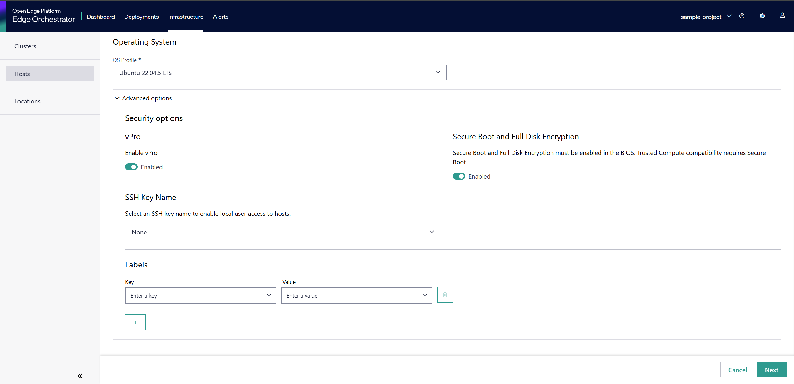

==============================
Intel® vPro® Power Management
==============================

This guide describes how to use Intel® vPro® features for power management, including activation, performing power operations, and deactivation.

Activation of vPro Power Management
-----------------------------------

To use vPro power management features, the device must be provisioned and activated. Provisioning is a prerequisite for activation and enables vPro management capabilities on the device.

.. note::
   If the edge node is vPro-enabled, activation of vPro features occurs internally and automatically
   during device onboarding. No explicit user action is required to trigger vPro activation for 
   supported devices. 
   
Enabling vpro while creating host

Power Operations
----------------

Once activated, you can perform various power operations such as power on, power off, reset, and cycle.
These operations can be managed through the user interface (UI): clicking 'Start' will power on the device, 'Stop' will power it off, and 'Reset' will reboot the device.

**UI Power Operations Example:**

.. figure:: images/vpro_power_mgt.png
   :width: 100 %
   :alt: Power operations UI

**CLI Power Operations Example:**

.. code-block:: bash

   # Power On
   orch-cli set host <host-id>  --project <project_name> --power on

   # Power Off
   orch-cli set host <host-id>  --project <project_name> --power off

   # Reset
   orch-cli set host <host-id>  --project <project_name> --power reset

Replace `<host_id>` and `<project_name>` with your actual host-id and project name.

Deactivation of vPro Power Management
-------------------------------------

To deactivate vPro management features, the device must be deauthorized. 
Deauthorizing will deactivate the device and prevent from further management via vPro.

Troubleshooting
---------------

If you encounter issues during activation, power operations, or deactivation, 
refer to the logs or use the `--verbose` flag with `orch-cli` for more details.

For further assistance, consult the official documentation or contact support.
