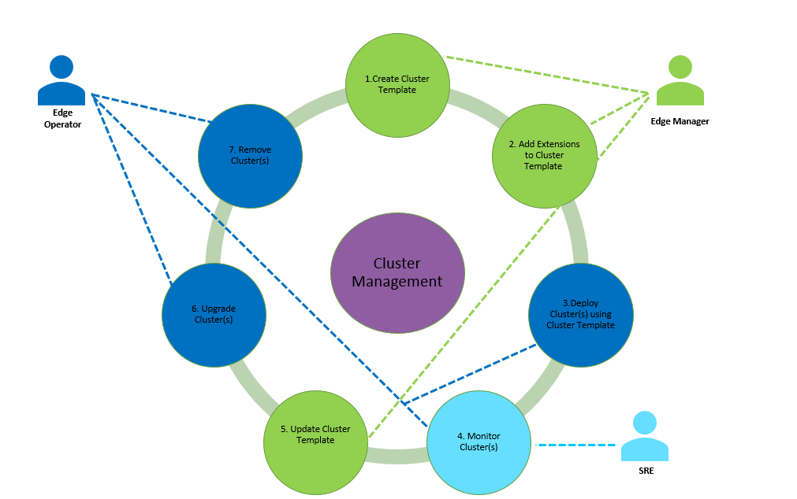

Cluster User Groups
=============================

This section describes the user groups that manage clusters and their specific
roles. For more information about user groups, see :doc:`/shared/shared_iam_groups`

**Edge-Manager-Group**

* Knowledgeable about Kubernetes.
* Composes cluster compositions (blueprints) using cluster templates.
* Revises cluster templates to update cluster configurations and extensions.

**Edge-Operator-Group**

* Creates edge clusters as instructed using predefined cluster templates.
* Specifies cluster deployment parameters.
* Assign one or more hosts configured as members of a cluster.
* Deploys and checks results of edge cluster deployments.
* Adds or removes nodes as required to edge clusters for operational
  efficiency or improved performance.
* Undeploys and removes edge clusters no longer required.

**SRE-Admin-Group**

* For System Reliability Engineer (SRE)
* Monitors overall health of Intel's Edge Orchestrator services, including
  Cluster Orchestration services.
* Respond to service alerts and inspect clusters for the current operational
  state.
* Remediates and repairs problems with help from Edge Operators.

The following diagram illustrates the user groups and their roles:

