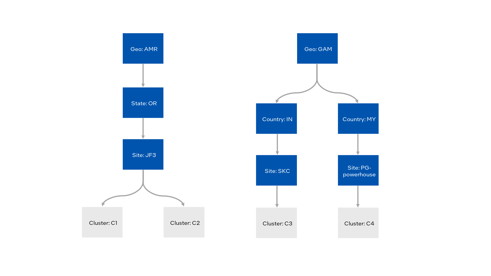

Example: Define Criteria for Automated Deployment
===========================================================

To enable automated deployment, you will:

* Associate deployment criteria with clusters. This includes:

  * Location information the cluster receives from its hosts.
  * Any deployment metadata associated with the cluster's site or region.
  * Deployment metadata associated with the cluster directly.

* Associate deployment criteria with deployments. These criteria are associated directly with the deployment
  you set up.

The following is an example use case
with four clusters located at three sites across two top-level regions:

This use case has the following requirements for deployments:

* Remote clusters get a modified version of the application.
  On-premises clusters get the base version.
* Upgrades must be deployed to test nodes and validated before deploying to production nodes.
* Clusters that support 5G networking receive an enhanced package of applications.

This means that you need to know whether a cluster:

* Is located on-premises or remotely.
* Belongs to the test or production environment.
* Supports 5G networking.

The following explains how deployment criteria help you meet those requirements.

Deployment Criteria for Infrastructure
*********************************************

**Location Information and Site-level Deployment Metadata**

Start with the location requirement, whether a cluster is remote or on-premises. This is a property of the
cluster's site, so associate a deployment metadata tag with the site.
Every host assigned to that site will be tagged with the site's deployment metadata.

When you :doc:`provision a host </user_guide/set_up_edge_infra/provision_host>`,
you assign it to a site. Each site is in a single region, which may belong to one
or more parent regions. When you assign a host to a site, the host is
associated with the entire region hierarchy.

Additionally, you can associate deployment metadata tags with a site. All hosts that are assigned to
the site will receive the deployment metadata.

All hosts in a cluster must come from the same site. When you
:doc:`/user_guide/set_up_edge_infra/create_clusters`,
it receives site, region, and site deployment metadata from its hosts.

In this case, assume that when you set up the
:doc:`sites </user_guide/set_up_edge_infra/location/add_site>` and
:doc:`regions </user_guide/set_up_edge_infra/location/add_region>`,
you tagged the JF3 and SKC sites with the deployment metadata `loc-type:on-prem`, and the
PG-powerhouse site with `loc-type:remote`.

Based on what you know so far, fill out a table tracking each cluster's deployment configuration:

+-------------+-------------+-------------+-------------+
| Cluster     | Site        | Region      | loc-type    |
+=============+=============+=============+=============+
| C1          | JF3         | geo:amr     | on-prem     |
|             |             | state:or    |             |
+-------------+-------------+-------------+-------------+
| C2          | JF3         | geo:amr     | on-prem     |
|             |             | state:or    |             |
+-------------+-------------+-------------+-------------+
| C3          | SKC         | geo:gam     | on-prem     |
|             |             | country:in  |             |
+-------------+-------------+-------------+-------------+
| C4          | PG          | geo:gam     | on-prem     |
|             |             | country:my  |             |
+-------------+-------------+-------------+-------------+

**Cluster-level Deployment Metadata**

Add the remaining requirements by assigning deployment metadata directly to the clusters. You need to:

* Differentiate test and production clusters.
* Flag clusters that support 5G.

To do this, assume that you have created two additional deployment metadata tags, `env` and `net-type`:

* `env` can take the values `prod` and `test`.
* `net-type` has been defined with a single value, `5g`.

Clusters C1 and C3 are part of the test environment and do not support 5G networking. C2 and C4 are in
production and have 5G support.

Once you define your cluster-level deployment metadata, the deployment criteria summary will look like
this:

+-----------+----------+-------------+-------------+-----------+------------+
| Cluster   | Site     | Region      | loc-type    | env       | net-type   |
+===========+==========+=============+=============+===========+============+
| C1        | JF3      | geo:amr     | on-prem     | test      |            |
|           |          | state:or    |             |           |            |
+-----------+----------+-------------+-------------+-----------+------------+
| C2        | JF3      | geo:amr     | on-prem     | prod      | 5g         |
|           |          | state:or    |             |           |            |
+-----------+----------+-------------+-------------+-----------+------------+
| C3        | SKC      | geo:gam     | on-prem     | test      |            |
|           |          | country:in  |             |           |            |
+-----------+----------+-------------+-------------+-----------+------------+
| C4        | PG       | geo:gam     | on-prem     | prod      | 5g         |
|           |          | country:my  |             |           |            |
+-----------+----------+-------------+-------------+-----------+------------+

Here, you have chosen an open-ended metadata category instead of defining 5G tag differently, calling it
`5g-support`` and allowing the values `Y` and `N`. This means it would be easy to indicate 6G nodes in
this example use case at some point. |software_prod_name| allows you to define a deployment metadata
schema that best meets your requirements.

Note that you could have chosen to apply the `loc-type` tag to each cluster individually. However, by
associating it at the site level, you automatically apply it to all hosts at that site. This is more
efficient and reduces errors, as all hosts at a site have the same location type.

Deployment Criteria for Deployments
***************************************

The applications are bundled into deployment packages to deploy software to the clusters. You can create
a deployment package profile to define an application's runtime behavior based on where its package is
deployed.

In this use case, you will deploy different application versions to on-premises versus remote clusters.
Remote clusters use a lower-fidelity AI model optimized for the field hardware.

Once you have created deployment packages and profiles, create a deployment by associating deployment
criteria with each package and choosing 'metadata-based' as the deployment type.

Automated Deployment
**************************

|software_prod_name| automatically pushes the deployment to clusters that match the criteria. As new
clusters with matching criteria are brought up, software is pushed to them.
Updates to deployment packages are automatically pushed as well.

Here are some examples of deployment criteria from the use case and their outcomes:

+-----------------------------------+------------------------+-----------------------+
| Deployment Target                 | Deployment Criteria    | Clusters Targeted     |
|                                   |                        +-----+-----+-----+-----+
|                                   |                        | C1  | C2  | C3  | C4  |
+===================================+========================+=====+=====+=====+=====+
| All remote production clusters    | loc-type:remote        | N   | N   | N   | Y   |
|                                   | env:prod               |     |     |     |     |
+-----------------------------------+------------------------+-----+-----+-----+-----+
| On-premises test clusters         | geo:gam                | N   | N   | Y   | N   |
| in the GAM geo                    | loc-type:on-prem       |     |     |     |     |
|                                   | env:test               |     |     |     |     |
+-----------------------------------+------------------------+-----+-----+-----+-----+
| Nodes in the JF3 5G Network       | site:jf3               | N   | Y   | N   | N   |
|                                   | net-type:5g            |     |     |     |     |
+-----------------------------------+------------------------+-----+-----+-----+-----+
