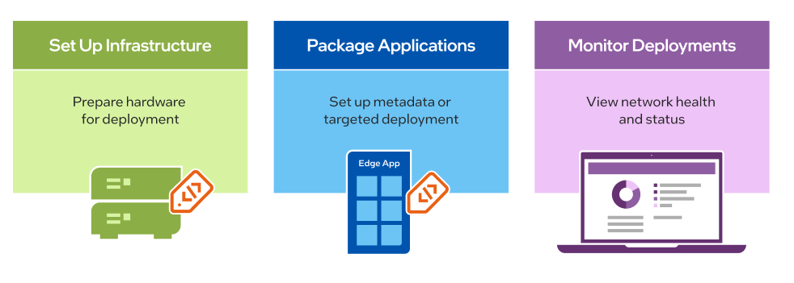

Get Started
===========================

This section will to help you become familiar with |software_prod_name|.

|software_prod_name| is a multi-tenant system, see :doc:`/shared/shared_mt_overview` for a multi-tenancy overview.

Hardware Requirements
----------------------------
|software_prod_name| support a plethora of Intel® platforms, including Core™,
Intel® Xeon® and Intel® Atom® processor families.
For detailed edge-node system requirements, see :doc:`/system_requirements/index`.
If you have a specific system configuration and you want to discuss it,
reach out to the development team.

Quick Start
------------------

Initial Configuration
----------------------------------------------

You must configure the following before
working with |software_prod_name|:

- :doc:`/shared/shared_mt_overview` to create Organizations and Projects
- :doc:`/user_guide/set_up_edge_infra/location/index`
- :doc:`/user_guide/advanced_functionality/set_default_cluster_template`

If you are deploying LOC-A with |software_prod_name|:

- :doc:`/user_guide/set_up_edge_infra/edge_node_onboard/3rd_party_examples/setup_loca`
