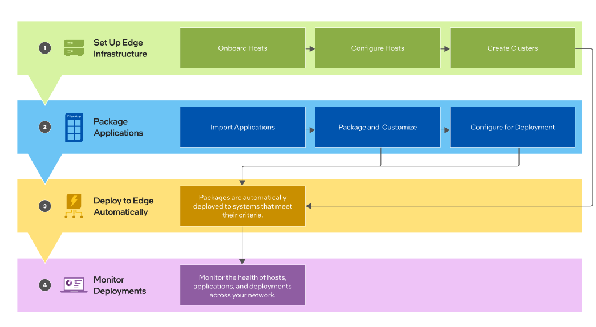

How it Works
============

Edge Manageability Framework is the primary solution to manage edge environments efficiently and securely. It encompasses a range of features that cater to the unique demands of edge computing, ensuring seamless integration and operation across diverse hardware and software landscapes.

.. toctree::
   :maxdepth: 2
   :caption: How it Works

   /user_guide/set_up_edge_infra/index
   /user_guide/package_software/index
   /user_guide/monitor_deployments/index

The :doc:`Get Started Guide </user_guide/get_started_guide/index>` provides you with a step by step process to use the system.
