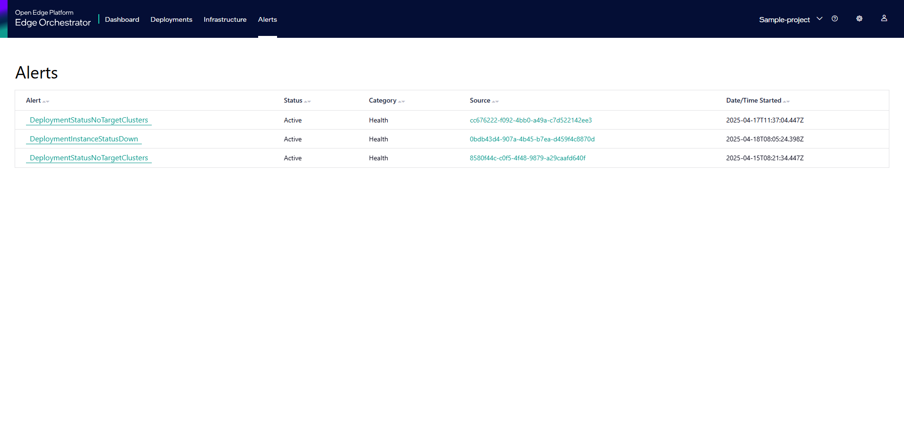
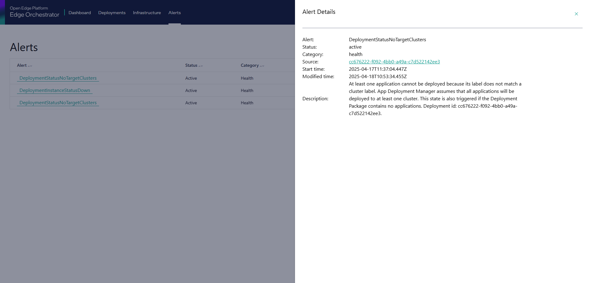

Alerts
===========

In the **Alerts** page, you can view the alerts generated in |software_prod_name|.

Click **Alerts** tab on the top menu to view the **Alerts** page.

.. list-table::
   :widths: 20, 20
   :header-rows: 1

   * - Field
     - Description

   * - Alert
     - The name of the alert.

   * - Status
     - The status of the alert.

   * - Category
     - Displays the category of alert.

   * - Source
     - Indicates the resource associated with that alert. Click on the source
       link to navigate to the resource.

   * - Date/Time Started
     - Indicates the date and time the alert was triggered.

Click on an Alert to see its details.

.. list-table::
   :widths: 20, 20
   :header-rows: 1

   * - Field
     - Description

   * - Alert
     - The name of the alert.

   * - Status
     - The status of the alert.

   * - Category
     - Displays the category of alert.

   * - Source
     - Indicates the resource associated with that alert. Click on the
       source link to navigate to the resource.

   * - Start Time
     - Indicates the date and time the alert was triggered.

   * - Modified Time
     - Indicates the date and time when the alert status was updated.

   * - Description
     - Provides additional details about the alert. Depending on type
       of alert it might include additional contextual information like resource identifiers or possible causes.

