Edge Node Host Performance Dashboard
=======================================================

Using the **Edge Node Host Performance Dashboard**, you can view the general
performance, system information, and track the connectivity and maintenance status
of the host.

* `View Observability and Performance Dashboard <#view-observability-and-performance-dashboard>`__
* `View Edge Node Pod details <#view-edge-node-pod-details>`__
* `Deployed Container Applications <#deployed-container-applications>`__
* `Application Logs and Telemetry <#application-logs-and-telemetry>`__
* `View Host Logs <#view-host-logs>`__
* `Cluster Observability <#cluster-observability>`__
* `Deployed Virtual Machine Applications <#deployed-virtual-machine-applications>`__

View Observability and Performance Dashboard
--------------------------------------------------

To view the observability and performance dashboard, perform the following steps:

1. Click **Infrastructure** on the top menu, then click **Provisioned** above the hosts list.

2. Identify the host  for which you want to access the metrics.

3. Click the three-dot icon in the **Actions** column and select **View Metrics**.
   The `Edge Node Host Performance` dashboard appears.

   .. figure:: images/view_metrics.png
      :alt: View metrics
      :width: 95 %

The **System** section shows the metrics for general performance and system
information of the host.

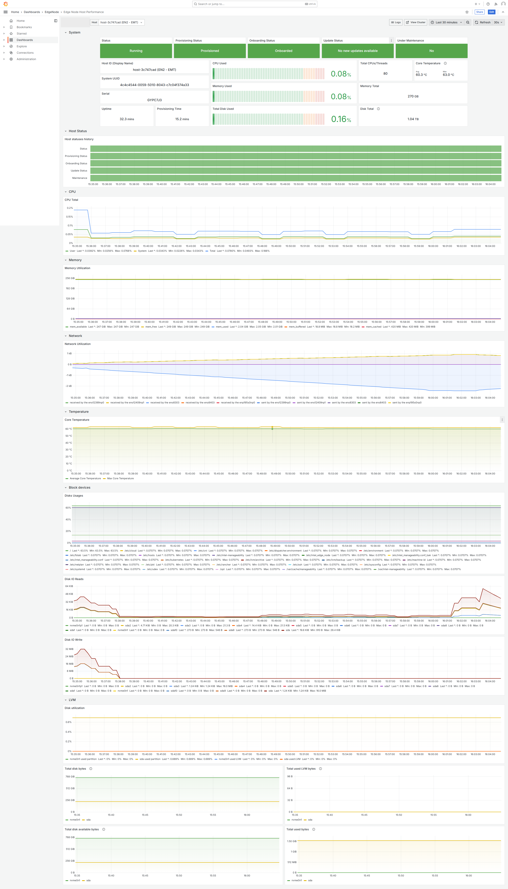

This panel also tracks the current maintenance mode state. This indicates
if the host is undergoing a planned outage such as a maintenance window,
or undergoing an upgrade.

You can also track the connectivity status of the host by using the
**Host Status** panel.

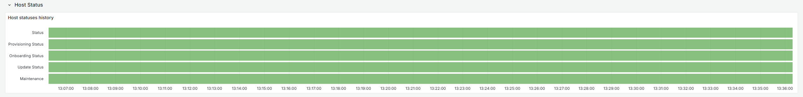

This panel shows the current and historical status of the host.

View Host Logs
----------------

From the `Edge Node Host Performance` dashboard, you can navigate to the `Logs`
dashboard for the Edge Node by clicking the `Logs` button in the top right of
the dashboard. This will reveal a drop-down menu of available logs to view.

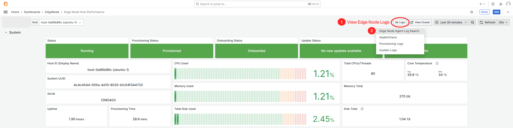

**Edge Node Agent Logs**

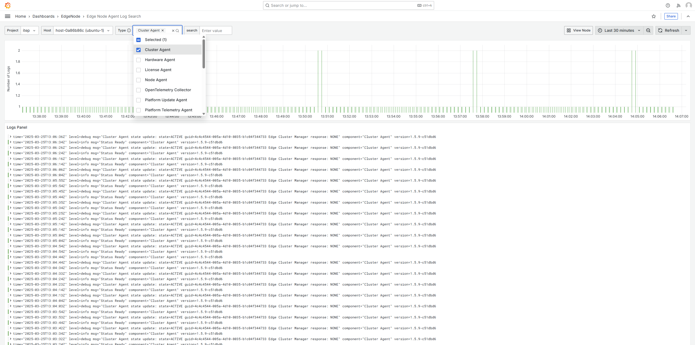

**Edge Node Health Check Logs**

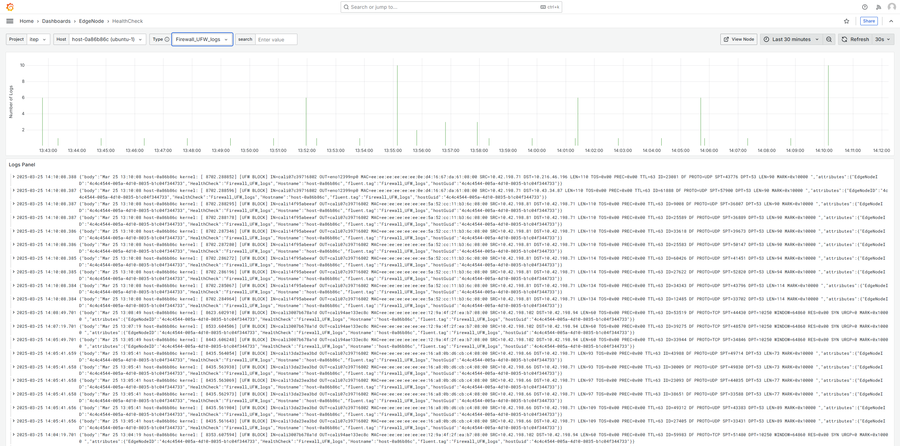

Cluster Observability
------------------------------------

If the EdgeNode has a cluster deployed, you can access the cluster telemetry
by clicking on `View Cluster` in the top right of the `EdgeNode Host
Performance` dashboard.

The cluster observability has logs and resource usage regarding the cluster
deployed on the Edge, as well as resource usage about any applications
deployed on the Edge Node.

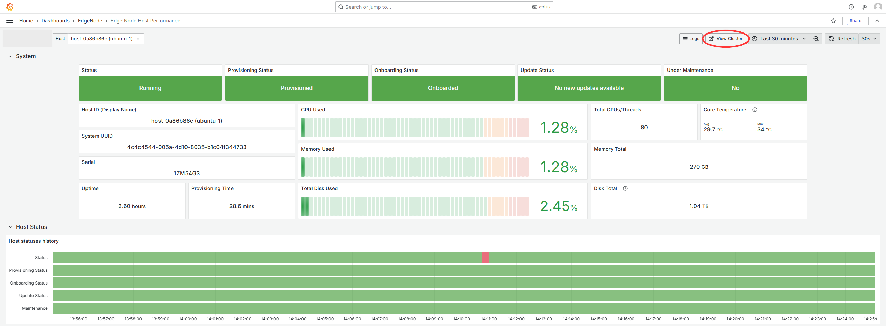

**Edge Node Cluster Dashboard**

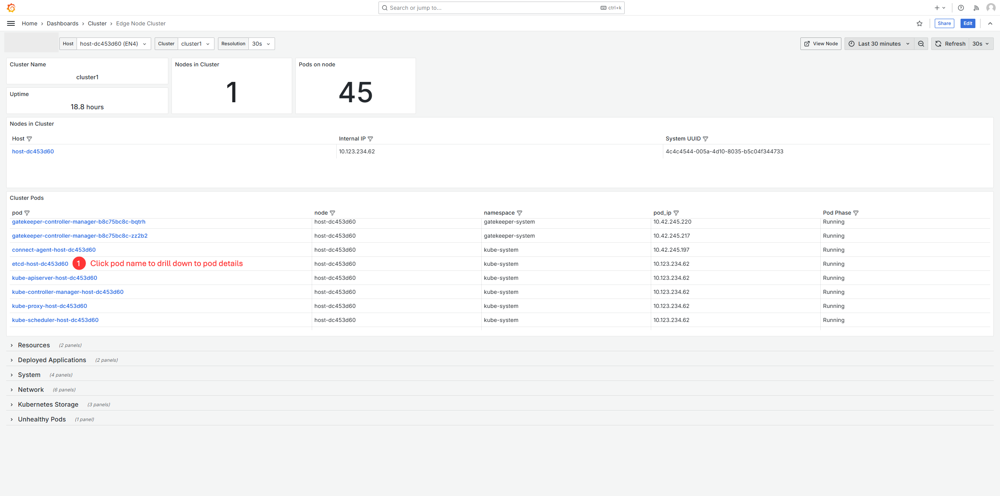

View Edge Node Pod details
------------------------------------

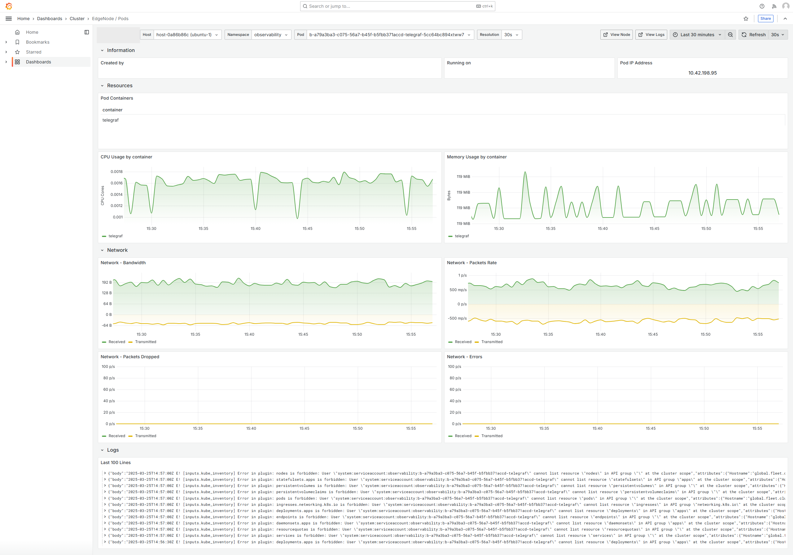

View Deployed Applications
------------------------------------

The Deployed Applications panel displays a list of the applications
deployed to a host. This sections is split into applications that are
deployed as containers, and applications that are deployed as virtual
machines.
Each application in the table can be clicked on to view further
metrics and logs about that specific application.

If you drill down into an application, you can view additional metrics
available about the container or virtual machine.

Deployed Container Applications
-----------------------------------

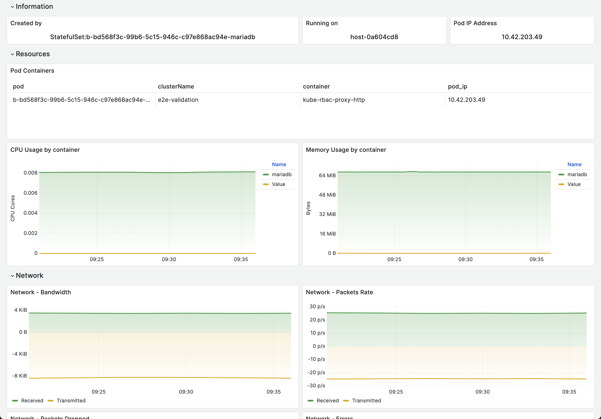

**Container Application Logs**

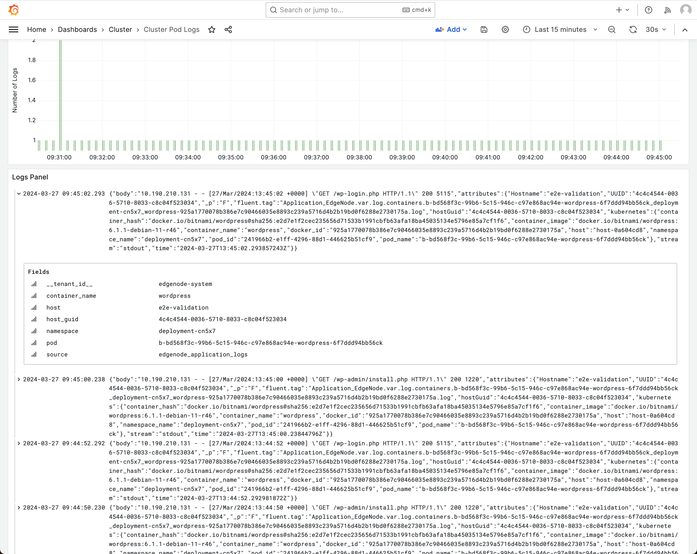

Deployed Virtual Machine Applications
----------------------------------------

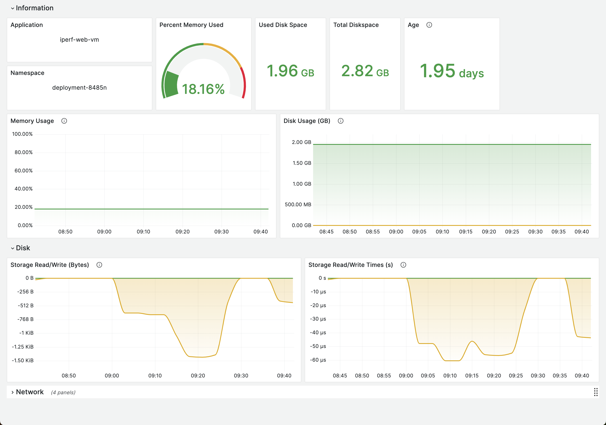

Application Logs and Telemetry
----------------------------------

By default, logs and metrics from within the applications deployed
 as cloud native containers on an Edge Node are retrieved and
 shown in the Edge Node Cluster dashboard. The Virtual machine based
 applications do not provide this capability by default.

To enable logging and telemetry from VM based applications,
the Edge Node provides endpoints for receiving logs and metrics.
Therefore, the applications need to be configured accordingly
by forwarding logs to
**fluent-bit-logging.observability.svc.cluster.local:22424**
and metrics to **telegraf.observability.svc.cluster.local:4317**.
When enabled, logs and metrics received from VM based applications
in this way can be viewed in the Edge Node Cluster dashboard.
