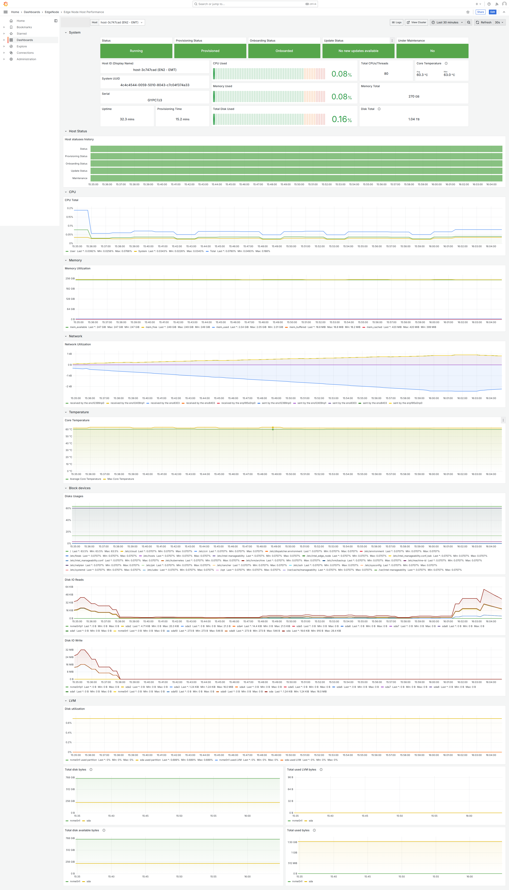
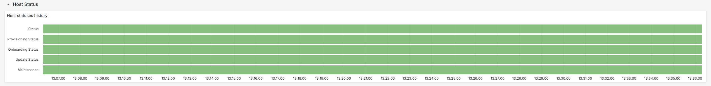
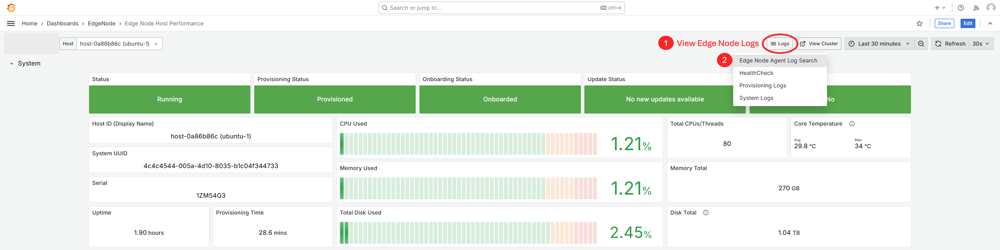
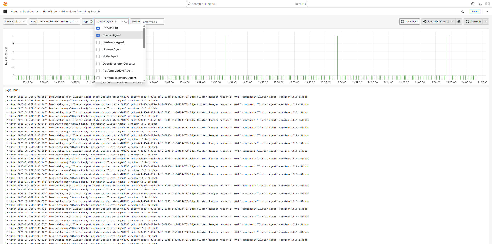
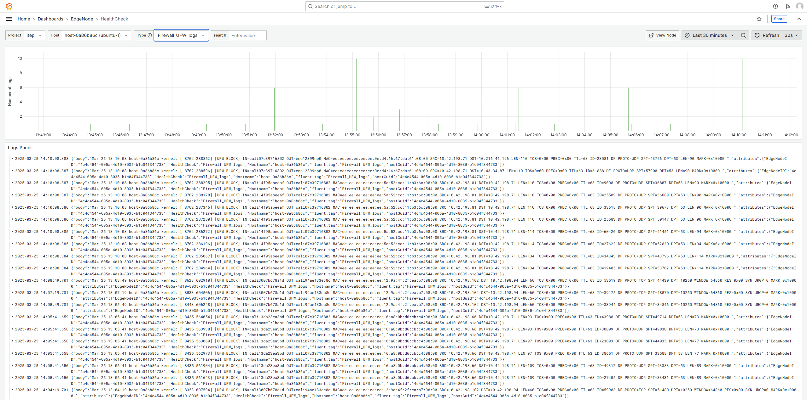

Edge Node Host Performance Dashboard
=======================================================

Using the **Edge Node Host Performance Dashboard**, you can view the general
performance, system information, and track the connectivity and maintenance status
of the host.

* `View Observability and Performance Dashboard <#view-observability-and-performance-dashboard>`__
* `View Edge Node Pod details <#view-edge-node-pod-details>`__
* `View Host Logs <#view-host-logs>`__

View Observability and Performance Dashboard
--------------------------------------------------

To view the observability and performance dashboard, perform the following steps:

1. Click **Infrastructure** on the top menu, then click **Provisioned** above the hosts list.

2. Identify the host for which you want to access the metrics for.

3. Click the three-dot icon in the **Actions** column and select **View Metrics**.
   The `Edge Node Host Performance` dashboard appears.

   .. figure:: images/view_metrics.png
      :alt: View metrics
      :width: 95 %

The **System** section shows the metrics for general performance and system
information of the host.

This panel also tracks the current maintenance mode state. This indicates
if the host is undergoing a planned outage such as a maintenance window,
or undergoing an upgrade.

You can also track the connectivity status of the host by using the
**Host Status** panel.

This panel shows the current and historical status of the host.

View Host Logs
----------------

From the `Edge Node Host Performance` dashboard, you can navigate to the `Logs`
dashboard for the Edge Node by clicking the `Logs` button in the top right of
the dashboard. This will reveal a drop-down menu of available logs to view.

**Edge Node Agent Logs**

**Edge Node Health Check Logs**

