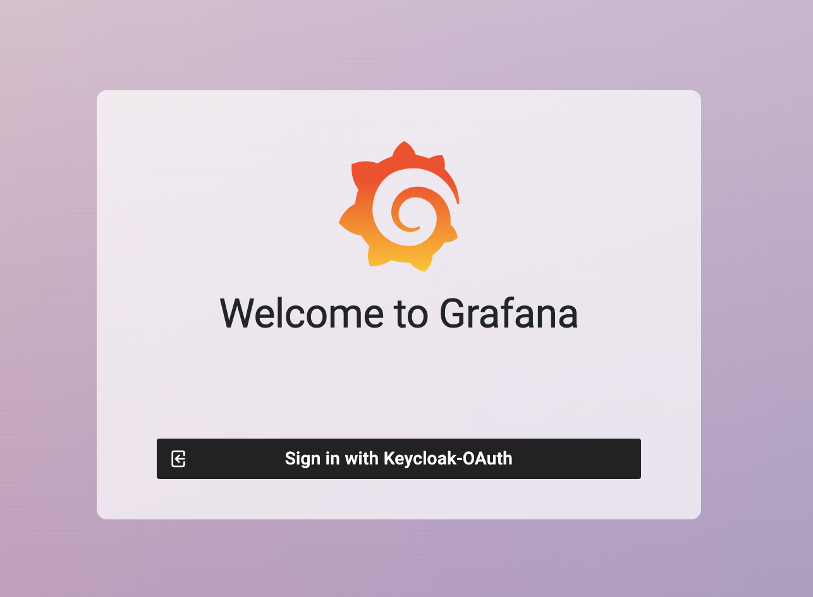
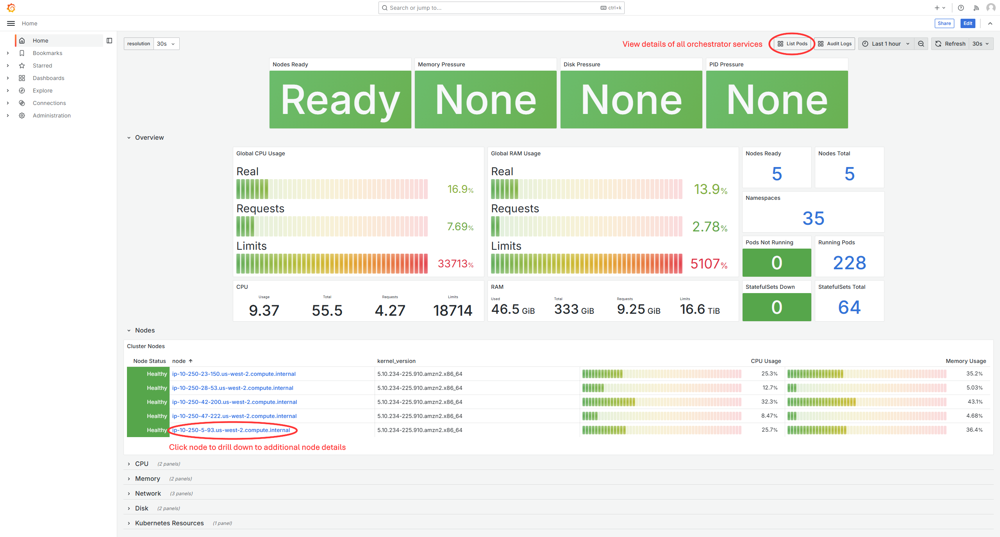
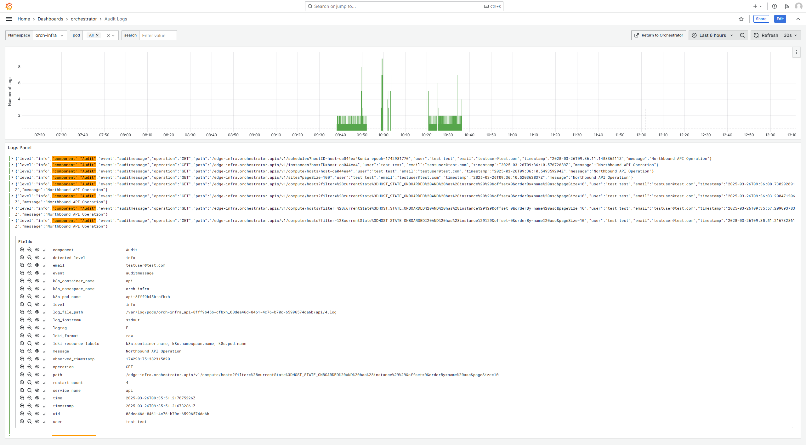
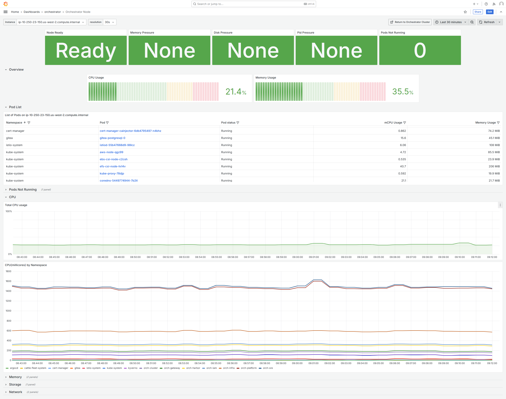
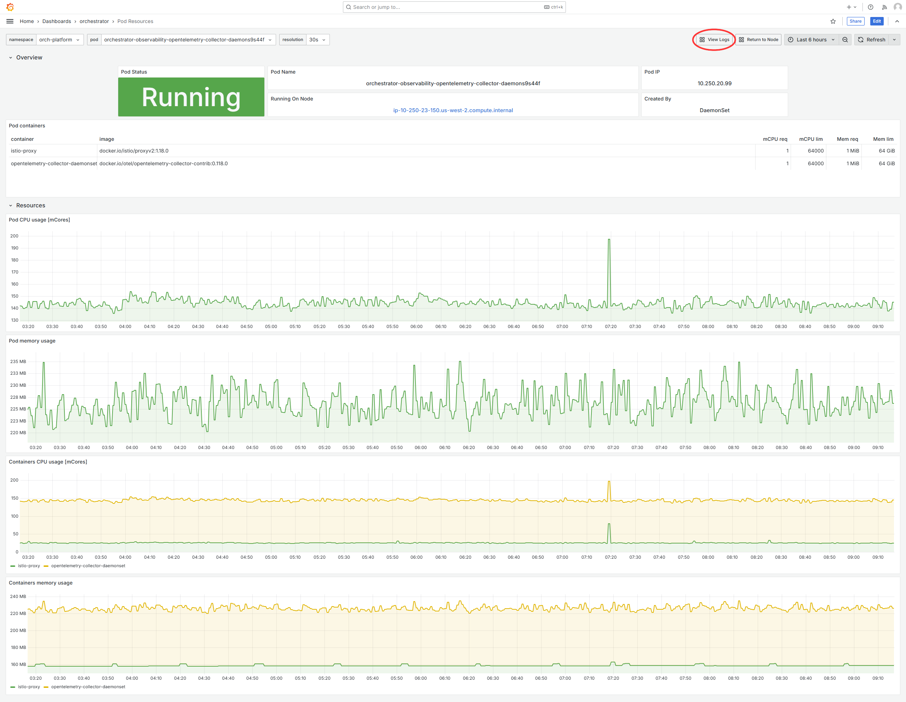
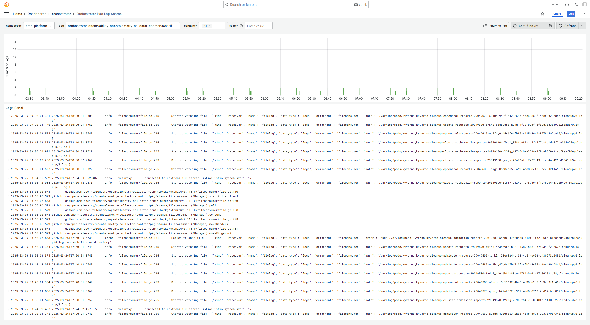

|software_prod_name| Edge Orchestrator Cluster Dashboard
==========================================================

Using the **Edge Orchestrator Cluster Dashboard**, you can view the general
performance, system information, and track the connectivity and maintenance
status of the |software_prod_name|\.

* `General Performance and System Information
  <#general-performance-and-system-information>`__
* `Auditing via Logs <#auditing-via-logs>`__
* `Node Details <#node-details>`__

Access Edge Orchestrator Cluster Dashboard
--------------------------------------------------

To view the Edge Orchestrator Cluster dashboard, perform these steps:

#. In the browser, navigate to `https://observability-admin.<domain>`

#. Click **Sign in with Keycloak-OAuth** from the Grafana\* dashboard interface.
   The **Edge Orchestrator Cluster Dashboard** appears.

.. note::
   The access to the dashboard the user must belong to `Service-Admin-Group`,
   which grants these roles:

   - `telemetry-client/viewer` role allows for viewing the dashboard
   - `telemetry-client/admin` role allows for editing the dashboard

   For additional details, see :doc:`/shared/shared_iam_groups`.

General Performance and System Information
--------------------------------------------------

The **Home** dashboard shows the metrics for general performance and
system information of the Edge Orchestrator.

Auditing via Logs
--------------------------------------------------

To audit on operations performed through REST Northbound APIs,
|software_prod_name| provide logs that include the path,
operation request, response, errors, status, the user, and the
email of the requester.

To visualize audit logs, from the `Orchestrator` section
navigate to the `Audit Logs` dashboard:

A key/value pair `.Str("event", "auditmessage")` is appended to
each log message for ease of this Grafana dashboard filtering.
You can perform additional filtering by using off-the-shelf
Grafana tools.

The following is an example of the Audit Log for REST APIs calls:

.. code-block:: json

   {
     "level": "info",
     "component": "Audit",
     "event": "auditmessage",
     "operation": "POST",
     "path": "test",
     "user": "username",
     "email": "test_email",
     "timestamp": "2024-06-19T15:01:00.395963Z",
     "message": "Northbound API Operation"
   }

Node Details
----------------------------------

When drilling down to a node, you can view details about all of
the pods deployed to the node, as well as overall resource usage
of the node:

You can click on a pod name to see details regarding the pod:

From the Pod details dashboard, click **Logs** in the top right
corner to see the pod's logs:

