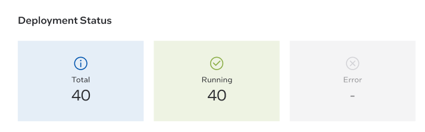
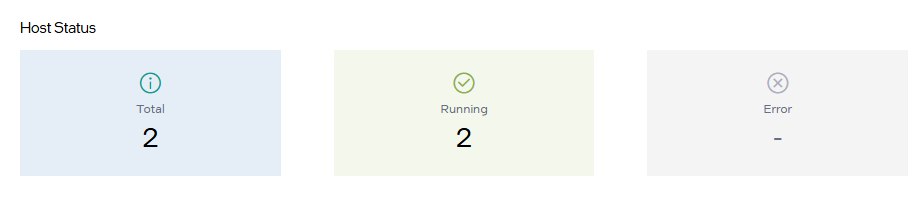

Dashboard
==================
Monitor the status of your deployments and the health of host infrastructure from the |software_prod_name| dashboard. Following are the sections:

 * `View Status of Deployments <#view-status-of-deployments>`__
 * `View Status of Host <#view-status-of-host>`__
 * `View Deployment Details <#view-deployment-details>`__
 * `Use Metadata Filters to Customize the Dashboard <#use-metadata-filters-to-customize-the-dashboard>`__

View Status of Deployments
---------------------------------

The **Deployment Status** section presents an at-a-glance view across all of your deployments. You can view the following statuses of the deployments:

-	**Total**: Shows the total count of deployments.
-	**Error**: Shows the total count of deployments that are not running and has encountered some error.
-	**Running**: Shows the total count of deployments that are running.

For example, in the following deployment status, there are a total of 40
deployments and the 40 deployments are running.

View Status of Host
---------------------------

The **Host Status** presents an at-a-glance status of your hosts in an
active state.

You can view the following statuses of the hosts:

- **Total**: Shows the total number of hosts that are in an active
  state.
- **Running**: Shows the count of active hosts that are running.
- **Error**: Shows the count of active hosts in an error state.
  You can view the hosts in an error state in the dashboard by
  scrolling through deployments. Alternatively, go to
  Infrastructure > Active Hosts to find the hosts in an error state
  and determine how to resolve the error.

For example, in the following host status, there are a total of two
running hosts.

View Deployment Details
---------------------------------

In the `Deployments Details` panel the user can view deployment name
and package, deployment and host status.

Click the **>** button on the right to view more details of the deployment, like
deployment package, metadata, and sites details.

Use Metadata Filters to Customize the Dashboard
-------------------------------------------------------
To filter by metadata, click the **Filter by Metadata** button to
enter your filters.

The **Filter by Metadata** option allows you to create a filter for
the dashboard based on your unique deployment configuration metadata.
For instance, you can select to filter the dashboard based on a region
that you need to see.  Or, if you created a "customer" category for
your deployment metadata, you could also use the metadata filter to
create a custom dashboard only showing deployments for that customer.

The **Dashboard** page displays the filtered result.

.. note::
   The intention of metadata filters are to provide a mechanism
   to filter the dashboard according to a customer's unique deployment
   configurations consisting of region/site data and deployment
   metadata assigned to the deployment and cluster.
