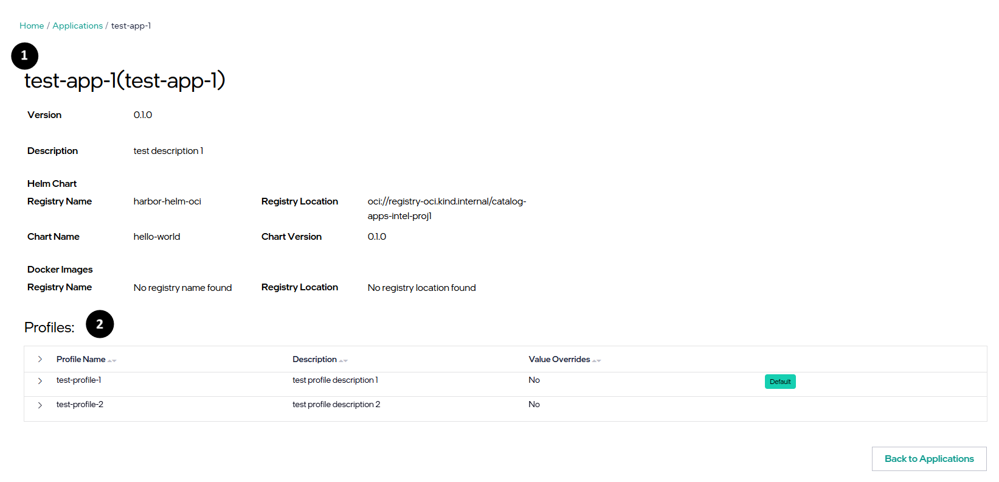

View Application Details
==============================
You can view the application details, including the details of the application and the profiles associated with it. To view the details of an application package, do the following:

1. In the **Application Packages** page, select the desired application package to view its details.

#. Click the three-dot icon in the **Actions** column and select **View Details**.

#. See details:
    1. Application details - details of the application.
    2. Application profiles - details of the profiles associated with the application.

