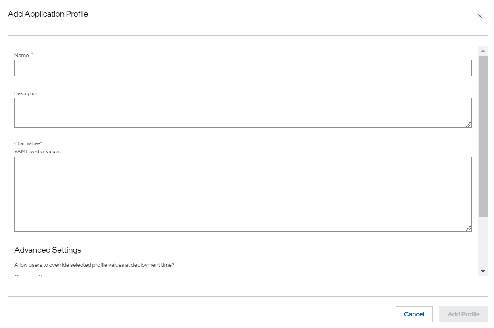

Application Profile
===============================================

Application Profiles are collections of settings that are used when launching an application. These settings are application-specific and are typically known to the developer. Profiles allow the developer to take this bundle of settings and give it a convenient name which can be used to deploy the application.

To add an application profile, perform the following steps:

1. Enter the application profile name in the **Name** field. Intel recommends to assign a meaningful name that will help you to remember the profile. The name field can include alphabets, numbers, and hyphens. Hyphens, if used, must not be located at the beginning or the end of the name.

#. Enter a brief description of the profile. This is optional.

#. In the **Chart values** field, enter the YAML representation of the values that will be used to configure the application. These are application-specific values. As an example, a YAML file from a wordpress sample application is shown as follows:

   .. code-block:: bash

      mariadb:
        primary:
          persistence:
          enabled: false
        auth:
          password: password
          rootPassword: secretpassword
      wordpressUsername: admin
      wordpressPassword: password
      wordpressBlogName: myBlog
      persistence:
        enabled: false

   .. note::
      These are application-specific and known to the developer. The developer
      might choose a convenient name for the profile, such as "default" or "high availability".

After the profiles are created, you have an option to
:doc:`add parameter templates </user_guide/package_software/param_template>`.

When you deploy applications by pulling containers or containerized VMs from the private registry, you must set `imagePullSecrets` or `imagePullSecret` for a container or a containerized VM, respectively. Those secrets can be dynamically assigned if they are parameterized in the `values.yaml` file. For more information, see
:doc:`/user_guide/package_software/image_pull_secret` section.

.. toctree::
   :hidden:

   param_template
