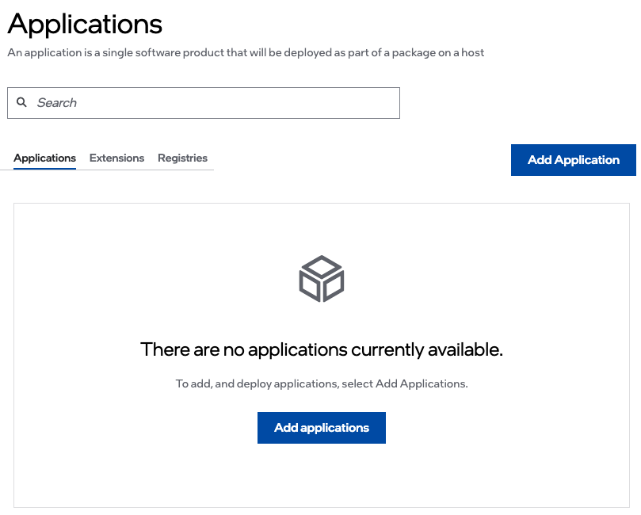
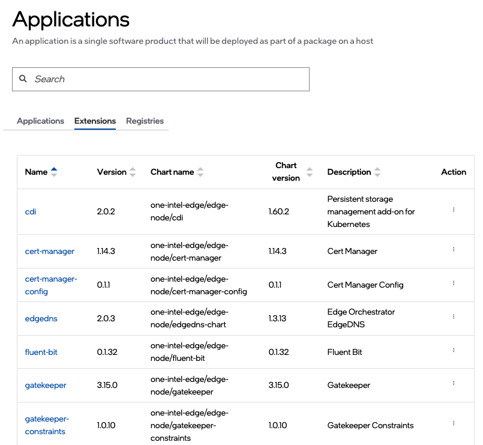

Applications
============

An application in |software_prod_name| is defined by a single Helm\* chart with predefined runtime configurations or profiles. The Helm chart must fulfill the following criteria, to be deployed and managed using |software_prod_name|\ :

* Deployable on CNCF-certified Kubernetes\* version v1.27.
* All Helm charts, including applications and dependencies, are stored in the Helm or OCI registry and can be downloaded through the network.
* Deployable using Helm install.
* Upgradable using Helm upgrade.
* Removable using Helm delete.
* Re-deployable using Helm install after delete; no manual cleanup is required.
* Use the *helm lint* command to check if the chart is well-formed.
* All Kubernetes resource creation and updates are done through the Helm chart. However, Intel does not recommend dynamic resource creation or update because this could lead to unexpected results.

View Applications
~~~~~~~~~~~~~~~~~

To view the **Applications** page, click the **Deployments** tab and then click **Applications** on the left menu. On the **Applications** page, you can view the list of applications and the available registries. You can search for applications and registries using the search bar at the top of the page. The other actions you can perform from this page are editing, viewing details, and deleting an application.

Applications are partitioned into two tabs:

*   **Applications** - Displays the list of user provided applications that are available for deployment.
    (The list is empty until a user adds an application)
*   **Extensions** - Displays the list of system provided extensions that are available for deployment.
    (The list is populated with many preconfigured applications. You cannot add or delete applications from this list).

Application Fields
~~~~~~~~~~~~~~~~~~~

.. list-table::
   :widths: 20, 20
   :header-rows: 1

   * - Field
     - Description

   * - Name
     - Displays the name of the application.

   * - Version
     - Displays the version name.

   * - Chart name
     - The name of the Helm chart. The Helm chart describes the resources loaded onto the application's edge.

   * - Chart version
     - Displays the version of the chart.

   * - Description
     - A brief description of the application.

   * - Action
     - Click the three-dot icon to view, edit, detail, or delete the application.

Fine-tuning Applications
~~~~~~~~~~~~~~~~~~~~~~~~

Applications have a number of features that allow you to fine-tune the
deployment:

- **Application Profiles**, which are like value files in Helm Charts,
  allow a variety of scenarios to be catered for at deployment time. Applications can have multiple :doc:`Application Profiles </user_guide/package_software/app_profile>` which consist of a profile name, description, Helm chart values, and value overrides.
- **Parameter Templates** allow further fine-tuning at deployment time.
  These are used to specify values that are impossible to know at the
  time of creating the values file. They can be marked as required or
  optional, secret or plain text, or given default values.
- **Ignore Resources** allows you to ignore changes to certain Kubernetes
  resources that will be deployed by the Helm Chart.
- This is useful in the case where some job or hook in the Helm Chart
  changes a value in the resource after deployment from what was
  originally specified in the Helm Chart. Because |software_prod_name|
  tracks all changes to Resources by default, this feature can provide
  the flexibility to ignore certain changes, thereby allowing the
  deployment to complete.

From this page, you can do the following tasks:

    * :doc:`/user_guide/package_software/app_details`
    * :doc:`/user_guide/package_software/add_applications`
    * :doc:`/user_guide/package_software/edit_application`
    * :doc:`/user_guide/package_software/delete_application`
    * :doc:`/user_guide/package_software/app_profile`

.. toctree::
   :hidden:

   app_details
   add_applications
   edit_application
   delete_application
   app_profile
