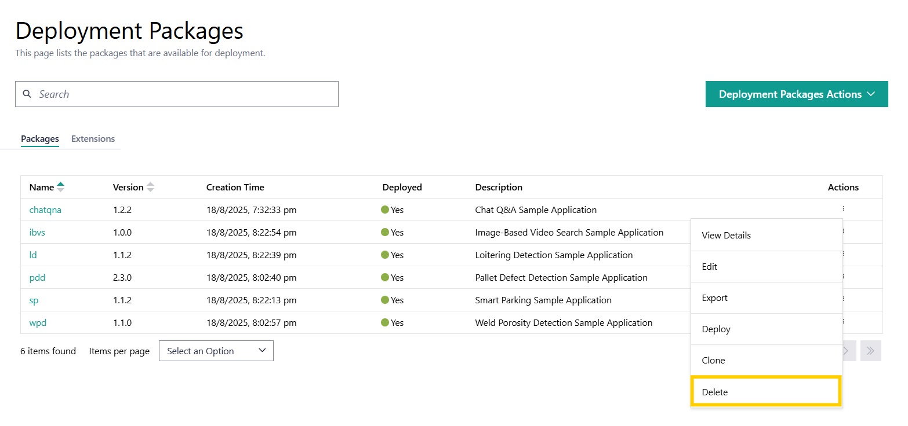

Delete Deployment Packages
==================================
You can delete deployment packages using the the **Delete** function
when those deployment packages are not in the deployed state.
Applications that are associated with the package are not deleted.

.. note::

   - Once deleted, an deployment package cannot be retrieved.
   - The applications that are associated with the package are not deleted.

Perform the following steps to delete an application package:

1. In the **Deployment Packages** page, identify the package that
   you want to delete.

#. In the **Actions** column, click the three-dot menu, and then click **Delete**:

Alternatively, you can go to the
:doc:`Deployment Package Details </user_guide/package_software/deploy_pack_details>`
page and delete the deployment package.
