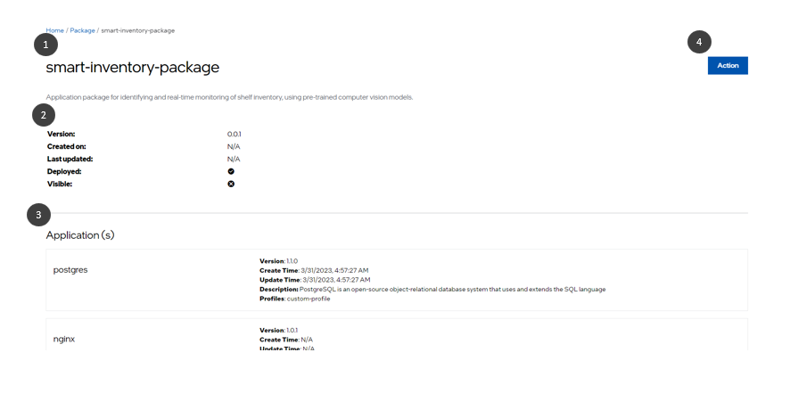

View Deployment Package Details
=====================================

You can view the deployment package details, including the creation date, deployment status, and the applications available in the package.
To view the details of an deployment package, do the following:

1. In the **Deployment Packages** page, select the desired deployment package to view its details.

#. Click the three-dot icon in the **Actions** column and select **Details**.

#. The deployment package details page appears.

   #. Deployment Package Name
   #. Details of the deployment package like version, creation date, last update etc.
   #. Details of the applications that are part of the application package.
   #. Perform actions like deploy, edit, and delete.

