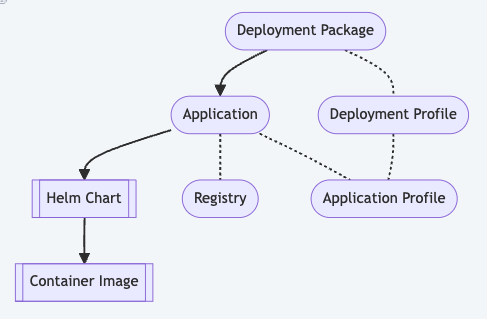
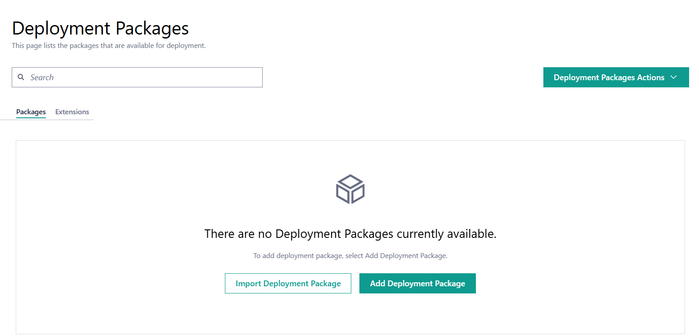
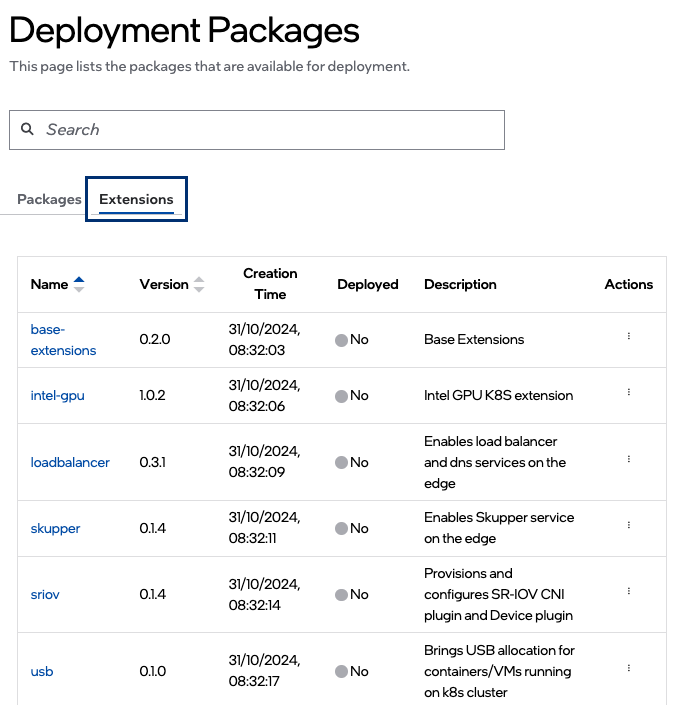

Deployment Packages
===================

Deployment packages and applications are a concept introduced in the
|software_prod_name|.

They are used to simplify the deployment of applications to the edge.
Deployment packages are a collection of applications and deployment
profiles. Deployment profiles are configurations that define how an
application must be deployed to an edge node.

See the :doc:`general overview of Deployment Packages </developer_guide/application_developer_workflow/deployment-packages/index>`
covering:

- Deployment Package Structure
- Deployment Package Design Strategies
- Fine tuning Applications

View Deployment Packages
------------------------

To view the **Deployment Packages** page, click **Deployments** tab and then click
 **Deployment Packages** on the left menu. In the **Deployment Packages** page, you can
 view the list of deployment packages available for deployment. Using the search bar at
 the top of the page, you can search for a deployment package. The other actions that you
 can perform from this page are create, edit, deploy, and delete a deployment package.

Deployment packages are partitioned into 2 tabs:

*   **Deployment Packages** - Displays the list of user provided deployment packages that are available for deployment.
    The list is empty until a user adds an deployment package.
    See :doc:`/user_guide/package_software/deployments`
    for more information on deploying a deployment package.
*   **Extensions** - Displays the list of system provided deployment packages.
    The list is populated with many preconfigured deployment packages.
    You cannot add or delete deployment packages from this list.
    See :doc:`/user_guide/package_software/extensions/deploy_extension_package`
    for more information on deploying an extension package.

Deployment Package Fields
-------------------------

.. list-table::
   :widths: 20, 20
   :header-rows: 1

   * - Fields
     - Description

   * - Name
     - The name of the deployment package. You can click the deployment package name to view the details.

   * - Version
     - The version number of the deployment package.

   * - Creation Time
     - The creation date and time of the deployment package.

   * - Deployed
     - Specifies the deployment status of the deployment package. It is marked as **Yes** when the deployment package is deployed, and **No** when it is not deployed.  When deployed, a deployment package cannot be modified.  If modifications are desired, the deployment package must be **cloned**.

   * - Description
     - The description of the deployment package.

   * - Actions
     - Click the three-dot icon to view details, deploy, edit, delete, or clone the deployment package.

From this page, you can do the following tasks:

   * :doc:`/user_guide/package_software/deploy_pack_details`
   * :doc:`/user_guide/package_software/add_deploy_pack`
   * :doc:`/user_guide/package_software/add_a_deploy_pkg_profile`
   * :doc:`/user_guide/package_software/edit_deploy_pack`
   * :doc:`/user_guide/package_software/import_deployment`
   * :doc:`/user_guide/package_software/export_deployment`
   * :doc:`/user_guide/package_software/delete_deploy_pack`
   * :doc:`/user_guide/package_software/clone_applications`

.. toctree::
   :hidden:

   deploy_pack_details
   add_deploy_pack
   add_a_deploy_pkg_profile
   edit_deploy_pack
   import_deployment
   export_deployment
   delete_deploy_pack
   clone_applications
